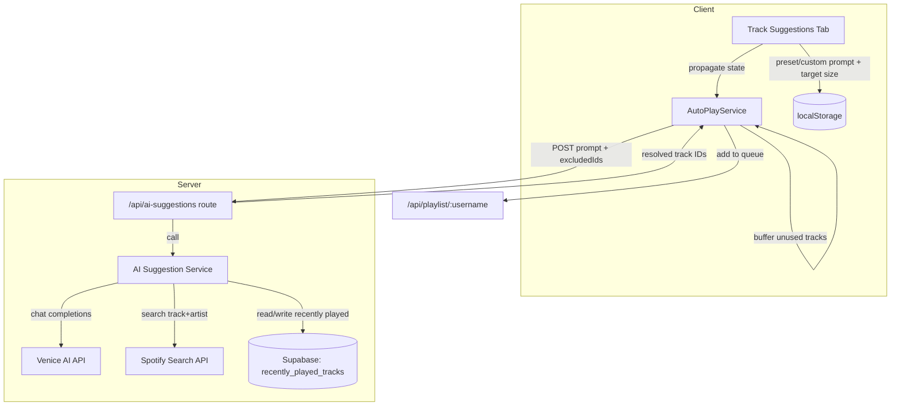

# Design Document: AI Song Suggestions

## Overview

This design replaces the existing database-driven track suggestion system with an AI-powered approach using Venice AI. Instead of querying a local `tracks` table with genre/year/popularity filters, the system sends a natural language prompt to Venice AI's chat completions API (`llama-3.3-70b` model) and receives a batch of 10 song recommendations (title + artist). Each recommendation is then resolved to a Spotify track ID via the Spotify Search API. A recently-played list (last 100 songs, persisted to Supabase) prevents repeat suggestions.

The existing DJ script generation (`/api/dj-script`) already demonstrates the Venice AI integration pattern: fetch to `https://api.venice.ai/api/v1/chat/completions` with `VENICE_AI_API_KEY`, system/user message structure, and a 25-second timeout. The new AI suggestion service follows this same pattern.

### Key Design Decisions

1. **Server-side AI calls only** — Venice AI calls happen in the API route (`/api/ai-suggestions`), never on the client. This protects the API key and allows centralized error handling.
2. **Batch-then-buffer** — Each AI call returns 10 songs. The AutoPlayService buffers unused suggestions and only requests a new batch when the buffer is empty AND the queue is below target.
3. **Spotify resolution on the server** — The API route resolves song title + artist to Spotify track IDs using `sendApiRequest` with `useAppToken: true`, matching the existing pattern in `app/api/tracks/upsert/route.ts`.
4. **Recently-played in Supabase** — A new `recently_played_tracks` table stores the last 100 played track IDs per venue, included in the AI prompt context and used for post-resolution filtering.
5. **Full removal of old system** — All old database-driven suggestion code (service, API route, UI components, hooks, types, validations, cooldown utility, constants) is deleted and replaced.

## Architecture



### Module Responsibilities

| Module | Responsibility |
|---|---|
| `services/aiSuggestion.ts` | Standalone server-side service: builds Venice AI prompt, calls chat completions, parses response, resolves to Spotify IDs, manages recently-played list |
| `app/api/ai-suggestions/route.ts` | POST endpoint: validates request with Zod, delegates to AI suggestion service, returns resolved track IDs |
| `AutoPlayService` (simplified) | Queue monitoring, auto-fill triggering. Maintains a buffer of unqueued suggestions. Delegates all suggestion logic to `/api/ai-suggestions` |
| `Track Suggestions Tab` (new UI) | 11 preset prompt cards, custom prompt textarea, auto-fill target selector. Persists state to localStorage |
| `useAiSuggestions` hook | Manages AI suggestion state (selected preset, custom prompt, auto-fill target), localStorage persistence, state propagation to AutoPlayService |

## Components and Interfaces

### AI Suggestion Service (`services/aiSuggestion.ts`)

```typescript
import { createModuleLogger } from '@/shared/utils/logger'

const logger = createModuleLogger('AISuggestion')

const VENICE_API_URL = 'https://api.venice.ai/api/v1/chat/completions'
const VENICE_MODEL = 'llama-3.3-70b'
const FETCH_TIMEOUT_MS = 25000
const BATCH_SIZE = 10

interface AiSongRecommendation {
  title: string
  artist: string
}

interface AiSuggestionResult {
  tracks: Array<{ spotifyTrackId: string; title: string; artist: string }>
  failedResolutions: Array<{ title: string; artist: string; reason: string }>
}

interface RecentlyPlayedEntry {
  spotifyTrackId: string
  title: string
  artist: string
}

export async function getAiSuggestions(
  prompt: string,
  excludedTrackIds: string[],
  recentlyPlayed: RecentlyPlayedEntry[]
): Promise<AiSuggestionResult>

export async function resolveToSpotifyTrack(
  title: string,
  artist: string
): Promise<string | null>

export async function getRecentlyPlayed(
  profileId: string
): Promise<RecentlyPlayedEntry[]>

export async function addToRecentlyPlayed(
  profileId: string,
  entry: RecentlyPlayedEntry
): Promise<void>
```

### API Endpoint (`app/api/ai-suggestions/route.ts`)

```typescript
// POST /api/ai-suggestions
// Request body (validated with Zod):
interface AiSuggestionsRequest {
  prompt: string          // non-empty, max 500 chars
  excludedTrackIds: string[]  // Spotify track IDs already in queue
  profileId: string       // venue owner's profile ID for recently-played lookup
}

// Response:
interface AiSuggestionsResponse {
  success: boolean
  tracks: Array<{ id: string; title: string; artist: string }>
  failedResolutions?: Array<{ title: string; artist: string; reason: string }>
  error?: string
}
```

### AutoPlayService Changes

The AutoPlayService is simplified to remove all suggestion parameter logic:

```typescript
// Removed properties:
// - trackSuggestionsState: TrackSuggestionsState
// - duplicateDetector: TrackDuplicateDetector (for suggestions)
// - mergedTrackSuggestions object construction

// Removed methods:
// - setTrackSuggestionsState()

// New properties:
private activePrompt: string = ''
private suggestionBuffer: Array<{ id: string }> = []

// New methods:
public setActivePrompt(prompt: string): void
public setAutoFillTargetSize(targetSize: number): void

// Modified autoFillQueue():
// 1. Check if suggestionBuffer has tracks → use those first
// 2. If buffer empty AND queue < target → POST to /api/ai-suggestions
// 3. Store unused tracks in suggestionBuffer
```

### UI Components

**New components** (under `app/[username]/admin/components/track-suggestions/`):

- `components/preset-prompt-selector.tsx` — Grid of 8 preset prompt cards with active indicator
- `components/custom-prompt-input.tsx` — Textarea with 500-char limit and character counter
- `auto-fill-target-selector.tsx` — Retained from old system (unchanged)
- `last-suggested-track.tsx` — Retained from old system (unchanged)

**New hook:**
- `hooks/useAiSuggestions.ts` — Replaces `useTrackSuggestions.ts`

```typescript
interface AiSuggestionsState {
  selectedPresetId: string | null
  customPrompt: string
  activePrompt: string  // derived: customPrompt if non-empty, else preset prompt text
  autoFillTargetSize: number
}

interface UseAiSuggestionsReturn {
  state: AiSuggestionsState
  selectPreset: (presetId: string) => void
  setCustomPrompt: (prompt: string) => void
  setAutoFillTargetSize: (size: number) => void
}
```

**Deleted components:**
- `genres-selector.tsx`
- `year-range-selector.tsx`
- `popularity-selector.tsx`
- `max-song-length-selector.tsx`
- `max-offset-selector.tsx`
- `explicit-content-toggle.tsx`

### Preset Prompts

11 preset prompts stored as constants in `shared/constants/aiSuggestion.ts`:

```typescript
export interface PresetPrompt {
  id: string
  label: string
  emoji: string
  prompt: string
}

export const PRESET_PROMPTS: PresetPrompt[] = [
  {
    id: 'party',
    label: 'Party',
    emoji: '🎉',
    prompt: 'Upbeat, high-energy party songs that get people dancing. Mix of pop, dance, and hip hop hits.'
  },
  {
    id: 'chill',
    label: 'Chill',
    emoji: '☕',
    prompt: 'Relaxed, mellow songs for a laid-back atmosphere. Lo-fi, acoustic, jazz, and soft indie.'
  },
  {
    id: 'rock',
    label: 'Rock',
    emoji: '🎸',
    prompt: 'Rock classics and modern rock anthems. Alternative, indie rock, and classic rock.'
  },
  {
    id: 'throwback',
    label: 'Throwback',
    emoji: '📻',
    prompt: 'Nostalgic hits from the 70s, 80s, and 90s. Classic soul, disco, new wave, and retro pop.'
  },
  {
    id: 'indie',
    label: 'Indie',
    emoji: '🎧',
    prompt: 'Independent and alternative music. Indie pop, indie rock, dream pop, and shoegaze.'
  },
  {
    id: 'hiphop',
    label: 'Hip Hop',
    emoji: '🎤',
    prompt: 'Hip hop and R&B tracks. Mix of classic boom bap, modern trap, and smooth R&B.'
  },
  {
    id: 'electronic',
    label: 'Electronic',
    emoji: '🎛️',
    prompt: 'Electronic and dance music. House, techno, ambient, and synth-driven tracks.'
  },
  {
    id: 'acoustic',
    label: 'Acoustic',
    emoji: '🪕',
    prompt: 'Acoustic and unplugged music. Singer-songwriter, folk, country, and acoustic covers.'
  },
  {
    id: 'vpop',
    label: 'V-Pop',
    emoji: '🇻🇳',
    prompt: 'Popular Vietnamese music (V-Pop). Trending Vietnamese hits, ballads, and modern Vietnamese pop songs.'
  },
  {
    id: 'vrock',
    label: 'Viet Rock & Hip Hop',
    emoji: '🎸🇻🇳',
    prompt: 'Vietnamese rock and hip hop. Vietnamese rap, Viet rock bands, and Vietnamese hip hop artists.'
  },
  {
    id: 'punk-metal',
    label: 'Punk & Metal',
    emoji: '🤘',
    prompt: 'Punk and metal music. Hardcore punk, pop punk, thrash metal, metalcore, and heavy metal anthems.'
  }
]
```


## Data Models

### New Supabase Table: `recently_played_tracks`

```sql
CREATE TABLE IF NOT EXISTS public.recently_played_tracks (
  id uuid PRIMARY KEY DEFAULT gen_random_uuid(),
  profile_id uuid NOT NULL REFERENCES public.profiles(id) ON DELETE CASCADE,
  spotify_track_id text NOT NULL,
  title text NOT NULL,
  artist text NOT NULL,
  played_at timestamptz NOT NULL DEFAULT now(),
  UNIQUE(profile_id, spotify_track_id)
);

CREATE INDEX idx_recently_played_profile_played
  ON public.recently_played_tracks(profile_id, played_at DESC);
```

- Stores the 100 most recently played tracks per venue owner (profile).
- On insert, if the list exceeds 100 entries for a profile, the oldest entry is deleted.
- The `UNIQUE(profile_id, spotify_track_id)` constraint uses upsert semantics: if a track is played again, its `played_at` is updated rather than creating a duplicate.

### New State Type: `AiSuggestionsState`

Replaces the old `TrackSuggestionsState` in `shared/types/aiSuggestions.ts`:

```typescript
export interface AiSuggestionsState {
  selectedPresetId: string | null
  customPrompt: string
  autoFillTargetSize: number
}

// Derived at runtime, not persisted:
// activePrompt = customPrompt.trim() || presetPromptText(selectedPresetId)
```

### localStorage Schema

Key: `ai-suggestions-state`

```json
{
  "selectedPresetId": "party",
  "customPrompt": "",
  "autoFillTargetSize": 10
}
```

### Venice AI Prompt Structure

The AI suggestion service constructs a system + user message pair:

**System message:**
```
You are a music recommendation engine. Return exactly 10 song suggestions as a JSON array.
Each entry must have "title" and "artist" fields. Return ONLY the JSON array, no other text.
Do not include songs from the recently played list provided by the user.
```

**User message:**
```
Suggest 10 songs matching this vibe: {prompt}

Do NOT suggest any of these recently played songs:
1. "{title}" by {artist}
2. "{title}" by {artist}
...

Return a JSON array like: [{"title": "Song Name", "artist": "Artist Name"}, ...]
```

### Spotify Track Resolution

For each AI recommendation, the service calls the Spotify Search API:

```typescript
const searchResponse = await sendApiRequest<SpotifySearchResponse>({
  path: `search?q=${encodeURIComponent(`track:${title} artist:${artist}`)}&type=track&limit=1&market=VN`,
  method: 'GET',
  useAppToken: true
})
```

This uses the existing `sendApiRequest` with `useAppToken: true` pattern, matching how `app/api/tracks/upsert/route.ts` and `app/api/track-suggestions/route.ts` already call the Spotify API server-side.

### Files to Delete

| File | Reason |
|---|---|
| `services/trackSuggestion.ts` | Old database-driven suggestion service |
| `app/api/track-suggestions/route.ts` | Old API endpoint with server cache |
| `app/[username]/admin/components/track-suggestions/components/genres-selector.tsx` | Old genre filter UI |
| `app/[username]/admin/components/track-suggestions/components/year-range-selector.tsx` | Old year range filter UI |
| `app/[username]/admin/components/track-suggestions/components/popularity-selector.tsx` | Old popularity filter UI |
| `app/[username]/admin/components/track-suggestions/components/max-song-length-selector.tsx` | Old max song length filter UI |
| `app/[username]/admin/components/track-suggestions/components/max-offset-selector.tsx` | Old max offset filter UI |
| `app/[username]/admin/components/track-suggestions/components/explicit-content-toggle.tsx` | Old explicit content toggle UI |
| `app/[username]/admin/components/track-suggestions/hooks/useTrackSuggestions.ts` | Old hook managing genre/year/popularity state |
| `shared/types/trackSuggestions.ts` | Old `TrackSuggestionsState` type |
| `shared/validations/trackSuggestion.ts` | Old validation functions |
| `shared/utils/suggestionsCooldown.ts` | Old 24-hour cooldown utility |

### Constants to Remove from `shared/constants/trackSuggestion.ts`

All constants except `DEFAULT_MARKET` (still used by other parts of the system) and the `Genre` type alias. The file will be significantly reduced or deleted if `DEFAULT_MARKET` is the only remaining export — in that case, move `DEFAULT_MARKET` to a more appropriate location.

Constants to remove: `COOLDOWN_MS`, `INTERVAL_MS`, `DEBOUNCE_MS`, `MIN_TRACK_POPULARITY`, `MIN_TRACK_POPULARITY_INCLUSIVE`, `MIN_TRACK_POPULARITY_VERY_INCLUSIVE`, `MIN_TRACK_POPULARITY_OBSCURE`, `FALLBACK_GENRES`, `ALL_SPOTIFY_GENRES`, `POPULAR_GENRES`, `MAX_PLAYLIST_LENGTH`, `TRACK_SEARCH_LIMIT`, `DEFAULT_MAX_SONG_LENGTH_MINUTES`, `DEFAULT_MAX_OFFSET`, `DEFAULT_MAX_GENRE_ATTEMPTS`, `DEFAULT_YEAR_RANGE`, `TRACK_REPEAT_COOLDOWN_HOURS`, `MIN_POPULARITY`, `MAX_POPULARITY`, `MIN_SONG_LENGTH_MINUTES`, `MAX_SONG_LENGTH_MINUTES`, `MIN_YEAR`, `MAX_YEAR`.


## Correctness Properties

*A property is a characteristic or behavior that should hold true across all valid executions of a system — essentially, a formal statement about what the system should do. Properties serve as the bridge between human-readable specifications and machine-verifiable correctness guarantees.*

### Property 1: Venice AI response parsing yields valid recommendations

*For any* valid JSON array returned by Venice AI containing objects with `title` and `artist` string fields, the parsing function shall return recommendation objects where every entry has a non-empty `title` and a non-empty `artist`.

**Validates: Requirements 1.2**

### Property 2: Spotify search query construction includes title and artist

*For any* song recommendation with a non-empty title and non-empty artist, the constructed Spotify search query string shall contain both the title and the artist in the `track:` and `artist:` query format.

**Validates: Requirements 1.3**

### Property 3: Graceful degradation on partial AI responses

*For any* Venice AI response containing N valid recommendations where 0 < N < 10, the service shall return exactly N resolved results without making additional Venice AI requests.

**Validates: Requirements 1.5**

### Property 4: Active prompt derivation from preset and custom prompt

*For any* combination of a selected preset ID (from the 11 presets) and a custom prompt string, the derived active prompt shall equal the custom prompt if the custom prompt is non-empty after trimming, and shall equal the selected preset's prompt text otherwise. If the custom prompt is cleared (empty or whitespace-only), the active prompt shall revert to the preset's prompt text.

**Validates: Requirements 2.2, 3.2, 3.3**

### Property 5: Suggestion state localStorage round-trip

*For any* valid `AiSuggestionsState` object (containing a selectedPresetId from the known presets or null, a customPrompt string of 0–500 characters, and an autoFillTargetSize integer), serializing the state to JSON, storing it in localStorage, and deserializing it shall produce an object equal to the original state.

**Validates: Requirements 2.4, 3.4, 8.2, 8.3**

### Property 6: Custom prompt truncation at 500 characters

*For any* string of length greater than 500 characters, the truncation function shall return a string of exactly 500 characters equal to the first 500 characters of the input. For any string of length ≤ 500, the function shall return the string unchanged.

**Validates: Requirements 3.5**

### Property 7: Auto-fill adds tracks from buffer up to target size

*For any* queue of current size C, an auto-fill target size T where C < T, and a suggestion buffer of size B, the auto-fill operation shall add exactly min(B, T − C) tracks to the queue from the buffer, and the resulting queue size shall be min(C + B, T).

**Validates: Requirements 4.2, 4.4**

### Property 8: Buffer is consumed before requesting a new batch

*For any* state where the suggestion buffer is non-empty and the queue size is below the auto-fill target, the auto-fill operation shall consume tracks from the existing buffer without triggering a new AI suggestion API call. A new API call shall only be made when the buffer is empty AND the queue is still below target.

**Validates: Requirements 4.3**

### Property 9: Recently played list size invariant

*For any* sequence of N track additions to the recently played list (where N ≥ 0), the list size shall never exceed 100 entries. After adding a track when the list already contains 100 entries, the oldest entry shall be removed and the list size shall remain exactly 100.

**Validates: Requirements 5.1, 5.4**

### Property 10: AI prompt includes recently played context

*For any* non-empty recently played list of entries (each with title and artist), the constructed Venice AI user message shall contain every title and every artist from the recently played list.

**Validates: Requirements 5.2**

### Property 11: Post-resolution filtering excludes recently played tracks

*For any* set of resolved Spotify track IDs and a recently played list containing Spotify track IDs, the filtered output shall contain no track ID that appears in the recently played list. The filtered output shall be a subset of the resolved track IDs minus the recently played set.

**Validates: Requirements 5.3**

### Property 12: Recently played database persistence round-trip

*For any* list of recently played entries (each with spotifyTrackId, title, and artist) written to the database for a given profile, reading the recently played list for that profile shall return entries with matching spotifyTrackId, title, and artist values.

**Validates: Requirements 5.5**

### Property 13: API request validation accepts valid and rejects invalid inputs

*For any* request body with a non-empty prompt string (≤ 500 chars), a valid profileId string, and an array of string excludedTrackIds, the Zod schema shall accept the input. *For any* request body where the prompt is empty, missing, or not a string, or where excludedTrackIds is not an array of strings, the Zod schema shall reject the input with validation errors.

**Validates: Requirements 7.1, 7.2, 7.4**

## Error Handling

| Scenario | Handling |
|---|---|
| Venice AI timeout (>25s) | `AbortSignal.timeout(25000)` on fetch. Return error response with `{ success: false, error: 'AI request timed out' }`. Log via `createModuleLogger`. |
| Venice AI returns non-JSON or malformed JSON | Catch JSON parse error. Return `{ success: false, error: 'Failed to parse AI response' }`. Log the raw response (truncated). |
| Venice AI returns fewer than 10 recommendations | Proceed with available recommendations. No retry. Log the count. |
| Venice AI returns 0 recommendations | Return `{ success: false, tracks: [], error: 'AI returned no recommendations' }`. |
| Spotify search returns no results for a recommendation | Skip that recommendation. Add to `failedResolutions` array in response. Log the failed title+artist. |
| Spotify API rate limit (429) | Handled by existing `sendApiRequest` retry logic with exponential backoff. |
| Spotify API auth failure (401) | Handled by existing `sendApiRequest` token refresh logic. |
| `VENICE_AI_API_KEY` not configured | Return 500 with `{ error: 'Venice AI API key is not configured' }`. Same pattern as `/api/dj-script`. |
| Zod validation failure on `/api/ai-suggestions` | Return 400 with Zod error details. Same pattern as existing `/api/track-suggestions`. |
| Database error reading/writing recently played | Log error. For reads: proceed with empty recently played list (degraded but functional). For writes: log and continue (non-blocking). |
| localStorage unavailable or corrupted | Fall back to default state (first preset selected, empty custom prompt, target size 10). Same pattern as existing `useTrackSuggestions`. |
| All Spotify resolutions fail | Return `{ success: true, tracks: [], failedResolutions: [...] }`. AutoPlayService handles empty result by not adding tracks and retrying on next queue check cycle. |

## Testing Strategy

### Property-Based Testing

Property-based tests use the `fast-check` library with the Node.js built-in test runner (`node:test`). Each property test runs a minimum of 100 iterations.

Each test is tagged with a comment referencing the design property:
```typescript
// Feature: ai-song-suggestions, Property 1: Venice AI response parsing yields valid recommendations
```

**Property tests to implement:**

1. **Venice AI response parsing** (Property 1) — Generate random JSON arrays of `{title, artist}` objects, verify parsing output invariants.
2. **Spotify search query construction** (Property 2) — Generate random title+artist strings, verify query contains both.
3. **Graceful degradation** (Property 3) — Generate responses with 1–9 valid items, verify count matches.
4. **Active prompt derivation** (Property 4) — Generate random preset IDs and custom prompt strings, verify derivation logic.
5. **State localStorage round-trip** (Property 5) — Generate random `AiSuggestionsState` objects, verify JSON round-trip.
6. **Custom prompt truncation** (Property 6) — Generate random strings of varying lengths, verify truncation behavior.
7. **Auto-fill up to target** (Property 7) — Generate random queue sizes, target sizes, and buffer sizes, verify addition count.
8. **Buffer before new batch** (Property 8) — Generate states with non-empty buffers, verify no API call is made.
9. **Recently played size invariant** (Property 9) — Generate sequences of track additions, verify list never exceeds 100.
10. **Prompt includes recently played** (Property 10) — Generate random recently played lists, verify prompt contains all entries.
11. **Post-resolution filtering** (Property 11) — Generate random resolved IDs and recently played sets, verify no overlap in output.
12. **DB persistence round-trip** (Property 12) — Generate random recently played entries, verify write-then-read equivalence.
13. **Zod validation** (Property 13) — Generate valid and invalid request bodies, verify accept/reject behavior.

### Unit Tests

Unit tests complement property tests for specific examples and edge cases:

- Venice AI response with garbled/non-JSON output
- Empty prompt string rejection
- Exactly 500-character custom prompt (boundary)
- Recently played list with exactly 100 entries, then adding one more
- Preset prompt selection for each of the 11 presets
- AutoPlayService buffer depletion followed by new batch request
- Spotify search returning no results for a specific title+artist
- `VENICE_AI_API_KEY` missing from environment

### Test File Locations

Following the project convention of `__tests__/` directories adjacent to code:

- `services/__tests__/aiSuggestion.test.ts` — AI suggestion service property + unit tests
- `app/api/ai-suggestions/__tests__/route.test.ts` — API endpoint validation and error handling tests
- `app/[username]/admin/components/track-suggestions/__tests__/useAiSuggestions.test.ts` — Hook state management and localStorage tests
- `shared/constants/__tests__/aiSuggestion.test.ts` — Preset prompt structure validation

### Test Configuration

```typescript
// fast-check configuration for all property tests
import fc from 'fast-check'

const PBT_CONFIG = { numRuns: 100 }
```

Tests are run via `yarn test` using the Node.js built-in test runner with `tsx --test`.
