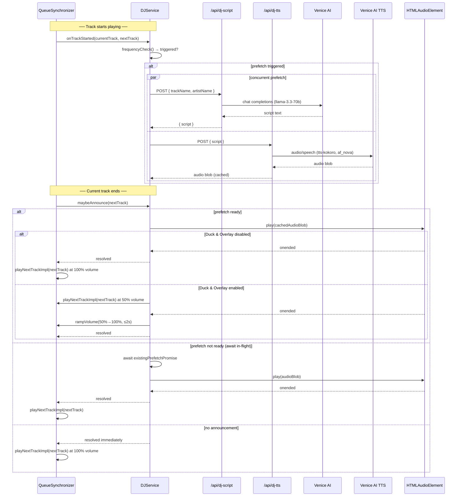

# Design Document: DJ Mode

## Overview

DJ Mode adds an optional AI-generated voice-over between tracks on the admin page. When enabled, the admin configures how often the DJ speaks via a frequency dropdown (Never / Rarely / Sometimes / Often / Always). Between each song, a short script is generated via the Venice AI API and converted to audio by Venice AI's own TTS endpoint (`/api/dj-tts`). Both the script and the audio are **prefetched concurrently while the current track is still playing**, so the voice plays immediately when the song ends with zero delay.

Two additional settings control playback behavior:

- **DJ Frequency** — a dropdown persisted to `localStorage["djFrequency"]` that maps to a probability (0%, 10%, 25%, 50%, 100%). Defaults to "Sometimes" (25%).
- **Duck & Overlay Mode** — an independent toggle persisted to `localStorage["duckOverlayMode"]`. When enabled, the next song starts immediately at 50% volume while the DJ voice plays simultaneously, then ramps to 100% over ≤ 2 seconds when the voice finishes.

The feature is entirely opt-in, degrades gracefully on any error, and the next track always plays regardless of what happens with the DJ announcement.

## Architecture

The feature spans four layers:

1. **UI layer** — `DJModeToggle`, `DJFrequencySelect`, and `DuckOverlayToggle` components in the dashboard tab that read/write `localStorage`.
2. **Script API layer** — `/api/dj-script` proxies Venice AI server-side (keeps `VENICE_AI_API_KEY` out of the browser).
3. **TTS API layer** — `/api/dj-tts` proxies Venice AI's TTS endpoint server-side (keeps `VENICE_AI_API_KEY` out of the browser), returning an audio blob.
4. **Service layer** — `DJService` singleton wired into `QueueSynchronizer.handleTrackFinishedImpl`. It starts prefetching at track-start and consumes the cached result at track-end.



### Key Design Decisions

- **Prefetch at track-start, consume at track-end** — `DJService.onTrackStarted` is called when a new track begins. It runs the frequency check and, if triggered, fires both the Venice AI and TTS API requests concurrently via `Promise.all`. The result is stored in a `prefetchPromise` field. At track-end, `maybeAnnounce` awaits that promise (already resolved or still in-flight) rather than issuing new requests.
- **Two server-side API routes** — `VENICE_AI_API_KEY` must not be exposed to the browser. `/api/dj-script` handles Venice AI chat completions; `/api/dj-tts` handles Venice AI TTS (model `tts-kokoro`, voice `af_nova`).
- **Duck & Overlay via Web Audio API** — The next track's `<audio>` element volume is set to 0.5 before playback starts. A `setInterval`-based ramp increments volume by a fixed step every 50 ms until it reaches 1.0, completing within 2 seconds.
- **Stale prefetch invalidation** — `DJService` stores the `trackId` of the next track it prefetched for. If `maybeAnnounce` is called with a different track, the cached data is discarded and the announcement is skipped.
- **`DJService` singleton** — Mirrors the pattern of `AutoPlayService` and `QueueManager`. Holds prefetch state and exposes `onTrackStarted` and `maybeAnnounce`.
- **Frequency mapping** — A static map converts the `djFrequency` string to a numeric threshold: `{ never: 0, rarely: 0.1, sometimes: 0.25, often: 0.5, always: 1.0 }`.

## Components and Interfaces

### `DJService` (`services/djService.ts`)

```typescript
type DJFrequency = 'never' | 'rarely' | 'sometimes' | 'often' | 'always'

const FREQUENCY_MAP: Record<DJFrequency, number> = {
  never: 0,
  rarely: 0.1,
  sometimes: 0.25,
  often: 0.5,
  always: 1.0
}

class DJService {
  static getInstance(): DJService

  // Called when a new track starts; triggers prefetch if frequency check passes
  onTrackStarted(
    currentTrack: JukeboxQueueItem,
    nextTrack: JukeboxQueueItem | null
  ): void

  // Called when the current track ends; awaits prefetch and plays audio
  // Never throws — all errors are caught internally
  async maybeAnnounce(nextTrack: JukeboxQueueItem): Promise<void>

  setEnabled(enabled: boolean): void
  isEnabled(): boolean

  getFrequency(): DJFrequency
  setFrequency(freq: DJFrequency): void

  isDuckOverlayEnabled(): boolean
  setDuckOverlay(enabled: boolean): void
}
```

**`onTrackStarted` logic:**

1. Re-read `localStorage["djMode"]`, `localStorage["djFrequency"]` (default `"sometimes"`).
2. If disabled or `Math.random() >= FREQUENCY_MAP[freq]` → clear any stale prefetch, return.
3. If `nextTrack` is null or has no name/artist → return.
4. Store `prefetchTrackId = nextTrack.id`.
5. Set `prefetchPromise = Promise.all([fetchScript(nextTrack), fetchTTSAudio(script)])` — note: script must resolve before TTS can start, so internally this is chained: fetch script → fetch audio, but both network calls are initiated as early as possible.
6. Catch all errors inside `prefetchPromise` and resolve to `null` on failure.

**`maybeAnnounce` logic:**

1. If `prefetchPromise` is null → return immediately (no announcement was scheduled).
2. If `nextTrack.id !== prefetchTrackId` → discard, return immediately.
3. Await `prefetchPromise` → get `audioBlob | null`.
4. If `audioBlob` is null → return immediately (prefetch failed).
5. Create `HTMLAudioElement` with `URL.createObjectURL(audioBlob)`.
6. If Duck & Overlay disabled: play audio, await `onended`, return.
7. If Duck & Overlay enabled: signal caller to start next track at 50% volume, play audio, await `onended`, ramp volume to 100% over ≤ 2 s, return.

### `/api/dj-script` route (`app/api/dj-script/route.ts`)

```
POST /api/dj-script
Body:     { trackName: string; artistName: string }
Response 200: { script: string }
Response 400: { error: string }   // missing fields
Response 500: { error: string }   // Venice AI failure or missing VENICE_AI_API_KEY
```

Reads `process.env.VENICE_AI_API_KEY`. Calls Venice AI chat completions with model `llama-3.3-70b` and a prompt instructing ≤ 3 sentences.

### `/api/dj-tts` route (`app/api/dj-tts/route.ts`)

```
POST /api/dj-tts
Body:     { text: string }
Response 200: audio/mpeg binary stream   // MP3 audio blob
Response 400: { error: string }          // missing text field
Response 500: { error: string }          // Venice AI TTS failure or missing VENICE_AI_API_KEY
```

Reads `process.env.VENICE_AI_API_KEY`. Forwards the script to `https://api.venice.ai/api/v1/audio/speech` using model `tts-kokoro` and voice `af_nova`. Returns the audio response to the client as `Content-Type: audio/mpeg`. This route already exists at `app/api/dj-tts/route.ts`.

### UI Components

#### `DJModeToggle` (`…/dashboard/components/dj-mode-toggle.tsx`)

```typescript
export function DJModeToggle(): JSX.Element
```

Checkbox labeled "DJ Mode". On mount reads `localStorage["djMode"]`. On change writes to `localStorage` and calls `DJService.getInstance().setEnabled(checked)`.

#### `DJFrequencySelect` (`…/dashboard/components/dj-frequency-select.tsx`)

```typescript
export function DJFrequencySelect(): JSX.Element
```

Dropdown with five options: Never / Rarely / Sometimes / Often / Always. Only rendered when DJ Mode is enabled. On mount reads `localStorage["djFrequency"]`, defaulting to `"sometimes"`. On change writes to `localStorage` and calls `DJService.getInstance().setFrequency(value)`.

#### `DuckOverlayToggle` (`…/dashboard/components/duck-overlay-toggle.tsx`)

```typescript
export function DuckOverlayToggle(): JSX.Element
```

Checkbox labeled "Duck & Overlay". Independent of DJ Mode toggle. On mount reads `localStorage["duckOverlayMode"]`. On change writes to `localStorage` and calls `DJService.getInstance().setDuckOverlay(checked)`.

### Hook points in `QueueSynchronizer`

```typescript
// When a new track starts:
DJService.getInstance().onTrackStarted(currentTrack, nextTrack)

// When the current track ends (existing hook point, unchanged):
const nextTrack = await this.findNextValidTrack(currentSpotifyTrackId)
if (nextTrack) {
  await DJService.getInstance().maybeAnnounce(nextTrack)
  await this.playNextTrackImpl(nextTrack)
}
```

## Data Models

### localStorage entries

| Key                 | Type   | Values                                                          | Default           |
| ------------------- | ------ | --------------------------------------------------------------- | ----------------- |
| `"djMode"`          | string | `"true"` / `"false"`                                            | absent = disabled |
| `"djFrequency"`     | string | `"never"` / `"rarely"` / `"sometimes"` / `"often"` / `"always"` | `"sometimes"`     |
| `"duckOverlayMode"` | string | `"true"` / `"false"`                                            | absent = disabled |

### `/api/dj-script` request / response

```typescript
interface DJScriptRequest {
  trackName: string
  artistName: string
}
interface DJScriptResponse {
  script: string
}
```

### `/api/dj-tts` request / response

```typescript
interface DJTTSRequest {
  text: string
}
// Response: binary audio/mpeg stream (no JSON wrapper)
```

### Venice AI request (internal to `/api/dj-script`)

```typescript
{
  model: "llama-3.3-70b",
  messages: [
    { role: "system", content: "You are an energetic radio DJ. Write a short announcement of no more than 3 sentences introducing the next track. Be enthusiastic but concise." },
    { role: "user",   content: `Introduce the next track: "${trackName}" by ${artistName}.` }
  ],
  max_tokens: 150
}
```

Venice AI base URL: `https://api.venice.ai/api/v1`

### DJService internal prefetch state

```typescript
interface PrefetchState {
  trackId: string // ID of the next track this prefetch is for
  promise: Promise<Blob | null> // resolves to audio blob or null on failure
}
```

## Correctness Properties

_A property is a characteristic or behavior that should hold true across all valid executions of a system — essentially, a formal statement about what the system should do. Properties serve as the bridge between human-readable specifications and machine-verifiable correctness guarantees._

### Property 1: DJ Mode localStorage round-trip

_For any_ boolean value written to `localStorage["djMode"]`, reading it back and rendering the `DJModeToggle` component should produce a checkbox whose checked state matches the written value.

**Validates: Requirements 1.2, 1.3, 1.4**

### Property 2: DJ Frequency gate uses correct probability threshold

_For any_ DJ frequency setting (`"never"`, `"rarely"`, `"sometimes"`, `"often"`, `"always"`) and any random value `r` in `[0, 1)`, `onTrackStarted` should trigger a prefetch if and only if DJ Mode is enabled AND `r < FREQUENCY_MAP[freq]`. For `"never"` no announcement should ever fire; for `"always"` every call should fire.

**Validates: Requirements 2.2, 2.6, 2.7**

### Property 3: Prompt contains track metadata

_For any_ `JukeboxQueueItem` with a non-empty track name and artist, the request body sent to the Venice AI API should contain both the track name and the artist name somewhere in the messages.

**Validates: Requirements 3.2**

### Property 4: Graceful fallback on any error

_For any_ error condition (Venice AI fetch failure, Venice AI TTS failure, missing `VENICE_AI_API_KEY`, prefetch failure, empty queue), `maybeAnnounce` should resolve without throwing, and the caller should proceed to play the next track normally.

**Validates: Requirements 2.8, 3.4, 3.5, 4.5, 4.6, 5.3, 6.5**

### Property 5: TTS audio sequencing respects Duck & Overlay mode

_For any_ generated DJ script, when Duck & Overlay Mode is **disabled**, `playNextTrackImpl` should not be called before the TTS audio `onended` event fires. When Duck & Overlay Mode is **enabled**, `playNextTrackImpl` should be called immediately (before `onended`) with the track volume set to 0.5.

**Validates: Requirements 4.3, 4.4, 8.5, 8.7**

### Property 6: DJ Frequency localStorage round-trip

_For any_ valid frequency value (`"never"` / `"rarely"` / `"sometimes"` / `"often"` / `"always"`), selecting it in `DJFrequencySelect` should persist it to `localStorage["djFrequency"]`, and re-mounting the component should display that same option as selected.

**Validates: Requirements 2.3, 2.4, 7.2, 7.3**

### Property 7: Prefetch fires during playback, not at track-end

_For any_ track transition where DJ Mode is enabled and the frequency check passes, the network requests to `/api/dj-script` and `/api/dj-tts` should be initiated during `onTrackStarted` (while the current track is playing), not during `maybeAnnounce` (at track-end).

**Validates: Requirements 6.1, 6.2**

### Property 8: No duplicate requests when prefetch is reused

_For any_ track transition where `onTrackStarted` has already initiated a prefetch for `nextTrack`, calling `maybeAnnounce(nextTrack)` should result in zero additional network requests to `/api/dj-script` or `/api/dj-tts` — whether the prefetch has already resolved or is still in-flight.

**Validates: Requirements 6.3, 6.4**

### Property 9: Stale prefetch is discarded on queue change

_For any_ scenario where `onTrackStarted` prefetches for track A but `maybeAnnounce` is called with track B (different ID), the prefetched audio for track A should be discarded and no announcement should play.

**Validates: Requirements 6.6**

### Property 10: Duck & Overlay localStorage round-trip

_For any_ boolean value written to `localStorage["duckOverlayMode"]`, reading it back and rendering the `DuckOverlayToggle` component should produce a toggle whose state matches the written value, independently of the DJ Mode toggle state.

**Validates: Requirements 8.2, 8.3, 8.4, 8.9**

### Property 11: Duck mode starts next track at 50% volume and ramps to 100%

_For any_ DJ announcement where Duck & Overlay Mode is enabled, the next track's audio element volume should be 0.5 at the moment playback starts, and should reach 1.0 within 2 seconds of the TTS audio `onended` event firing.

**Validates: Requirements 8.5, 8.6**

### Property 12: No-announcement invariant — full volume when no DJ fires

_For any_ track transition where no DJ announcement is triggered (DJ Mode disabled, frequency check fails, or prefetch fails), the next track should start at full volume (1.0) regardless of the Duck & Overlay Mode setting.

**Validates: Requirements 8.8**

## Error Handling

All errors in the DJ announcement path are non-fatal. The invariant is: **the next track always plays**.

| Error scenario                   | Handling                                                                                                            |
| -------------------------------- | ------------------------------------------------------------------------------------------------------------------- |
| `VENICE_AI_API_KEY` not set      | `/api/dj-script` and `/api/dj-tts` both return 500; prefetch resolves to `null`; `maybeAnnounce` skips announcement |
| Venice AI network timeout        | `fetch` rejects; prefetch resolves to `null`; `maybeAnnounce` skips announcement                                    |
| Venice AI returns non-200        | prefetch resolves to `null`; `maybeAnnounce` skips announcement                                                     |
| Venice AI returns empty script   | prefetch resolves to `null`; `maybeAnnounce` skips announcement                                                     |
| Venice AI TTS network timeout    | `fetch` rejects; prefetch resolves to `null`; `maybeAnnounce` skips announcement                                    |
| Venice AI TTS returns non-200    | prefetch resolves to `null`; `maybeAnnounce` skips announcement                                                     |
| Audio playback error (`onerror`) | `maybeAnnounce` catches, logs, returns; next track plays                                                            |
| Queue changed (stale prefetch)   | `maybeAnnounce` discards cached blob, returns immediately                                                           |
| Next track not in queue          | `maybeAnnounce` returns immediately                                                                                 |
| Duck & Overlay ramp interrupted  | Volume ramp is cancelled; next track continues at whatever volume it reached                                        |

Logging uses `console.warn` / `console.error` in the service layer, consistent with how other singleton services log outside the admin page context.

## Testing Strategy

### Unit tests

- `DJModeToggle` renders a checkbox with label "DJ Mode"
- `DJModeToggle` reads initial state from `localStorage` on mount
- `DJFrequencySelect` renders exactly five options: Never, Rarely, Sometimes, Often, Always
- `DJFrequencySelect` defaults to "Sometimes" when `localStorage["djFrequency"]` is absent
- `DuckOverlayToggle` renders a toggle labeled "Duck & Overlay"
- `DuckOverlayToggle` reads initial state from `localStorage` on mount
- `/api/dj-script` returns 500 when `VENICE_AI_API_KEY` is absent
- `/api/dj-script` returns 400 when request body is missing fields
- `/api/dj-script` sends `model: "llama-3.3-70b"` in the Venice AI request body
- `/api/dj-tts` returns 500 when `VENICE_AI_API_KEY` is absent
- `/api/dj-tts` returns 400 when `text` field is missing
- `/api/dj-tts` forwards the script to Venice AI TTS and streams the response

### Property-based tests

Uses [fast-check](https://github.com/dubzzz/fast-check). Each property test runs a minimum of 100 iterations.

**Property 1: DJ Mode localStorage round-trip**

```typescript
// Feature: dj-mode, Property 1: DJ Mode localStorage round-trip
fc.property(fc.boolean(), (enabled) => {
  localStorage.setItem("djMode", String(enabled))
  render(<DJModeToggle />)
  expect(screen.getByRole("checkbox")).toHaveProperty("checked", enabled)
})
```

**Property 2: DJ Frequency gate uses correct probability threshold**

```typescript
// Feature: dj-mode, Property 2: DJ Frequency gate uses correct probability threshold
const FREQ_MAP = {
  never: 0,
  rarely: 0.1,
  sometimes: 0.25,
  often: 0.5,
  always: 1.0
}
fc.property(
  fc.constantFrom('never', 'rarely', 'sometimes', 'often', 'always'),
  fc.float({ min: 0, max: 0.9999, noNaN: true }),
  fc.boolean(),
  async (freq, r, djEnabled) => {
    jest.spyOn(Math, 'random').mockReturnValue(r)
    localStorage.setItem('djMode', String(djEnabled))
    localStorage.setItem('djFrequency', freq)
    const fetchSpy = jest.spyOn(global, 'fetch')
    djService.onTrackStarted(mockCurrentTrack, mockNextTrack)
    const shouldPrefetch = djEnabled && r < FREQ_MAP[freq]
    expect(fetchSpy).toHaveBeenCalledTimes(shouldPrefetch ? 1 : 0)
  }
)
```

**Property 3: Prompt contains track metadata**

```typescript
// Feature: dj-mode, Property 3: Prompt contains track metadata
fc.property(
  fc.string({ minLength: 1 }),
  fc.string({ minLength: 1 }),
  async (trackName, artistName) => {
    const capturedBody = await captureVeniceRequest(trackName, artistName)
    const allContent = capturedBody.messages
      .map((m: { content: string }) => m.content)
      .join(' ')
    expect(allContent).toContain(trackName)
    expect(allContent).toContain(artistName)
  }
)
```

**Property 4: Graceful fallback on any error**

```typescript
// Feature: dj-mode, Property 4: Graceful fallback on any error
fc.property(
  fc.constantFrom(
    'fetch-script-error',
    'fetch-tts-error',
    'no-api-key',
    'audio-error'
  ),
  async (errorType) => {
    setupError(errorType)
    localStorage.setItem('djMode', 'true')
    jest.spyOn(Math, 'random').mockReturnValue(0.01) // always trigger
    await expect(djService.maybeAnnounce(mockTrack)).resolves.toBeUndefined()
  }
)
```

**Property 5: TTS audio sequencing respects Duck & Overlay mode**

```typescript
// Feature: dj-mode, Property 5: TTS audio sequencing respects Duck & Overlay mode
fc.property(fc.boolean(), async (duckEnabled) => {
  const order: string[] = []
  localStorage.setItem('duckOverlayMode', String(duckEnabled))
  mockTTSAudio({ onEndDelay: 50, onRecord: () => order.push('tts-end') })
  mockPlayNextTrack((vol: number) => order.push(`play:${vol}`))
  await runAnnouncementWithCachedAudio()
  if (duckEnabled) {
    expect(order[0]).toMatch(/^play:0\.5/)
    expect(order[1]).toBe('tts-end')
  } else {
    expect(order[0]).toBe('tts-end')
    expect(order[1]).toMatch(/^play:1/)
  }
})
```

**Property 6: DJ Frequency localStorage round-trip**

```typescript
// Feature: dj-mode, Property 6: DJ Frequency localStorage round-trip
fc.property(
  fc.constantFrom("never", "rarely", "sometimes", "often", "always"),
  (freq) => {
    localStorage.setItem("djFrequency", freq)
    render(<DJFrequencySelect />)
    expect(screen.getByRole("combobox")).toHaveValue(freq)
  }
)
```

**Property 7: Prefetch fires during playback, not at track-end**

```typescript
// Feature: dj-mode, Property 7: Prefetch fires during playback, not at track-end
fc.property(
  fc.record({
    id: fc.string(),
    name: fc.string({ minLength: 1 }),
    artist: fc.string({ minLength: 1 })
  }),
  (nextTrack) => {
    localStorage.setItem('djMode', 'true')
    localStorage.setItem('djFrequency', 'always')
    const fetchSpy = jest
      .spyOn(global, 'fetch')
      .mockResolvedValue(mockOkResponse())
    djService.onTrackStarted(mockCurrentTrack, nextTrack)
    // Fetch should have been called synchronously during onTrackStarted
    expect(fetchSpy).toHaveBeenCalled()
    // maybeAnnounce should NOT trigger additional fetches
    fetchSpy.mockClear()
    return djService.maybeAnnounce(nextTrack).then(() => {
      expect(fetchSpy).not.toHaveBeenCalled()
    })
  }
)
```

**Property 8: No duplicate requests when prefetch is reused**

```typescript
// Feature: dj-mode, Property 8: No duplicate requests when prefetch is reused
fc.property(fc.boolean(), async (prefetchComplete) => {
  const fetchSpy = jest.spyOn(global, 'fetch')
  if (prefetchComplete) {
    await djService.onTrackStarted(mockCurrentTrack, mockNextTrack) // let it resolve
  } else {
    djService.onTrackStarted(mockCurrentTrack, mockNextTrack) // don't await
  }
  fetchSpy.mockClear()
  await djService.maybeAnnounce(mockNextTrack)
  expect(fetchSpy).not.toHaveBeenCalled()
})
```

**Property 9: Stale prefetch is discarded on queue change**

```typescript
// Feature: dj-mode, Property 9: Stale prefetch is discarded on queue change
fc.property(
  fc.record({ id: fc.string({ minLength: 1 }) }),
  fc.record({ id: fc.string({ minLength: 1 }) }),
  async (trackA, trackB) => {
    fc.pre(trackA.id !== trackB.id)
    djService.onTrackStarted(mockCurrentTrack, { ...mockNextTrack, ...trackA })
    const audioSpy = jest.spyOn(HTMLAudioElement.prototype, 'play')
    await djService.maybeAnnounce({ ...mockNextTrack, ...trackB })
    expect(audioSpy).not.toHaveBeenCalled()
  }
)
```

**Property 10: Duck & Overlay localStorage round-trip**

```typescript
// Feature: dj-mode, Property 10: Duck & Overlay localStorage round-trip
fc.property(fc.boolean(), fc.boolean(), (duckEnabled, djEnabled) => {
  localStorage.setItem("duckOverlayMode", String(duckEnabled))
  localStorage.setItem("djMode", String(djEnabled))
  render(<DuckOverlayToggle />)
  expect(screen.getByRole("checkbox")).toHaveProperty("checked", duckEnabled)
  // DJ Mode toggle state should be independent
  render(<DJModeToggle />)
  expect(screen.getByRole("checkbox")).toHaveProperty("checked", djEnabled)
})
```

**Property 11: Duck mode starts next track at 50% volume and ramps to 100%**

```typescript
// Feature: dj-mode, Property 11: Duck mode starts next track at 50% volume and ramps to 100%
fc.property(fc.integer({ min: 50, max: 2000 }), async (rampDurationMs) => {
  jest.useFakeTimers()
  localStorage.setItem('duckOverlayMode', 'true')
  const volumeAtStart = await captureVolumeAtPlayStart()
  expect(volumeAtStart).toBe(0.5)
  // Simulate TTS ending and advance timers by 2s
  triggerTTSEnd()
  jest.advanceTimersByTime(2000)
  expect(captureCurrentVolume()).toBe(1.0)
  jest.useRealTimers()
})
```

**Property 12: No-announcement invariant — full volume when no DJ fires**

```typescript
// Feature: dj-mode, Property 12: No-announcement invariant — full volume when no DJ fires
fc.property(fc.boolean(), async (duckEnabled) => {
  localStorage.setItem('duckOverlayMode', String(duckEnabled))
  localStorage.setItem('djMode', 'false') // DJ disabled → no announcement
  const volumeAtStart = await captureVolumeAtPlayStart()
  expect(volumeAtStart).toBe(1.0)
})
```
