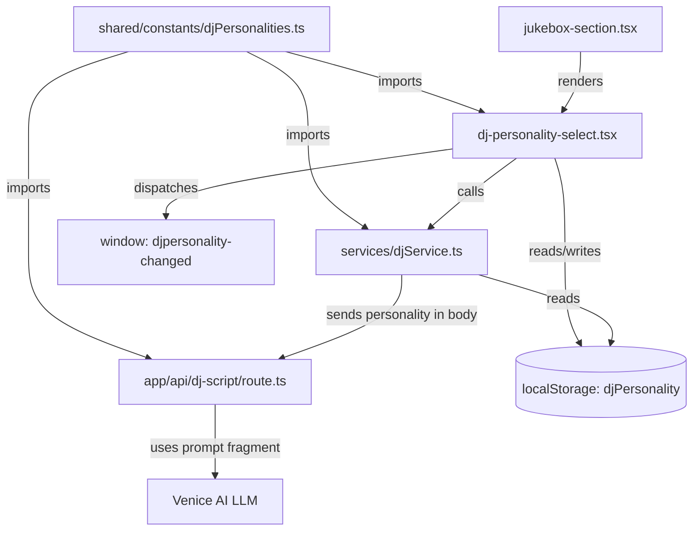

# Design Document: DJ Personality Options

## Overview

This feature adds 6 selectable DJ personality options that alter the tone and style of AI-generated voice announcements between tracks. The current English system prompt hardcodes a "laid back, relaxed and chill DJ" personality. This design introduces a shared constants file defining personality options, a selector UI component in the admin dashboard, localStorage persistence, and prompt injection into the script generation API.

The architecture follows the exact same pattern already established by the DJ Voice feature: shared constants → UI selector component → localStorage persistence → DJService reads and transmits → API route consumes.

## Architecture



The data flow is:

1. `djPersonalities.ts` defines 6 personalities with IDs, labels, and prompt fragments
2. `dj-personality-select.tsx` renders toggle buttons, persists selection to localStorage, dispatches `djpersonality-changed` event, and calls `DJService.invalidatePrefetch()`
3. `DJService._doFetchAudioBlob()` reads `djPersonality` from localStorage and includes it in the `/api/dj-script` request body
4. `/api/dj-script/route.ts` imports personality constants, validates the received personality ID, and substitutes the prompt fragment into the English system prompt
5. Vietnamese requests are unaffected — they continue using the fixed Vietnamese prompt

## Components and Interfaces

### 1. `shared/constants/djPersonalities.ts`

Follows the same structure as `djVoices.ts`:

```typescript
export interface DJPersonalityOption {
  value: string
  label: string
  prompt: string
}

export const DEFAULT_DJ_PERSONALITY = 'chill'

export const DJ_PERSONALITIES: DJPersonalityOption[] = [
  { value: 'chill', label: 'Chill', prompt: 'laid back, relaxed and chill' },
  {
    value: 'hype',
    label: 'Hype',
    prompt: 'high-energy, enthusiastic and hype'
  },
  {
    value: 'smooth',
    label: 'Smooth',
    prompt: 'smooth, suave and sophisticated'
  },
  { value: 'witty', label: 'Witty', prompt: 'witty, clever and humorous' },
  {
    value: 'old-school',
    label: 'Old School',
    prompt: 'old-school, nostalgic and classic radio-style'
  },
  {
    value: 'storyteller',
    label: 'Storyteller',
    prompt: 'storytelling, narrative-driven and insightful'
  }
]

export const DJ_PERSONALITY_IDS = DJ_PERSONALITIES.map((p) => p.value)
```

Exports: `DJPersonalityOption`, `DEFAULT_DJ_PERSONALITY`, `DJ_PERSONALITIES`, `DJ_PERSONALITY_IDS`

### 2. `dj-personality-select.tsx`

A `'use client'` component following the exact pattern of `dj-voice-select.tsx`:

- State: `djEnabled`, `language`, `personality`
- `useEffect` syncs from localStorage and listens for `djmode-changed`, `djlanguage-changed`, `djpersonality-changed` events
- Returns `null` when `!djEnabled || language !== 'english'`
- `handleSelect(value)`: sets state, writes to `localStorage('djPersonality')`, calls `DJService.getInstance().invalidatePrefetch()`, dispatches `djpersonality-changed`
- Renders toggle buttons with the same green active / gray inactive styling

### 3. `services/djService.ts` changes

In `_doFetchAudioBlob()`, after reading `djLanguage` and `djVoice`, also read `djPersonality` from localStorage:

```typescript
const rawPersonality = localStorage.getItem('djPersonality')
const resolvedPersonality =
  typeof rawPersonality === 'string' &&
  DJ_PERSONALITY_IDS.includes(rawPersonality)
    ? rawPersonality
    : DEFAULT_DJ_PERSONALITY
```

Include `personality: resolvedPersonality` in the `/api/dj-script` request body (only matters for English; the API ignores it for Vietnamese).

### 4. `app/api/dj-script/route.ts` changes

Import `DJ_PERSONALITY_IDS`, `DEFAULT_DJ_PERSONALITY`, and `DJ_PERSONALITIES` from the constants file.

Extract `personality` from the request body. Resolve it:

```typescript
const resolvedPersonality =
  typeof personality === 'string' && DJ_PERSONALITY_IDS.includes(personality)
    ? personality
    : DEFAULT_DJ_PERSONALITY

const personalityPrompt = DJ_PERSONALITIES.find(
  (p) => p.value === resolvedPersonality
)!.prompt
```

Replace the hardcoded `"laid back, relaxed and chill DJ"` in the English system prompt with `${personalityPrompt} DJ`.

Vietnamese prompt remains completely untouched.

### 5. `jukebox-section.tsx` changes

Import and render `<DJPersonalitySelect />` between `<DJVoiceSelect />` and `<DuckOverlayToggle />`.

## Data Models

### localStorage keys

| Key             | Type                      | Default              | Description             |
| --------------- | ------------------------- | -------------------- | ----------------------- |
| `djPersonality` | `string` (personality ID) | `'chill'` (implicit) | Selected DJ personality |

### API request body addition (`/api/dj-script`)

| Field         | Type     | Required | Description                                                |
| ------------- | -------- | -------- | ---------------------------------------------------------- |
| `personality` | `string` | No       | Personality ID. Falls back to `'chill'` if missing/invalid |

### Constants data shape

```typescript
interface DJPersonalityOption {
  value: string // unique ID, e.g. 'chill'
  label: string // display label, e.g. 'Chill'
  prompt: string // tone description injected into system prompt
}
```

## Correctness Properties

_A property is a characteristic or behavior that should hold true across all valid executions of a system — essentially, a formal statement about what the system should do. Properties serve as the bridge between human-readable specifications and machine-verifiable correctness guarantees._

### Property 1: Personality ID list consistency

_For any_ personality in the `DJ_PERSONALITIES` array, its `value` field must appear in the `DJ_PERSONALITY_IDS` list, and the length of `DJ_PERSONALITY_IDS` must equal the length of `DJ_PERSONALITIES`. Conversely, _for any_ ID in `DJ_PERSONALITY_IDS`, there must exist a corresponding entry in `DJ_PERSONALITIES`.

**Validates: Requirements 1.3**

### Property 2: Personality resolution round-trip

_For any_ valid personality ID (one that exists in `DJ_PERSONALITY_IDS`), storing it in localStorage under `djPersonality` and then resolving it should return that same ID. _For any_ string that is not a valid personality ID (or when the key is absent), resolving should return `DEFAULT_DJ_PERSONALITY`.

**Validates: Requirements 3.1, 3.2**

### Property 3: Selector visibility

_For any_ combination of `djMode` (boolean) and `djLanguage` (string), the personality selector renders if and only if `djMode` is `true` AND `djLanguage` is `'english'`. In all other cases, it must not render.

**Validates: Requirements 2.1, 2.2, 5.2, 5.3, 6.2**

### Property 4: Selection persists and invalidates prefetch

_For any_ personality ID from `DJ_PERSONALITIES`, selecting it must: (a) write that ID to `localStorage('djPersonality')`, (b) dispatch a `djpersonality-changed` event on `window`, and (c) call `DJService.invalidatePrefetch()`.

**Validates: Requirements 2.3, 2.4, 6.1**

### Property 5: English prompt contains resolved personality fragment

_For any_ personality value (valid ID, invalid string, or missing), the English system prompt constructed by the script generator must contain the prompt fragment of the resolved personality — the matching personality if valid, or the default (`'chill'`) personality otherwise. The hardcoded phrase "laid back, relaxed and chill" must not appear when a non-chill personality is selected.

**Validates: Requirements 4.1, 4.2, 4.4**

### Property 6: Vietnamese prompt isolation

_For any_ personality value (valid or invalid), when the language is `'vietnamese'`, the system prompt must be the fixed Vietnamese prompt and must not contain any English personality prompt fragment.

**Validates: Requirements 4.3**

## Error Handling

| Scenario                                                   | Handling                                                                                                                 |
| ---------------------------------------------------------- | ------------------------------------------------------------------------------------------------------------------------ |
| `localStorage('djPersonality')` is missing                 | Fall back to `DEFAULT_DJ_PERSONALITY` (`'chill'`)                                                                        |
| `localStorage('djPersonality')` contains an invalid string | Fall back to `DEFAULT_DJ_PERSONALITY`                                                                                    |
| `/api/dj-script` receives missing `personality` field      | Use `DEFAULT_DJ_PERSONALITY` prompt fragment                                                                             |
| `/api/dj-script` receives invalid `personality` value      | Use `DEFAULT_DJ_PERSONALITY` prompt fragment                                                                             |
| `DJ_PERSONALITIES.find()` returns undefined (defensive)    | Not possible if validation uses `DJ_PERSONALITY_IDS.includes()` first, but the default constant provides a safe fallback |

All error handling follows the existing pattern: invalid or missing values silently fall back to defaults. No user-facing error messages are needed since personality selection is a non-critical preference.

## Testing Strategy

### Property-Based Testing

- Library: `fast-check` (already used in the project, see `shared/constants/__tests__/aiSuggestion.test.ts`)
- Test runner: Node.js built-in test runner (`node:test`) via `tsx --test`
- Minimum 100 iterations per property test (`{ numRuns: 100 }`)
- Each property test must reference its design property with a comment tag:
  `// Feature: dj-personality-options, Property {N}: {title}`
- Each correctness property must be implemented by a single property-based test

### Unit Tests

Unit tests cover specific examples and edge cases not suited for property-based testing:

- Constants file exports exactly 6 personalities (Req 1.1)
- Default personality ID is `'chill'` (Req 1.2)
- Default personality is in the first position or matches expected value (Req 2.5)
- Jukebox section renders personality selector between voice selector and duck overlay toggle (Req 5.1)

### Test File Locations

| Test                              | Location                                                                |
| --------------------------------- | ----------------------------------------------------------------------- |
| Constants properties + unit tests | `shared/constants/__tests__/djPersonalities.test.ts`                    |
| API route prompt construction     | `app/api/dj-script/__tests__/route.test.ts` (extend existing or create) |

### Dual Testing Approach

- Property tests verify universal properties across all inputs (Properties 1–6)
- Unit tests verify specific examples, edge cases, and structural requirements
- Both are complementary: property tests catch general correctness issues across randomized inputs, unit tests pin down specific expected values
