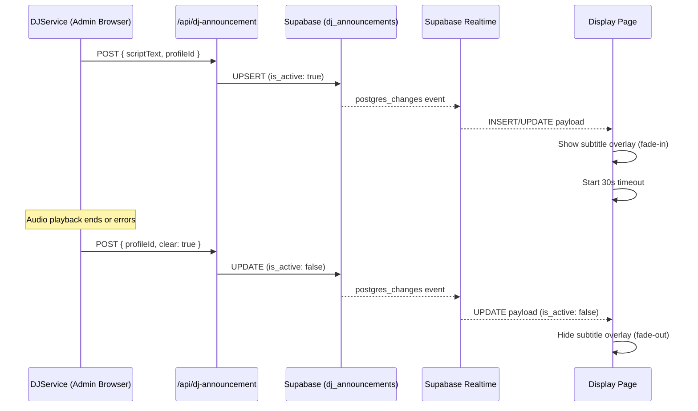

# Design Document: DJ Subtitles

## Overview

DJ Subtitles bridges the gap between the admin-side DJService (which generates and plays AI DJ announcements) and the public display page. Currently, the DJ script text only exists in the admin browser's memory. This feature persists announcement text to Supabase, pushes it to the display page via Supabase Realtime (`postgres_changes`), and renders it as a fade-in/fade-out subtitle overlay positioned at the bottom of the display viewport.

The data flow is:

1. DJService generates script → calls `/api/dj-announcement` to persist text as active
2. Supabase Realtime pushes the change to the display page
3. Display page renders the subtitle overlay with Framer Motion animations
4. When audio ends (or errors), DJService calls `/api/dj-announcement` to mark inactive
5. Display page receives the inactive update and fades out the subtitle
6. A 30-second client-side timeout acts as a safety net if the clear signal is lost



## Architecture

### System Components

The feature adds four new pieces to the existing architecture:

1. **API Route** (`app/api/dj-announcement/route.ts`) — Server-side endpoint that accepts script text or clear signals and upserts the `dj_announcements` table using `supabaseAdmin`.

2. **Database Table** (`dj_announcements`) — Single-row-per-venue table with a unique constraint on `profile_id`. Enabled for Supabase Realtime publication.

3. **React Hook** (`hooks/useDjSubtitles.ts`) — Subscribes to `postgres_changes` on `dj_announcements` filtered by `profile_id`. Manages subtitle text state and the 30-second safety timeout.

4. **UI Component** (`components/Display/SubtitleOverlay.tsx`) — Framer Motion `AnimatePresence` component that renders the subtitle text with fade-in/fade-out transitions, positioned at bottom-center above the QR code.

### Integration Points

- **DJService** (`services/djService.ts`) — Modified to call `/api/dj-announcement` after script generation succeeds (to set active) and when audio playback ends or errors (to clear). These calls are fire-and-forget to avoid blocking audio playback.

- **Display Page** (`app/[username]/display/page.tsx`) — Adds the `useDjSubtitles` hook and renders `SubtitleOverlay` in the existing layout.

- **Supabase Client** (`lib/supabase.ts`) — The existing anon client is reused for realtime subscriptions on the display page (same pattern as `usePlaylistData`).

### Design Decisions

- **Upsert with unique `profile_id`**: Each venue has at most one row. This avoids unbounded table growth and simplifies the realtime subscription (filter on `profile_id`, listen for any change).

- **Fire-and-forget from DJService**: The announcement API calls in DJService use `.catch(() => {})` so that network failures never block or delay DJ audio playback. The 30-second timeout on the display side handles the case where a clear signal is lost.

- **Server-side writes via `supabaseAdmin`**: The API route uses the service-role client to bypass RLS for writes, matching the existing pattern in `app/api/tracks/upsert/route.ts`. The display page reads via the anon client with a public SELECT RLS policy.

- **No Zustand store**: The subtitle state is local to the display page and doesn't need to be shared across components. A simple hook with `useState` is sufficient.

## Components and Interfaces

### API Route: `/api/dj-announcement`

**File**: `app/api/dj-announcement/route.ts`

```typescript
// POST handler
interface DjAnnouncementRequest {
  profileId: string // UUID of the venue profile
  scriptText?: string // The DJ script text (omit when clearing)
  clear?: boolean // When true, marks the announcement as inactive
}

// Response: 200 on success, 400 on validation error, 500 on DB error
interface DjAnnouncementResponse {
  success: boolean
  error?: string
}
```

Validation rules:

- `profileId` is required and must be a non-empty string
- Either `scriptText` (non-empty string) or `clear: true` must be provided
- If both are provided, `clear` takes precedence

### React Hook: `useDjSubtitles`

**File**: `hooks/useDjSubtitles.ts`

```typescript
interface UseDjSubtitlesOptions {
  profileId: string | null
}

interface UseDjSubtitlesResult {
  subtitleText: string | null // null when no active subtitle
  isVisible: boolean // controls AnimatePresence
}

function useDjSubtitles(options: UseDjSubtitlesOptions): UseDjSubtitlesResult
```

Behavior:

- Subscribes to `postgres_changes` on `dj_announcements` filtered by `profile_id`
- On active announcement: sets `subtitleText` and `isVisible = true`, starts 30s timeout
- On inactive announcement or timeout: sets `isVisible = false`, then clears `subtitleText` after fade-out completes
- Cleans up subscription and timeout on unmount

### UI Component: `SubtitleOverlay`

**File**: `components/Display/SubtitleOverlay.tsx`

```typescript
interface SubtitleOverlayProps {
  text: string | null
  isVisible: boolean
}
```

Rendering:

- Uses Framer Motion `AnimatePresence` with `motion.div` for fade-in/fade-out
- Positioned `fixed` at bottom-center, above the QR code (`bottom: 6rem`)
- Semi-transparent dark background panel (`bg-black/70`)
- White text, minimum `2rem` font size, text shadow for contrast
- Max width constrained with `line-clamp` or natural wrapping

### DJService Modifications

**File**: `services/djService.ts`

Two new fire-and-forget calls added:

1. In `_doFetchAudioBlob` — after successfully receiving the script from `/api/dj-script`, call `/api/dj-announcement` with the script text and profile ID to set it active.

2. In `playAudioBlob` — on `audio.onended` and `audio.onerror`, call `/api/dj-announcement` with `clear: true` to mark inactive.

The profile ID is read from `localStorage` (same pattern as other admin settings like `djMode`, `djFrequency`).

## Data Models

### `dj_announcements` Table

```sql
CREATE TABLE public.dj_announcements (
  id UUID PRIMARY KEY DEFAULT gen_random_uuid(),
  profile_id UUID NOT NULL REFERENCES public.profiles(id) ON DELETE CASCADE,
  script_text TEXT NOT NULL DEFAULT '',
  is_active BOOLEAN NOT NULL DEFAULT false,
  created_at TIMESTAMPTZ NOT NULL DEFAULT now(),
  updated_at TIMESTAMPTZ NOT NULL DEFAULT now(),
  CONSTRAINT dj_announcements_profile_id_key UNIQUE (profile_id)
);

-- RLS: public read, service-role write
ALTER TABLE public.dj_announcements ENABLE ROW LEVEL SECURITY;

CREATE POLICY "Public read access to dj_announcements"
  ON public.dj_announcements FOR SELECT USING (true);

CREATE POLICY "Service role write access to dj_announcements"
  ON public.dj_announcements FOR ALL USING (true);

-- Enable realtime
ALTER PUBLICATION supabase_realtime ADD TABLE public.dj_announcements;
```

### Realtime Subscription Filter

The display page subscribes with:

```typescript
supabase
  .channel(`dj_announcements_${profileId}`)
  .on(
    'postgres_changes',
    {
      event: '*',
      schema: 'public',
      table: 'dj_announcements',
      filter: `profile_id=eq.${profileId}`
    },
    callback
  )
  .subscribe()
```

## Correctness Properties

_A property is a characteristic or behavior that should hold true across all valid executions of a system — essentially, a formal statement about what the system should do. Properties serve as the bridge between human-readable specifications and machine-verifiable correctness guarantees._

### Property 1: Invalid announcement requests are rejected

_For any_ request body where `profileId` is missing/empty OR neither a non-empty `scriptText` nor `clear: true` is provided, the announcement API validation function shall return an error result and never produce a database payload.

**Validates: Requirements 1.3**

### Property 2: Announcement API payload construction

_For any_ valid profile ID and either a non-empty script text (set action) or a clear flag (clear action), the API payload construction function shall produce a Supabase upsert object where: `profile_id` equals the input profile ID, `is_active` is `true` when setting and `false` when clearing, and `script_text` equals the input text when setting or empty string when clearing.

**Validates: Requirements 1.2, 2.3**

### Property 3: Realtime payload maps to visibility state

_For any_ Supabase realtime payload from the `dj_announcements` table containing a `script_text` string and an `is_active` boolean, the subtitle hook's derived state shall have `isVisible` equal to the payload's `is_active` value, and `subtitleText` equal to the payload's `script_text` when active or `null` when inactive.

**Validates: Requirements 3.2, 3.3**

### Property 4: Subtitle auto-hides after timeout

_For any_ active announcement, if no clear signal (inactive update) is received within 30 seconds, the subtitle hook shall set `isVisible` to `false` automatically.

**Validates: Requirements 5.1, 5.2**

### Property 5: New announcement resets timeout

_For any_ sequence of two active announcements received within 30 seconds of each other, the timeout shall be reset by the second announcement, so the subtitle remains visible for 30 seconds from the most recent announcement rather than from the first.

**Validates: Requirements 5.3**

## Error Handling

### API Route Errors

| Scenario                                 | Response                 | Client Impact                           |
| ---------------------------------------- | ------------------------ | --------------------------------------- |
| Missing/invalid `profileId`              | 400 with error message   | DJService logs warning, audio continues |
| Missing `scriptText` and no `clear` flag | 400 with error message   | DJService logs warning, audio continues |
| Supabase write failure                   | 500 with error message   | DJService logs warning, audio continues |
| Unexpected server error                  | 500 with generic message | DJService logs warning, audio continues |

### DJService Error Handling

- All `/api/dj-announcement` calls are fire-and-forget (`.catch(() => {})`)
- Announcement failures never block, delay, or interrupt DJ audio playback
- Errors are logged via the existing DJService `warn()` function

### Display Page Error Handling

- If the Supabase Realtime subscription fails to connect, subtitles simply don't appear — the display page continues to function normally
- The 30-second timeout ensures stale subtitles are cleared even if the clear signal is lost due to network issues, admin browser closing, or API failures
- If `profileId` is not available (no venue found), the hook skips subscription setup

## Testing Strategy

### Property-Based Tests (fast-check)

The project already uses `fast-check` with the Node.js built-in test runner (`node:test`). Each correctness property above maps to a property-based test with a minimum of 100 iterations.

**Test files and their properties:**

1. `app/api/dj-announcement/__tests__/route.test.ts`

   - Property 1: Invalid request rejection — generate random invalid request bodies and verify validation rejects them
   - Property 2: Payload construction — generate random valid profile IDs and script texts, verify correct upsert payloads

2. `hooks/__tests__/useDjSubtitles.test.ts`
   - Property 3: Realtime payload mapping — generate random payloads with varying `is_active` and `script_text`, verify derived state
   - Property 4: Timeout auto-hide — verify that after activation without a clear signal, visibility becomes false (using fake timers)
   - Property 5: Timeout reset — generate sequences of active announcements and verify timeout resets

**Tag format:** `Feature: dj-subtitles, Property {N}: {title}`

### Unit Tests

Unit tests complement property tests for specific examples, integration points, and edge cases:

- API route: test actual HTTP handler with mocked `supabaseAdmin` for set, clear, and error scenarios
- DJService integration: verify that `_doFetchAudioBlob` calls `/api/dj-announcement` after successful script fetch (mocked fetch)
- DJService clear: verify that `playAudioBlob` calls clear on `onended` and `onerror` events
- SubtitleOverlay component: snapshot/render test verifying the component renders text when visible and nothing when hidden

### Test Configuration

- Runner: `node:test` via `tsx --test`
- PBT library: `fast-check` (already a project dependency)
- Minimum iterations: 100 per property (`{ numRuns: 100 }`)
- Fake timers for timeout-related tests
- Mocked `supabase` client for realtime subscription tests
