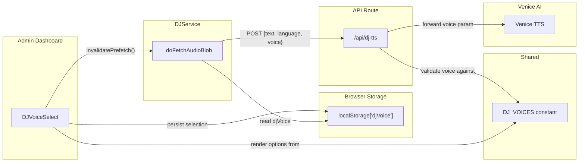

# Design Document: DJ Voice Selection

## Overview

DJ Voice Selection adds a voice picker to the admin dashboard that lets the operator choose which `tts-kokoro` voice is used for English DJ announcements. Today the voice is hardcoded to `af_nova` in the `/api/dj-tts` route. This feature replaces that constant with a configurable value that flows from a new `DJVoiceSelect` UI component → `localStorage["djVoice"]` → `DJService` → `/api/dj-tts` → Venice AI TTS.

The voice list is defined once in a shared constant (`shared/constants/djVoices.ts`) and consumed by both the UI component and the API route for validation. Changing the voice invalidates any in-flight prefetch so the next announcement uses the new voice immediately.

Vietnamese TTS is unaffected — it continues to use `tts-qwen3-0-6b` with voice `Vivian` regardless of the `djVoice` setting.

## Architecture

The feature touches three layers, all of which already exist. No new layers or services are introduced.

1. **Shared constant** — `shared/constants/djVoices.ts` exports `DJ_VOICES` (the voice list) and `DEFAULT_DJ_VOICE`. Both the UI and the API route import from here.
2. **UI layer** — New `DJVoiceSelect` component in the dashboard tab, following the same pattern as `DJLanguageSelect` and `DJFrequencySelect` (button-style selector, localStorage persistence, custom event dispatch, prefetch invalidation).
3. **Service layer** — `DJService._doFetchAudioBlob` reads `localStorage["djVoice"]` and includes it in the request body to `/api/dj-tts`.
4. **API layer** — `/api/dj-tts/route.ts` reads the `voice` field from the request body, validates it against `DJ_VOICES`, falls back to `DEFAULT_DJ_VOICE` if invalid or missing, and forwards it to Venice AI.



### Key Design Decisions

- **Single source of truth for voices** — `shared/constants/djVoices.ts` is imported by both client and server code. Adding or removing a voice requires editing only this file.
- **Follows existing component pattern** — `DJVoiceSelect` mirrors `DJLanguageSelect` exactly: button-style pills, `localStorage` read on mount, custom event listener for `djmode-changed`, prefetch invalidation on change. This keeps the dashboard settings area visually and architecturally consistent.
- **Server-side validation with fallback** — The TTS route validates the incoming voice against the allowed list and silently falls back to `af_nova` if invalid. This prevents a corrupted localStorage value from breaking announcements.
- **No new localStorage event** — Voice changes dispatch `djvoice-changed` as a custom event (same pattern as `djmode-changed`) so the component re-syncs if multiple tabs are open. `DJService.invalidatePrefetch()` is called directly on selection, same as the language selector.
- **Vietnamese path untouched** — The `isVietnamese` branch in the TTS route is unchanged. The `voice` field is only read and forwarded when `language !== 'vietnamese'`.

## Components and Interfaces

### `shared/constants/djVoices.ts`

```typescript
export interface DJVoiceOption {
  value: string // voice identifier sent to Venice AI (e.g. 'af_nova')
  label: string // human-readable display label (e.g. 'Nova')
}

export const DEFAULT_DJ_VOICE = 'af_nova'

export const DJ_VOICES: DJVoiceOption[] = [
  { value: 'af_nova', label: 'Nova' },
  { value: 'af_heart', label: 'Heart' },
  { value: 'af_bella', label: 'Bella' },
  { value: 'af_nicole', label: 'Nicole' },
  { value: 'af_sarah', label: 'Sarah' },
  { value: 'af_sky', label: 'Sky' },
  { value: 'am_adam', label: 'Adam' },
  { value: 'am_michael', label: 'Michael' }
]

export const DJ_VOICE_IDS = DJ_VOICES.map((v) => v.value)
```

### `DJVoiceSelect` (`app/[username]/admin/components/dashboard/components/dj-voice-select.tsx`)

```typescript
export function DJVoiceSelect(): JSX.Element
```

Button-style selector, identical layout to `DJLanguageSelect` and `DJFrequencySelect`. Visible only when DJ Mode is enabled AND DJ Language is English.

**Mount behavior:**

1. Read `localStorage["djMode"]`, `localStorage["djLanguage"]`, `localStorage["djVoice"]`.
2. If `djVoice` is missing or not in `DJ_VOICE_IDS`, default to `DEFAULT_DJ_VOICE`.
3. Listen for `storage`, `djmode-changed`, and `djvoice-changed` events to re-sync.

**Selection behavior:**

1. Set local state.
2. Write to `localStorage["djVoice"]`.
3. Call `DJService.getInstance().invalidatePrefetch()`.
4. Dispatch `window.dispatchEvent(new Event('djvoice-changed'))`.

### Changes to `DJService` (`services/djService.ts`)

**`_doFetchAudioBlob`** — After reading `djLanguage`, also read `localStorage["djVoice"]`. Validate against `DJ_VOICE_IDS`; fall back to `DEFAULT_DJ_VOICE` if invalid. Include `voice` in the POST body to `/api/dj-tts`:

```typescript
body: JSON.stringify({ text: data.script, language, voice: resolvedVoice })
```

No other methods on `DJService` change. The existing `invalidatePrefetch()` method is already sufficient.

### Changes to `/api/dj-tts` route (`app/api/dj-tts/route.ts`)

1. Import `DJ_VOICE_IDS` and `DEFAULT_DJ_VOICE` from `@/shared/constants/djVoices`.
2. Extract `voice` from the request body alongside `text` and `language`.
3. For English requests: validate `voice` against `DJ_VOICE_IDS`. If missing or invalid, use `DEFAULT_DJ_VOICE`. Forward the resolved voice to Venice AI.
4. For Vietnamese requests: ignore `voice` entirely, continue using `Vivian`.

```typescript
const resolvedVoice =
  typeof voice === 'string' && DJ_VOICE_IDS.includes(voice)
    ? voice
    : DEFAULT_DJ_VOICE
```

### Dashboard integration

Export `DJVoiceSelect` from the dashboard components `index.ts` barrel file. Render it in the DJ settings area of the dashboard tab, after the language selector and before the frequency selector.

## Data Models

### localStorage entries (new)

| Key         | Type   | Values                                         | Default            |
| ----------- | ------ | ---------------------------------------------- | ------------------ |
| `"djVoice"` | string | Any value from `DJ_VOICE_IDS` (e.g. `af_nova`) | absent = `af_nova` |

### `/api/dj-tts` request body (updated)

```typescript
interface DJTTSRequest {
  text: string
  language?: 'english' | 'vietnamese'
  voice?: string // new — English voice identifier, validated server-side
}
```

### `DJVoiceOption` type (new)

```typescript
interface DJVoiceOption {
  value: string // voice identifier
  label: string // display label
}
```

## Correctness Properties

_A property is a characteristic or behavior that should hold true across all valid executions of a system — essentially, a formal statement about what the system should do. Properties serve as the bridge between human-readable specifications and machine-verifiable correctness guarantees._

### Property 1: Voice selector visibility depends on DJ Mode and language

_For any_ combination of `djMode` (true/false) and `djLanguage` (english/vietnamese), the `DJVoiceSelect` component should render its voice options if and only if `djMode` is `"true"` AND `djLanguage` is `"english"` (or absent, since English is the default).

**Validates: Requirements 1.1, 1.6, 1.7**

### Property 2: Voice localStorage round-trip

_For any_ voice identifier in `DJ_VOICE_IDS`, writing it to `localStorage["djVoice"]` and then mounting the `DJVoiceSelect` component should display that voice as the selected option. When `localStorage["djVoice"]` is absent, the component should show `af_nova` as selected.

**Validates: Requirements 1.3, 1.4, 1.5**

### Property 3: DJService includes resolved voice in TTS request

_For any_ valid voice identifier stored in `localStorage["djVoice"]`, when `DJService._doFetchAudioBlob` sends a request to `/api/dj-tts`, the request body should contain a `voice` field matching that identifier. When `localStorage["djVoice"]` is absent or invalid, the request body should contain `af_nova`.

**Validates: Requirements 2.1, 2.2**

### Property 4: TTS route forwards valid English voice to Venice AI

_For any_ voice identifier that is a member of `DJ_VOICE_IDS`, when the `/api/dj-tts` route receives a request with `language` not equal to `"vietnamese"` and that voice value, the outgoing request to Venice AI should contain that exact voice in the `voice` parameter.

**Validates: Requirements 2.3, 2.4**

### Property 5: Vietnamese TTS ignores voice field

_For any_ string value in the `voice` field (valid, invalid, or absent), when the `/api/dj-tts` route receives a request with `language` set to `"vietnamese"`, the outgoing request to Venice AI should use voice `Vivian` and model `tts-qwen3-0-6b`, regardless of the `voice` field.

**Validates: Requirements 2.5**

### Property 6: Voice change triggers prefetch invalidation and custom event

_For any_ voice selected in the `DJVoiceSelect` component, the selection handler should call `DJService.getInstance().invalidatePrefetch()` and dispatch a `djvoice-changed` custom event on `window`.

**Validates: Requirements 3.1, 3.2**

### Property 7: TTS route falls back to default for invalid English voice

_For any_ string that is not a member of `DJ_VOICE_IDS`, when the `/api/dj-tts` route receives an English request with that string as the `voice` field, the outgoing request to Venice AI should use `af_nova` as the voice.

**Validates: Requirements 4.3, 4.4**

### Property 8: DJService falls back to default for corrupted localStorage voice

_For any_ arbitrary string stored in `localStorage["djVoice"]` that is not a member of `DJ_VOICE_IDS`, the voice resolved by `DJService` should be `af_nova`.

**Validates: Requirements 5.1**

## Error Handling

This feature inherits the existing DJ Mode error handling strategy: all errors are non-fatal and the next track always plays.

| Error scenario                                                 | Handling                                                                             |
| -------------------------------------------------------------- | ------------------------------------------------------------------------------------ |
| `localStorage["djVoice"]` is corrupted or not in allowed list  | `DJService` resolves to `DEFAULT_DJ_VOICE` (`af_nova`)                               |
| `voice` field in TTS request is missing or not in allowed list | `/api/dj-tts` falls back to `DEFAULT_DJ_VOICE` (`af_nova`)                           |
| Venice AI TTS rejects the selected voice                       | `/api/dj-tts` returns 500; `DJService` skips announcement; next track plays normally |
| `DJ_VOICES` constant is empty (developer error)                | `DEFAULT_DJ_VOICE` is a standalone constant, so fallback still works                 |

No new error paths are introduced. The existing `try/catch` in `DJService._doFetchAudioBlob` and the error responses in `/api/dj-tts` handle all failure modes.

## Testing Strategy

### Testing framework

- Node.js built-in test runner (`node:test`) with `describe`, `it`, `assert` from `node:test` and `node:assert`
- Property-based tests use [fast-check](https://github.com/dubzzz/fast-check) for input generation
- Each property-based test runs a minimum of 100 iterations
- Test files live in `__tests__/` directories adjacent to the code they test

### Unit tests

- `DJVoiceSelect` renders all voices from `DJ_VOICES` as buttons
- `DJVoiceSelect` returns null when DJ Mode is disabled
- `DJVoiceSelect` returns null when DJ Language is Vietnamese
- `DJVoiceSelect` defaults to `af_nova` when `localStorage["djVoice"]` is absent
- `/api/dj-tts` uses `af_nova` when no `voice` field is provided (English)
- `/api/dj-tts` ignores `voice` field when language is Vietnamese
- `/api/dj-tts` returns 500 when Venice AI rejects the voice
- `DJ_VOICES` constant contains `af_nova` as an entry
- `DEFAULT_DJ_VOICE` equals `'af_nova'`

### Property-based tests

Each test references its design document property via a comment tag.

**Property 1: Voice selector visibility depends on DJ Mode and language**

```typescript
// Feature: dj-voice-selection, Property 1: Voice selector visibility depends on DJ Mode and language
fc.property(
  fc.boolean(),
  fc.constantFrom('english', 'vietnamese'),
  (djEnabled, language) => {
    localStorage.setItem('djMode', String(djEnabled))
    localStorage.setItem('djLanguage', language)
    render(<DJVoiceSelect />)
    const shouldBeVisible = djEnabled && language === 'english'
    const buttons = screen.queryAllByRole('button')
    if (shouldBeVisible) {
      assert.ok(buttons.length > 0)
    } else {
      assert.strictEqual(buttons.length, 0)
    }
  }
)
```

**Property 2: Voice localStorage round-trip**

```typescript
// Feature: dj-voice-selection, Property 2: Voice localStorage round-trip
fc.property(
  fc.constantFrom(...DJ_VOICE_IDS),
  (voiceId) => {
    localStorage.setItem('djMode', 'true')
    localStorage.setItem('djLanguage', 'english')
    localStorage.setItem('djVoice', voiceId)
    render(<DJVoiceSelect />)
    const selectedButton = screen.getByText(
      DJ_VOICES.find(v => v.value === voiceId)!.label
    )
    assert.ok(selectedButton.classList.contains('bg-green-600'))
  }
)
```

**Property 3: DJService includes resolved voice in TTS request**

```typescript
// Feature: dj-voice-selection, Property 3: DJService includes resolved voice in TTS request
fc.property(fc.constantFrom(...DJ_VOICE_IDS), async (voiceId) => {
  localStorage.setItem('djVoice', voiceId)
  localStorage.setItem('djLanguage', 'english')
  const capturedBodies: unknown[] = []
  stubFetch((url, opts) => {
    if (url === '/api/dj-tts') capturedBodies.push(JSON.parse(opts.body))
    return mockOkResponse()
  })
  await triggerFetchAudioBlob('Track', 'Artist')
  assert.strictEqual(capturedBodies.length, 1)
  assert.strictEqual((capturedBodies[0] as { voice: string }).voice, voiceId)
})
```

**Property 4: TTS route forwards valid English voice to Venice AI**

```typescript
// Feature: dj-voice-selection, Property 4: TTS route forwards valid English voice to Venice AI
fc.property(fc.constantFrom(...DJ_VOICE_IDS), async (voiceId) => {
  const capturedBody = await callTTSRoute({ text: 'Hello', voice: voiceId })
  const venicePayload = JSON.parse(capturedBody)
  assert.strictEqual(venicePayload.voice, voiceId)
})
```

**Property 5: Vietnamese TTS ignores voice field**

```typescript
// Feature: dj-voice-selection, Property 5: Vietnamese TTS ignores voice field
fc.property(fc.string({ minLength: 0, maxLength: 50 }), async (randomVoice) => {
  const capturedBody = await callTTSRoute({
    text: 'Xin chào',
    language: 'vietnamese',
    voice: randomVoice
  })
  const venicePayload = JSON.parse(capturedBody)
  assert.strictEqual(venicePayload.voice, 'Vivian')
  assert.strictEqual(venicePayload.model, 'tts-qwen3-0-6b')
})
```

**Property 6: Voice change triggers prefetch invalidation and custom event**

```typescript
// Feature: dj-voice-selection, Property 6: Voice change triggers prefetch invalidation and custom event
fc.property(
  fc.constantFrom(...DJ_VOICE_IDS),
  (voiceId) => {
    localStorage.setItem('djMode', 'true')
    localStorage.setItem('djLanguage', 'english')
    const invalidateSpy = stubInvalidatePrefetch()
    const events: string[] = []
    window.addEventListener('djvoice-changed', () => events.push('fired'))
    render(<DJVoiceSelect />)
    fireEvent.click(screen.getByText(
      DJ_VOICES.find(v => v.value === voiceId)!.label
    ))
    assert.strictEqual(invalidateSpy.callCount, 1)
    assert.strictEqual(events.length, 1)
  }
)
```

**Property 7: TTS route falls back to default for invalid English voice**

```typescript
// Feature: dj-voice-selection, Property 7: TTS route falls back to default for invalid English voice
fc.property(
  fc
    .string({ minLength: 1, maxLength: 50 })
    .filter((s) => !DJ_VOICE_IDS.includes(s)),
  async (invalidVoice) => {
    const capturedBody = await callTTSRoute({
      text: 'Hello',
      voice: invalidVoice
    })
    const venicePayload = JSON.parse(capturedBody)
    assert.strictEqual(venicePayload.voice, 'af_nova')
  }
)
```

**Property 8: DJService falls back to default for corrupted localStorage voice**

```typescript
// Feature: dj-voice-selection, Property 8: DJService falls back to default for corrupted localStorage voice
fc.property(
  fc
    .string({ minLength: 1, maxLength: 100 })
    .filter((s) => !DJ_VOICE_IDS.includes(s)),
  async (corruptedVoice) => {
    localStorage.setItem('djVoice', corruptedVoice)
    localStorage.setItem('djLanguage', 'english')
    const capturedBodies: unknown[] = []
    stubFetch((url, opts) => {
      if (url === '/api/dj-tts') capturedBodies.push(JSON.parse(opts.body))
      return mockOkResponse()
    })
    await triggerFetchAudioBlob('Track', 'Artist')
    assert.strictEqual(
      (capturedBodies[0] as { voice: string }).voice,
      'af_nova'
    )
  }
)
```
