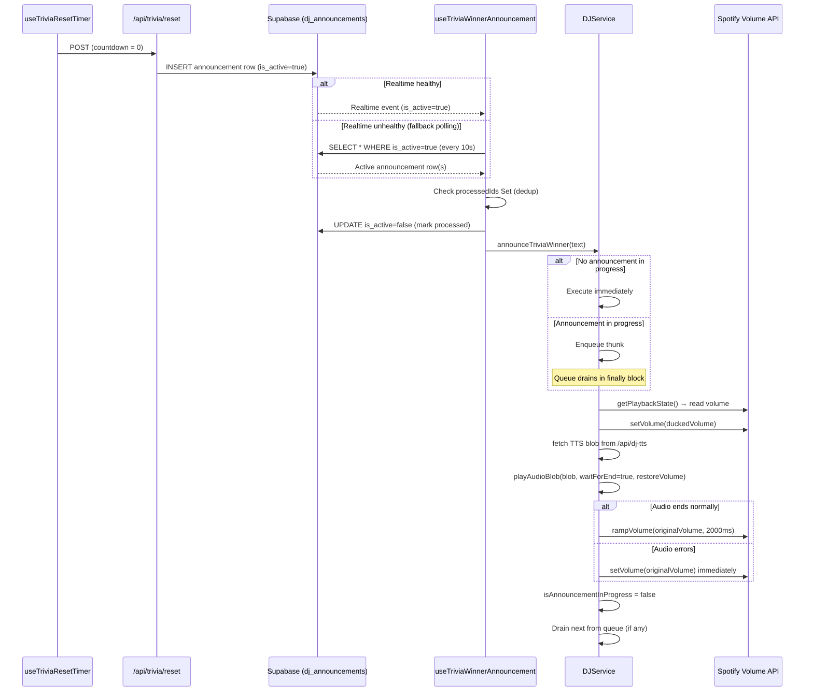
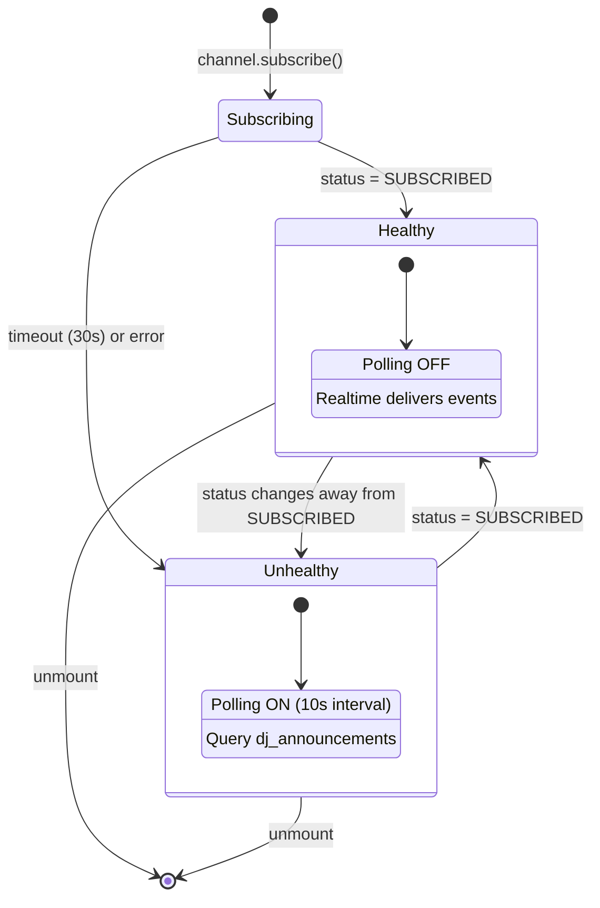

# Design Document: DJ Winner Announcement

## Overview

The trivia winner announcement pipeline already exists end-to-end: `useTriviaResetTimer` → `/api/trivia/reset` → DB insert → Supabase Realtime → `useTriviaWinnerAnnouncement` → `djService.announceTriviaWinner()`. However, the final method `announceTriviaWinner()` has two critical gaps compared to the regular DJ announcement path (`maybeAnnounce()`):

1. **No volume ducking** — `announceTriviaWinner()` calls `playAudioBlob(blob, true, null)` with `restoreVolume: null`, so the music plays at full volume over the DJ speech. In contrast, `maybeAnnounce()` reads the current Spotify volume, ducks to 20%, and passes the original volume to `playAudioBlob` for restoration.
2. **No queuing** — When `isAnnouncementInProgress` is true, `announceTriviaWinner()` returns immediately (drops the announcement). It should instead enqueue the announcement and play it when the current one finishes.

This design adds volume ducking to `announceTriviaWinner()` by reusing the same ducking pattern from `maybeAnnounce()`, and introduces an announcement queue so that winner announcements (and any other announcements) are never dropped.

Additionally, the Supabase Realtime subscription that delivers winner announcement events has proven unreliable. This design adds a polling fallback mechanism to `useTriviaWinnerAnnouncement` that activates only when Realtime is detected as unhealthy, ensuring announcements are never silently lost. The fallback marks rows as processed (`is_active = false`) after delivery to prevent duplicates.

### Key Design Decisions

1. **Shared ducking logic**: Extract the volume duck/restore pattern from `maybeAnnounce()` into a reusable helper within `DJService` so both `maybeAnnounce()` and `announceTriviaWinner()` use identical ducking behavior. This avoids code duplication and ensures consistent volume handling.
2. **Simple array queue**: Use a plain `Array<() => Promise<void>>` as the announcement queue inside `DJService`. When an announcement arrives and one is already in progress, push a thunk onto the queue. When the current announcement finishes, shift and execute the next thunk. No external state management needed — this is purely internal to the singleton.
3. **Queue draining in finally block**: The queue drain happens in the `finally` block of the announcement execution, guaranteeing the next item plays even if the current one errors out. This also satisfies the volume-restoration-on-error requirement.
4. **Winner announcement always ducks**: Unlike regular DJ announcements where ducking is gated by the `duckOverlayMode` toggle, winner announcements always duck. The winner announcement is a special event that must be audible over the music regardless of the overlay setting.
5. **No changes to the server-side pipeline**: The `/api/trivia/reset` route and `dj_announcements` table schema remain unchanged. The `useTriviaWinnerAnnouncement` hook gains fallback polling logic but the server insert path is untouched.
6. **Conditional polling, not always-on**: The fallback poller only activates when the Realtime subscription is detected as unhealthy (channel status is not `SUBSCRIBED`). This avoids unnecessary database queries during normal operation. When Realtime recovers, polling stops automatically.
7. **Mark-as-processed deduplication**: Both the Realtime path and the polling path mark announcement rows as processed (`is_active = false`) after delivering them to `djService`. A local `Set<string>` of processed row IDs provides an additional guard against the race where both paths detect the same row before the DB update completes.
8. **Poll interval of 10 seconds**: Aggressive enough to catch announcements within a reasonable window after the hourly reset, but not so frequent as to burden the database. Since trivia resets happen once per hour, a 10-second poll is more than adequate.

## Architecture



### Realtime Health Monitoring



### Data Flow

1. **Trigger**: `useTriviaResetTimer` detects countdown ≤ 1 second → POSTs to `/api/trivia/reset`
2. **Server**: API determines winner via RPC, inserts announcement row into `dj_announcements` with `is_active: true`
3. **Delivery (primary)**: `useTriviaWinnerAnnouncement` receives the row via Supabase Realtime
4. **Delivery (fallback)**: If Realtime is unhealthy, the hook polls `dj_announcements` every 10 seconds for rows where `is_active = true` and `profile_id` matches
5. **Deduplication**: The hook checks a local `processedIds` Set before delivering. If the row ID is already in the set, it's skipped. Otherwise, the row is marked as processed (`is_active = false`) in the database and the ID is added to the set.
6. **Handoff**: The hook calls `djService.announceTriviaWinner(text)`
7. **Queue check**: If `isAnnouncementInProgress`, push a thunk onto `announcementQueue`. Otherwise, execute immediately.
8. **Ducking**: Read current Spotify volume → set to 20% of original → fetch TTS → play audio blob with `restoreVolume` set to original
9. **Restore**: On audio end, `playAudioBlob` triggers `rampVolume(originalVolume, 2000)`. On error, direct `setVolume(originalVolume)` call.
10. **Drain**: In the `finally` block, set `isAnnouncementInProgress = false`, then shift and execute the next queued thunk if any.

## Components and Interfaces

### Modified: `DJService` (services/djService.ts)

The only file that needs changes. All modifications are internal to this singleton class.

#### New Private Members

```typescript
// Announcement queue — holds thunks for deferred announcements
private announcementQueue: Array<() => Promise<void>> = []
```

#### New Private Method: `duckAndPlay`

Extracted from the ducking logic currently inline in `maybeAnnounce()`. Both `maybeAnnounce()` and `announceTriviaWinner()` will call this.

```typescript
private async duckAndPlay(
  audioBlob: Blob,
  scriptText: string | null,
  waitForEnd: boolean
): Promise<void> {
  let originalVolume = 100
  try {
    const state = await SpotifyApiService.getInstance().getPlaybackState()
    originalVolume = state?.device?.volume_percent ?? 100
  } catch {
    // Requirement 1.4: assume 100% if read fails
  }

  const duckedVolume = Math.round(originalVolume * 0.2)

  try {
    await SpotifyApiService.getInstance().setVolume(duckedVolume)
  } catch {
    // Requirement 1.5: play without ducking if setVolume fails
  }

  // Re-apply duck after Spotify's play command may reset volume
  setTimeout(() => {
    SpotifyApiService.getInstance().setVolume(duckedVolume).catch(() => {})
  }, 500)

  // Persist announcement text for display subtitles
  if (scriptText) {
    const profileId = localStorage.getItem('profileId')
    if (profileId) {
      fetch('/api/dj-announcement', {
        method: 'POST',
        headers: { 'Content-Type': 'application/json' },
        body: JSON.stringify({ profileId, scriptText })
      }).catch(() => {})
    }
  }

  await this.playAudioBlob(audioBlob, waitForEnd, originalVolume)
}
```

#### New Private Method: `drainQueue`

Called in the `finally` block after any announcement completes.

```typescript
private drainQueue(): void {
  this.isAnnouncementInProgress = false
  const next = this.announcementQueue.shift()
  if (next) {
    this.isAnnouncementInProgress = true
    next().catch(() => {}).finally(() => this.drainQueue())
  }
}
```

#### Modified: `announceTriviaWinner(text: string)`

Updated to use ducking and queuing.

```typescript
async announceTriviaWinner(text: string): Promise<void> {
  if (!this.isEnabled()) return

  const execute = async (): Promise<void> => {
    const rawVoice = localStorage.getItem('djVoice')
    const resolvedVoice = /* ... existing voice resolution ... */

    let blob: Blob | null = null
    try {
      const ttsRes = await fetch('/api/dj-tts', { /* ... existing fetch ... */ })
      if (!ttsRes.ok) return
      blob = await ttsRes.blob()
    } catch {
      return
    }

    await this.duckAndPlay(blob, text, true)
  }

  if (this.isAnnouncementInProgress) {
    this.announcementQueue.push(execute)
    return
  }

  this.isAnnouncementInProgress = true
  try {
    await execute()
  } finally {
    this.drainQueue()
  }
}
```

#### Modified: `maybeAnnounce(nextTrack: JukeboxQueueItem)`

Refactored to use `duckAndPlay` for the ducking path and `drainQueue` for queue management.

```typescript
async maybeAnnounce(nextTrack: JukeboxQueueItem): Promise<void> {
  // ... existing guard checks (enabled, metadata, prefetch) ...

  const execute = async (): Promise<void> => {
    const duckOverlay = this.isDuckOverlayEnabled()
    if (duckOverlay) {
      await this.duckAndPlay(audioBlob, this.lastGeneratedScript, false)
    } else {
      await this.playAudioBlob(audioBlob, true, null)
    }
  }

  if (this.isAnnouncementInProgress) {
    this.announcementQueue.push(execute)
    return
  }

  this.isAnnouncementInProgress = true
  try {
    await execute()
  } finally {
    this.drainQueue()
  }
}
```

### Unchanged Components

These components require no modifications:

| Component             | File                            | Reason                                                                  |
| --------------------- | ------------------------------- | ----------------------------------------------------------------------- |
| `useTriviaResetTimer` | `hooks/useTriviaResetTimer.ts`  | Already triggers reset at countdown zero correctly                      |
| `/api/trivia/reset`   | `app/api/trivia/reset/route.ts` | Already determines winner, inserts announcement row, skips if no winner |
| `/api/dj-tts`         | `app/api/dj-tts/route.ts`       | Already generates TTS audio from text + voice                           |
| `SpotifyApiService`   | `services/spotifyApi.ts`        | `setVolume()` and `getPlaybackState()` already exist                    |
| `playAudioBlob`       | `services/djService.ts`         | Already handles `restoreVolume` on end/error — no changes needed        |
| `rampVolume`          | `services/djService.ts`         | Already ramps volume over a duration — no changes needed                |

### Modified: `useTriviaWinnerAnnouncement` (hooks/useTriviaWinnerAnnouncement.ts)

This hook gains Realtime health monitoring, fallback polling, and deduplication logic. The core Realtime subscription remains, but is now wrapped with health tracking and a conditional polling backup.

#### Updated Interface

The `AnnouncementRow` interface must be extended to include the `id` field (already present in the `dj_announcements` table schema):

```typescript
interface AnnouncementRow {
  id: string
  script_text: string
  is_active: boolean
  profile_id: string
}
```

#### New Internal State

```typescript
// Track which announcement row IDs have been delivered to djService
const processedIds = useRef<Set<string>>(new Set())

// Whether the Realtime channel is currently healthy
const isRealtimeHealthy = useRef<boolean>(false)

// Polling interval ref for cleanup
const pollIntervalRef = useRef<ReturnType<typeof setInterval> | null>(null)
```

#### Realtime Health Monitoring

The hook monitors the Supabase channel subscription status. The channel's `subscribe()` callback provides status updates. If the status is `'SUBSCRIBED'`, Realtime is healthy. Any other status (or a 30-second timeout after initial subscribe without reaching `SUBSCRIBED`) marks it as unhealthy.

```typescript
const channel = supabaseBrowser
  .channel(`trivia_winner_announcement_${profileId}`)
  .on(
    'postgres_changes',
    {
      /* ... existing filter ... */
    },
    (payload) => {
      const row = payload.new as AnnouncementRow | undefined
      if (!row?.is_active || !row.script_text || !row.id) return
      if (!getTriviaEnabled()) return
      handleAnnouncement(row.id, row.script_text)
    }
  )
  .subscribe((status) => {
    isRealtimeHealthy.current = status === 'SUBSCRIBED'
    if (status === 'SUBSCRIBED') {
      stopPolling()
    } else {
      startPolling(profileId)
    }
  })

// Timeout: if not SUBSCRIBED within 30s, start polling
const healthTimeout = setTimeout(() => {
  if (!isRealtimeHealthy.current) {
    startPolling(profileId)
  }
}, 30_000)
```

#### Fallback Polling

When Realtime is unhealthy, the hook starts a `setInterval` that queries `dj_announcements` for active rows:

```typescript
function startPolling(profileId: string): void {
  if (pollIntervalRef.current) return // already polling

  pollIntervalRef.current = setInterval(async () => {
    try {
      const { data } = await supabaseBrowser
        .from('dj_announcements')
        .select('id, script_text')
        .eq('profile_id', profileId)
        .eq('is_active', true)
        .order('created_at', { ascending: true })

      if (!data?.length) return
      if (!getTriviaEnabled()) return

      for (const row of data) {
        handleAnnouncement(row.id, row.script_text)
      }
    } catch {
      // Swallow — will retry on next interval
    }
  }, 10_000)
}

function stopPolling(): void {
  if (pollIntervalRef.current) {
    clearInterval(pollIntervalRef.current)
    pollIntervalRef.current = null
  }
}
```

#### Shared Announcement Handler (Deduplication)

Both the Realtime callback and the polling path call the same handler, which deduplicates and marks rows as processed:

```typescript
function handleAnnouncement(rowId: string, scriptText: string): void {
  if (processedIds.current.has(rowId)) return
  processedIds.current.add(rowId)

  // Mark as processed in DB to prevent re-delivery
  supabaseBrowser
    .from('dj_announcements')
    .update({ is_active: false })
    .eq('id', rowId)
    .then()
    .catch(() => {})

  void djService.announceTriviaWinner(scriptText)
}
```

#### Cleanup

On unmount, the hook clears the polling interval, removes the Realtime channel, and clears the health timeout:

```typescript
return () => {
  clearTimeout(healthTimeout)
  stopPolling()
  if (channelRef.current) {
    supabaseBrowser.removeChannel(channelRef.current)
    channelRef.current = null
  }
}
```

## Data Models

No new database tables, columns, or migrations are required. The existing `dj_announcements` table and `trivia_determine_winner_and_reset` RPC function are sufficient. The `is_active` column on `dj_announcements` is now used as a processed flag — rows are inserted with `is_active: true` by the reset API and updated to `is_active: false` by the hook after delivery.

### Existing Tables Used

- **`dj_announcements`**: Stores the winner announcement text with `is_active: true`. The `useTriviaWinnerAnnouncement` hook subscribes to Realtime changes on this table filtered by `profile_id`. The hook also queries this table directly during fallback polling and updates `is_active` to `false` after delivering an announcement.
- **`trivia_scores`**: Read by the reset RPC to determine the winner. Cleared after winner determination.

### State Changes (Client-Side Only)

New state within `DJService` singleton:

| Property            | Type                         | Purpose                                    |
| ------------------- | ---------------------------- | ------------------------------------------ |
| `announcementQueue` | `Array<() => Promise<void>>` | FIFO queue of deferred announcement thunks |

Existing state reused:

| Property                   | Type      | Purpose                                                 |
| -------------------------- | --------- | ------------------------------------------------------- |
| `isAnnouncementInProgress` | `boolean` | Guards concurrent execution, now also gates queue entry |

New state within `useTriviaWinnerAnnouncement` hook:

| Ref                 | Type                                     | Purpose                                                                                           |
| ------------------- | ---------------------------------------- | ------------------------------------------------------------------------------------------------- |
| `processedIds`      | `Set<string>`                            | Row IDs already delivered to djService — prevents duplicate playback from Realtime + polling race |
| `isRealtimeHealthy` | `boolean`                                | Tracks whether the Supabase Realtime channel is in `SUBSCRIBED` state                             |
| `pollIntervalRef`   | `ReturnType<typeof setInterval> \| null` | Handle for the fallback polling interval, cleared on cleanup or when Realtime recovers            |

## Correctness Properties

_A property is a characteristic or behavior that should hold true across all valid executions of a system — essentially, a formal statement about what the system should do. Properties serve as the bridge between human-readable specifications and machine-verifiable correctness guarantees._

### Property 1: Ducked volume is 20% of original

_For any_ Spotify volume V in the range [0, 100], the ducked volume computed by the Volume_Ducker SHALL equal `Math.round(V * 0.2)`.

**Validates: Requirements 1.2**

### Property 2: All announcements are played in FIFO order, none dropped

_For any_ sequence of N announcements arriving at `DJService` (where N ≥ 1), all N announcements SHALL eventually be played, and they SHALL be played in the same order they were received (first-in, first-out). No announcement is discarded due to another being in progress.

**Validates: Requirements 2.1, 2.2, 2.3, 2.5**

### Property 3: At most one announcement plays at a time

_For any_ sequence of announcements processed by `DJService`, at most one announcement SHALL be in the "playing" state at any point in time. The `isAnnouncementInProgress` flag SHALL be true for exactly one announcement at a time.

**Validates: Requirements 2.4**

### Property 4: Error recovery restores volume and drains queue

_For any_ original Spotify volume V and any announcement that fails during playback (audio error event or `play()` rejection), the Volume_Ducker SHALL restore the Spotify volume to V, and the `DJService` SHALL mark the announcement as complete so the next queued announcement can proceed.

**Validates: Requirements 5.1, 5.2**

### Property 5: DJ disabled skips announcement without error

_For any_ announcement text, if DJ mode is disabled (`isEnabled()` returns false), `announceTriviaWinner()` SHALL return without making any TTS API calls, volume changes, or audio playback, and SHALL not throw an error.

**Validates: Requirements 4.3**

### Property 6: Configured voice is passed to TTS API

_For any_ valid DJ voice ID stored in localStorage, the TTS request made by `announceTriviaWinner()` SHALL include that voice ID in the request body. If no valid voice is configured, the default voice SHALL be used.

**Validates: Requirements 3.2**

### Property 7: Announcement text contains winner name and score

_For any_ winner with name N and score S, the announcement text generated by `/api/trivia/reset` SHALL contain both N and S as substrings.

**Validates: Requirements 3.4**

### Property 8: Polling activation tracks Realtime health

_For any_ sequence of Supabase Realtime channel status transitions, the fallback polling interval SHALL be active if and only if the current channel status is not `SUBSCRIBED`. When the status transitions to `SUBSCRIBED`, polling SHALL stop. When the status transitions away from `SUBSCRIBED` (or the initial subscribe times out), polling SHALL start.

**Validates: Requirements 6.1, 6.2, 6.3**

### Property 9: Announcement deduplication — each row ID delivered at most once

_For any_ sequence of announcement row IDs presented to `handleAnnouncement` (whether from Realtime, polling, or both), each unique row ID SHALL result in exactly one call to `djService.announceTriviaWinner()` and exactly one database update setting `is_active` to `false`. Duplicate presentations of the same row ID SHALL be silently ignored.

**Validates: Requirements 6.5, 6.6**

## Error Handling

### Volume Ducking Errors

| Error                                            | Handling                                                                  | Requirement |
| ------------------------------------------------ | ------------------------------------------------------------------------- | ----------- |
| `getPlaybackState()` fails                       | Assume original volume = 100%, proceed with ducking                       | 1.4         |
| `setVolume(duckedVolume)` fails                  | Skip ducking, play announcement at full music volume                      | 1.5         |
| `setVolume(originalVolume)` fails during restore | Fire-and-forget — volume may remain ducked until next Spotify interaction | Best effort |

### Audio Playback Errors

| Error                           | Handling                                                                                         | Requirement |
| ------------------------------- | ------------------------------------------------------------------------------------------------ | ----------- |
| `audio.onerror` event fires     | Restore volume via direct `setVolume()`, clear announcement subtitle, mark complete, drain queue | 5.1, 5.2    |
| `audio.play()` promise rejected | Restore volume via direct `setVolume()`, mark complete, drain queue                              | 5.3         |
| TTS fetch fails (network/500)   | Log error, skip announcement, do not duck volume, drain queue                                    | 3.3         |

### Queue Errors

| Error                 | Handling                                                                      |
| --------------------- | ----------------------------------------------------------------------------- |
| Queued thunk throws   | Caught by `.catch(() => {})` in `drainQueue`, proceeds to next item           |
| Queue grows unbounded | Unlikely in practice (announcements are hourly), but no artificial cap needed |

### Key Invariant

The `drainQueue()` method runs in the `finally` block of every announcement execution. This guarantees that regardless of how an announcement completes (success, audio error, TTS failure, play rejection), the queue always advances and `isAnnouncementInProgress` is correctly reset.

### Realtime Fallback Errors

| Error                                        | Handling                                                                             | Requirement |
| -------------------------------------------- | ------------------------------------------------------------------------------------ | ----------- |
| Realtime channel never reaches `SUBSCRIBED`  | After 30-second timeout, mark unhealthy and start polling                            | 6.1         |
| Realtime channel disconnects mid-session     | Status callback fires with non-`SUBSCRIBED` status, polling starts automatically     | 6.1, 6.2    |
| Polling query fails (network/Supabase error) | Swallowed — retry on next 10-second interval                                         | 6.2         |
| `is_active = false` update fails             | Fire-and-forget — the in-memory `processedIds` Set still prevents duplicate delivery | 6.5         |
| Both Realtime and polling detect same row    | `processedIds` Set ensures `handleAnnouncement` only fires once per row ID           | 6.6         |

## Testing Strategy

### Property-Based Testing

Use `fast-check` as the property-based testing library with the Node.js built-in test runner (`node:test`).

Each property test MUST:

- Run a minimum of 100 iterations
- Reference its design document property in a comment tag
- Use the format: `Feature: dj-winner-announcement, Property {number}: {property_text}`

#### Property Tests

| Property   | Test Description                                                                                                                                                                           | Generator Strategy                                                                                                             |
| ---------- | ------------------------------------------------------------------------------------------------------------------------------------------------------------------------------------------ | ------------------------------------------------------------------------------------------------------------------------------ |
| Property 1 | Generate random volumes 0–100, verify `Math.round(v * 0.2)`                                                                                                                                | `fc.integer({ min: 0, max: 100 })`                                                                                             |
| Property 2 | Generate random sequences of 1–10 announcement texts, simulate queue, verify all played in order                                                                                           | `fc.array(fc.string({ minLength: 1 }), { minLength: 1, maxLength: 10 })`                                                       |
| Property 3 | Generate random sequences, track `isAnnouncementInProgress` transitions, verify never two concurrent                                                                                       | Same as Property 2                                                                                                             |
| Property 4 | Generate random original volumes, simulate error during playback, verify volume restored and queue drained                                                                                 | `fc.integer({ min: 0, max: 100 })` combined with error injection                                                               |
| Property 5 | Generate random announcement texts with DJ disabled, verify no side effects                                                                                                                | `fc.string({ minLength: 1 })`                                                                                                  |
| Property 6 | Generate random voice IDs from the valid set, verify passthrough to TTS fetch                                                                                                              | `fc.constantFrom(...DJ_VOICE_IDS)`                                                                                             |
| Property 7 | Generate random player names and scores, verify announcement text contains both                                                                                                            | `fc.tuple(fc.string({ minLength: 1, maxLength: 20 }), fc.integer({ min: 1, max: 9999 }))`                                      |
| Property 8 | Generate random sequences of channel status values (SUBSCRIBED, TIMED_OUT, CLOSED, CHANNEL_ERROR), verify polling is active iff status ≠ SUBSCRIBED                                        | `fc.array(fc.constantFrom('SUBSCRIBED', 'TIMED_OUT', 'CLOSED', 'CHANNEL_ERROR'), { minLength: 1, maxLength: 20 })`             |
| Property 9 | Generate random sequences of row IDs with intentional duplicates, call handleAnnouncement for each, verify each unique ID triggers exactly one announceTriviaWinner call and one DB update | `fc.array(fc.uuid(), { minLength: 1, maxLength: 15 }).chain(ids => fc.shuffledSubarray(ids).map(dupes => [...ids, ...dupes]))` |

### Unit Tests

Unit tests complement property tests by covering specific examples, edge cases, and integration points:

- **Edge case**: Volume read fails → assumes 100% (Requirement 1.4)
- **Edge case**: `setVolume` fails during duck → announcement still plays (Requirement 1.5)
- **Edge case**: `play()` rejected → volume restored immediately (Requirement 5.3)
- **Edge case**: TTS API returns non-OK status → announcement skipped gracefully (Requirement 3.3)
- **Example**: No players scored → no announcement row inserted (Requirement 4.4)
- **Example**: Timer fires at countdown zero → reset API called (Requirement 4.1)
- **Example**: Realtime event with `is_active: true` → `announceTriviaWinner()` called (Requirement 4.2)
- **Example**: Volume reads as 80% → ducks to 16% → restores to 80% (Requirement 1.1, 1.2, 1.3)
- **Example**: Realtime channel reaches SUBSCRIBED → polling does not start (Requirement 6.3)
- **Example**: Realtime channel times out after 30s → polling starts at 10s interval (Requirement 6.1, 6.2)
- **Example**: Polling finds active row → delivers to djService and sets `is_active = false` (Requirement 6.4, 6.5)
- **Edge case**: Polling query fails → swallowed, retries on next interval (Requirement 6.2)
- **Edge case**: `is_active = false` update fails → announcement still delivered, no duplicate on next poll due to processedIds (Requirement 6.5, 6.6)
- **Example**: Hook unmounts → polling interval cleared and Realtime channel removed (Requirement 6.7)

### Test File Location

Tests should live at:

- `services/__tests__/djServiceAnnouncement.test.ts` — DJService ducking, queuing, and playback tests
- `hooks/__tests__/triviaWinnerAnnouncementFallback.test.ts` — Realtime health monitoring, polling fallback, and deduplication tests
