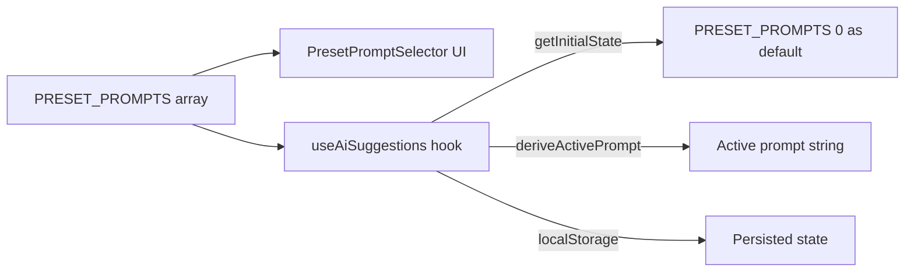

# Design Document: Drinking Anthems Preset

## Overview

This feature adds a "Drinking Anthems" preset to the existing AI track suggestions system and makes it the default preset for new users. The change is minimal and purely additive — a new entry is prepended to the `PRESET_PROMPTS` array in `shared/constants/aiSuggestion.ts`. Because the default preset is already derived from `PRESET_PROMPTS[0]`, placing the new entry at index 0 automatically makes it the default for fresh installs with no localStorage state. No changes are needed to the hook, UI component, types, or API layer.

## Architecture

The existing architecture remains unchanged. The data flow is:



The only modification point is the `PRESET_PROMPTS` constant array. All downstream consumers (the selector UI, the hook, and the prompt derivation function) already operate generically over the array contents.

## Components and Interfaces

### Modified File: `shared/constants/aiSuggestion.ts`

A new `PresetPrompt` object is prepended to the `PRESET_PROMPTS` array at index 0:

```typescript
{
  id: 'drinking-anthems',
  label: 'Drinking Anthems',
  emoji: '🍺',
  prompt: 'Classic drinking songs, pub anthems, and bar singalongs. Songs about beer, whiskey, pubs, bars, and drinking culture from rock, country, folk, and pop.'
}
```

### Unchanged Components

- **`PresetPromptSelector`** (`preset-prompt-selector.tsx`): Already iterates over `PRESET_PROMPTS` with `.map()`. The new preset will render automatically as an additional button in the grid.
- **`useAiSuggestions`** (`useAiSuggestions.ts`): `getInitialState()` already defaults to `PRESET_PROMPTS[0]?.id`. No code change needed.
- **`deriveActivePrompt`**: Already resolves any valid preset ID to its prompt text via `.find()`.
- **`AiSuggestionsState`** type: No structural changes.

## Data Models

No new types or data model changes. The existing `PresetPrompt` interface is sufficient:

```typescript
interface PresetPrompt {
  id: string
  label: string
  emoji: string
  prompt: string
}
```

The `PRESET_PROMPTS` array grows from 11 to 12 entries. The new entry follows the same shape as all existing presets.

## Correctness Properties

_A property is a characteristic or behavior that should hold true across all valid executions of a system — essentially, a formal statement about what the system should do. Properties serve as the bridge between human-readable specifications and machine-verifiable correctness guarantees._

### Property 1: Original presets preserved

_For any_ preset from the set of 11 originally existing presets, the `PRESET_PROMPTS` array shall contain that preset with its `id`, `label`, `emoji`, and `prompt` fields unchanged.

**Validates: Requirements 3.2**

### Property 2: Saved preset selection restored over default

_For any_ valid preset ID that exists in `PRESET_PROMPTS`, if a prior `AiSuggestionsState` with that `selectedPresetId` is stored in localStorage, then `getInitialState()` shall return that saved preset ID rather than the default (`PRESET_PROMPTS[0].id`).

**Validates: Requirements 3.1**

## Error Handling

This feature introduces no new error paths. The existing error handling covers all relevant scenarios:

- **Invalid localStorage data**: `getInitialState()` already catches JSON parse errors and falls back to defaults (which will now default to `'drinking-anthems'`).
- **Missing preset ID**: `deriveActivePrompt()` already handles the case where a `selectedPresetId` doesn't match any preset — it returns `''`.
- **Empty PRESET_PROMPTS**: The existing `PRESET_PROMPTS[0]?.id ?? null` guard handles an empty array, though this is not a realistic scenario.

No additional error handling is required.

## Testing Strategy

### Property-Based Tests (fast-check)

The project uses `fast-check` with Node.js built-in test runner (`node:test`). Each property test runs a minimum of 100 iterations.

**Property 1 test** — Generate each of the 11 original preset IDs, look them up in the current `PRESET_PROMPTS` array, and assert all four fields match the known original values.

- Tag: `Feature: drinking-anthems-preset, Property 1: Original presets preserved`

**Property 2 test** — Generate a random valid preset ID from `PRESET_PROMPTS`, construct a serialized `AiSuggestionsState` with that ID as `selectedPresetId`, simulate localStorage containing that state, call `getInitialState()`, and assert the returned `selectedPresetId` matches the saved value (not the default).

- Tag: `Feature: drinking-anthems-preset, Property 2: Saved preset selection restored over default`

### Unit Tests (examples and edge cases)

Unit tests cover the specific example-based acceptance criteria:

- **Drinking anthems entry shape**: Assert `PRESET_PROMPTS` contains an entry with `id: 'drinking-anthems'`, `label: 'Drinking Anthems'`, `emoji: '🍺'`, and a `prompt` that references beer, pubs, bars, and drinking culture. _(Validates: 1.1, 1.2)_
- **Index 0 position**: Assert `PRESET_PROMPTS[0].id === 'drinking-anthems'`. _(Validates: 2.1)_
- **Default preset derivation**: Assert that with no localStorage state, the default `selectedPresetId` equals `'drinking-anthems'` and `deriveActivePrompt('drinking-anthems', '')` returns the drinking anthems prompt text. _(Validates: 2.2, 2.3)_
- **Total preset count**: Assert `PRESET_PROMPTS.length === 12` (11 original + 1 new). _(Validates: 1.1, 3.2)_

### Test File Location

Tests should be added to `shared/constants/__tests__/aiSuggestion.test.ts` alongside the existing property tests for this module.
