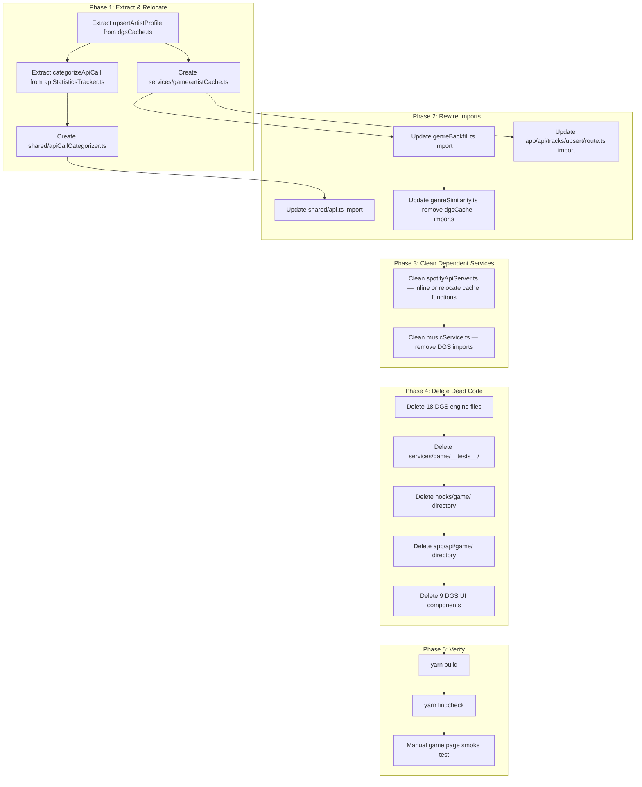

# Design Document: Game Code Cleanup

## Overview

This design covers the removal of the deprecated DGS (Dual Gravity System) game engine and all exclusively-DGS code from the codebase. The DGS game has been replaced by a Song Trivia Game, but the old code remains — 18 engine services, 7 hooks, 9 UI components, 8 API route directories, and test files — creating dead code and a runtime console error.

The console error occurs because `genreBackfill.ts` imports `upsertArtistProfile` from `dgsCache.ts`, which imports `supabase-admin.ts` (a server-only module that throws when `SUPABASE_SERVICE_ROLE_KEY` is missing). When `genreBackfill.ts` is transitively imported client-side, this chain triggers the error.

The cleanup must preserve four shared utilities (`genreBackfill.ts`, `metadataBackfill.ts`, `genreConstants.ts`, `genreSimilarity.ts`) and relocate `upsertArtistProfile` out of `dgsCache.ts` so the import chain is severed. Additionally, `spotifyApiServer.ts`, `musicService.ts`, `shared/api.ts`, and `app/api/tracks/upsert/route.ts` have DGS-specific imports that must be updated.

## Architecture

The cleanup follows a dependency-aware deletion strategy executed in phases:



The key insight is that several non-DGS files depend on functions currently housed in DGS modules:

| Non-DGS Consumer                 | Current DGS Import                                                                         | Resolution                                                                                        |
| -------------------------------- | ------------------------------------------------------------------------------------------ | ------------------------------------------------------------------------------------------------- |
| `genreBackfill.ts`               | `upsertArtistProfile` from `dgsCache.ts`                                                   | Relocate to `services/game/artistCache.ts`                                                        |
| `genreSimilarity.ts`             | `batchGetArtistProfilesWithCache`, `batchUpsertArtistProfiles` from `dgsCache.ts`          | Relocate needed functions to `artistCache.ts`                                                     |
| `app/api/tracks/upsert/route.ts` | `upsertArtistProfile` from `dgsCache.ts`                                                   | Update import to `artistCache.ts`                                                                 |
| `shared/api.ts`                  | `categorizeApiCall` + type from `apiStatisticsTracker.ts`                                  | Relocate to `shared/apiCallCategorizer.ts`                                                        |
| `spotifyApiServer.ts`            | Multiple functions from `dgsCache.ts`, `dgsDb.ts`, `artistGraph.ts`, `relatedArtistsDb.ts` | Inline essential cache logic or relocate to `artistCache.ts`; remove graph/relatedArtistsDb usage |
| `musicService.ts`                | `dgsCache.*`, `dgsDb.*`, `dgsTypes`, `artistGraph`, `apiStatisticsTracker`                 | Remove DGS-specific methods; retain only non-DGS functionality                                    |

## Components and Interfaces

### New Module: `services/game/artistCache.ts`

Extracted from `dgsCache.ts`, this module contains only the artist profile caching functions needed by shared utilities. It imports `supabase-admin.ts` (server-only), which is safe because all its consumers (`genreBackfill.ts`, `genreSimilarity.ts`, `app/api/tracks/upsert/route.ts`) run server-side.

```typescript
// services/game/artistCache.ts
import { supabaseAdmin } from '@/lib/supabase-admin'
import { supabase, queryWithRetry } from '@/lib/supabase'
import { sendApiRequest } from '@/shared/api'
import { createModuleLogger } from '@/shared/utils/logger'

export async function upsertArtistProfile(artistData: {
  spotify_artist_id: string
  name: string
  genres: string[]
  popularity?: number
  follower_count?: number
}): Promise<void>

export async function batchUpsertArtistProfiles(
  artists: Array<{
    id: string
    name: string
    genres: string[]
    popularity?: number
    followers?: { total: number }
  }>
): Promise<void>

export async function batchGetArtistProfilesWithCache(
  spotifyArtistIds: string[],
  token: string,
  statisticsTracker?: ApiStatisticsTracker
): Promise<
  Map<
    string,
    {
      id: string
      name: string
      genres: string[]
      popularity?: number
      followers?: number
    }
  >
>
```

### New Module: `shared/apiCallCategorizer.ts`

Extracted from `apiStatisticsTracker.ts`, this contains the `categorizeApiCall` function and the `OperationType` / `ApiStatisticsTracker` type that `shared/api.ts` depends on. This breaks the dependency from `shared/` into `services/game/`.

```typescript
// shared/apiCallCategorizer.ts
export type OperationType =
  | 'topTracks'
  | 'trackDetails'
  | 'relatedArtists'
  | 'artistProfiles'
  | 'artistSearches'

export interface ApiStatisticsTracker {
  recordApiCall(operationType: OperationType, durationMs?: number): void
  recordCacheHit(operationType: OperationType, cacheLevel: string): void
  recordFromSpotify(operationType: OperationType, itemCount: number): void
  recordRequest(operationType: OperationType): void
  recordDbQuery(operation: string, durationMs: number): void
}

export function categorizeApiCall(path: string): OperationType | null
```

### Modified: `spotifyApiServer.ts`

This file currently imports from `dgsCache.ts`, `dgsDb.ts`, `artistGraph.ts`, and `relatedArtistsDb.ts`. After cleanup:

- Cache functions (`getCachedRelatedArtists`, `upsertRelatedArtists`, `getCachedTopTracks`, `upsertTopTracks`, `batchGetTrackDetailsWithCache`) will be relocated to `artistCache.ts` if still needed, or the methods that use them will be simplified.
- `fetchTracksByGenreFromDb` and `upsertTrackDetails` from `dgsDb.ts` will be inlined or relocated.
- `getRelatedArtistsServer` will be simplified to remove the artist graph and relatedArtistsDb tiers, falling back to a simpler DB + Spotify approach.
- The `ApiStatisticsTracker` type import will point to `shared/apiCallCategorizer.ts`.

### Modified: `musicService.ts`

Heavy DGS coupling will be removed:

- Remove `import type { DgsOptionTrack }` from `dgsTypes`
- Remove `import * as dgsCache` and `import * as dgsDb`
- Remove `import { getFromArtistGraph, saveToArtistGraph }`
- Remove `import type { ApiStatisticsTracker }` (or update to new location)
- Remove `searchTracksByGenre` method (DGS-only, uses `DgsOptionTrack`)
- Simplify `getArtist`, `getTrack`, `getTopTracks`, `getRelatedArtists` to use `spotifyApiServer` directly or inline the needed DB queries
- The `TargetArtist` type from `gameService.ts` is used by `musicService.ts` — if `gameService.ts` is retained, this stays; otherwise the type moves

### Modified: `gameService.ts`

This file exports `TargetArtist`, `getCurrentArtistId`, `getRelatedArtistsForGame`, and `getGameOptionTracks`. Its only non-DGS consumer is `musicService.ts` (for the `TargetArtist` type). Since `gameService.ts` itself only imports from `spotifyApiServer.ts` and shared types (no DGS imports), it can be retained as-is. Its DGS consumers (hooks/game, app/api/game) will be deleted.

### Deleted Modules

**18 DGS engine services** (all in `services/game/`):
`dgsEngine.ts`, `dgsScoring.ts`, `dgsDiversity.ts`, `dgsTypes.ts`, `dgsDb.ts`, `dgsCache.ts`, `clientPipeline.ts`, `artistGraph.ts`, `prepCache.ts`, `lazyUpdateQueue.ts`, `selfHealing.ts`, `debugUtils.ts`, `noopLogger.ts`, `apiStatisticsTracker.ts`, `adminAuth.ts`, `gameRules.ts`, `genreGraph.ts`, `relatedArtistsDb.ts`, `trackBackfill.ts`

**7 DGS hooks** (all in `hooks/game/`):
`useMusicGame.ts`, `useGameData.ts`, `useGameRound.ts`, `useGameTimer.ts`, `useBackgroundUpdates.ts`, `usePopularArtists.ts`, `usePlayerNames.ts`

**9 DGS UI components** (in `app/[username]/game/components/`):
`ArtistSelectionModal.tsx`, `DgsDebugPanel.tsx`, `GameBoard.tsx`, `GameOptionNode.tsx`, `GameOptionSkeleton.tsx`, `LoadingProgressBar.tsx`, `PlayerHud.tsx`, `ScoreAnimation.tsx`, `TurnTimer.tsx`

**All DGS API routes** (entire `app/api/game/` directory):
`artists/`, `influence/`, `init-round/`, `lazy-update-tick/`, `options/`, `pipeline/` (stage1-artists, stage2-score-artists, stage3-fetch-tracks), `prep-seed/`

**All DGS test files** (`services/game/__tests__/`)

## Data Models

No database schema changes are required. The cleanup only removes application code. The Supabase tables (`artists`, `artist_relationships`, `artist_top_tracks`, `tracks`) remain unchanged as they are used by the preserved shared utilities and the trivia game.

### Key Type Changes

The `ApiStatisticsTracker` interface moves from `services/game/apiStatisticsTracker.ts` to `shared/apiCallCategorizer.ts`. All consumers that only need the type/interface will import from the new location.

The `TargetArtist` interface remains in `services/gameService.ts` since that file has no DGS dependencies.

## Correctness Properties

_A property is a characteristic or behavior that should hold true across all valid executions of a system — essentially, a formal statement about what the system should do. Properties serve as the bridge between human-readable specifications and machine-verifiable correctness guarantees._

### Property 1: All DGS files are deleted

_For any_ file path in the DGS deletion manifest (18 engine services, 7 hooks, 9 UI components, all `app/api/game/` routes, and all `services/game/__tests__/` test files), that file path should not exist in the codebase after cleanup.

**Validates: Requirements 1.1, 1.2, 2.1, 3.1, 4.1, 5.1**

### Property 2: All preserved files are retained

_For any_ file path in the preservation list (`genreBackfill.ts`, `metadataBackfill.ts`, `genreConstants.ts`, `genreSimilarity.ts`, all `hooks/trivia/` files, all `app/api/trivia/` files, and the five trivia UI components), that file path should exist in the codebase after cleanup.

**Validates: Requirements 2.2, 3.2, 4.2, 6.1, 6.2, 6.3**

### Property 3: No surviving source file imports a deleted module

_For any_ TypeScript source file that remains in the codebase after cleanup, none of its import statements should reference any file path from the DGS deletion manifest (e.g., `dgsCache`, `dgsDb`, `dgsTypes`, `artistGraph`, `apiStatisticsTracker`, `dgsEngine`, `dgsScoring`, `dgsDiversity`, `clientPipeline`, `prepCache`, `lazyUpdateQueue`, `selfHealing`, `debugUtils`, `noopLogger`, `adminAuth`, `gameRules`, `genreGraph`, `relatedArtistsDb`, `trackBackfill`).

**Validates: Requirements 5.2, 7.1, 7.3**

## Error Handling

### Console Error Resolution

The primary error being resolved is `Missing Supabase Service Role environment variables` thrown by `lib/supabase-admin.ts` when imported client-side. The fix is structural: by relocating `upsertArtistProfile` to `services/game/artistCache.ts` and updating `genreBackfill.ts` to import from there instead of `dgsCache.ts`, the import chain `genreBackfill.ts → dgsCache.ts → supabase-admin.ts` is broken. Since `genreBackfill.ts` is only called from server-side API routes (`app/api/search/route.ts`, `app/api/tracks/upsert/route.ts`) and from `metadataBackfill.ts` (also server-side), the `supabase-admin.ts` import remains server-only.

### Build Errors During Cleanup

If intermediate steps leave dangling imports, `yarn build` will fail with module resolution errors. The phased approach (extract → rewire → clean → delete) ensures imports are updated before their targets are deleted.

### Missing Exports After Relocation

When moving functions to `artistCache.ts` and `shared/apiCallCategorizer.ts`, all consumers must be updated atomically. The design identifies every consumer via grep analysis:

- `upsertArtistProfile`: `genreBackfill.ts`, `app/api/tracks/upsert/route.ts`, `genreSimilarity.ts` (via `batchUpsertArtistProfiles`)
- `categorizeApiCall`: `shared/api.ts`
- `ApiStatisticsTracker` type: `shared/api.ts`, `spotifyApiServer.ts`, `musicService.ts`

## Testing Strategy

### Dual Testing Approach

This cleanup is primarily a code deletion task, so testing focuses on verifying nothing is broken rather than testing new behavior.

**Unit tests** (specific examples):

- Verify `artistCache.ts` exports `upsertArtistProfile` and `batchUpsertArtistProfiles`
- Verify `shared/apiCallCategorizer.ts` exports `categorizeApiCall` and the `ApiStatisticsTracker` interface
- Verify the relocated `upsertArtistProfile` function signature matches the original
- Verify `genreBackfill.ts` can be imported without triggering the supabase-admin error in a server context

**Property-based tests** (universal properties):

- Property 1: Generate the full DGS deletion manifest and assert no file exists
- Property 2: Generate the full preservation manifest and assert all files exist
- Property 3: Parse all surviving `.ts`/`.tsx` files' import statements and assert none reference deleted DGS modules

**Build verification** (integration):

- `yarn build` passes with zero errors
- `yarn lint:check` passes with no new lint errors

### Property-Based Testing Configuration

- Library: `fast-check` (compatible with Node.js built-in test runner via `node:test`)
- Minimum iterations: 100 per property test (though for filesystem checks, the iteration count is bounded by the manifest size)
- Each property test must reference its design document property
- Tag format: **Feature: game-code-cleanup, Property {number}: {property_text}**
- Each correctness property is implemented by a single property-based test

### Test File Location

Tests will be placed in `services/game/__tests__/` — but since that directory is being deleted as part of cleanup, the verification tests should be placed in a new location: `__tests__/game-cleanup-verification/` at the project root, or run as a post-cleanup verification script.
