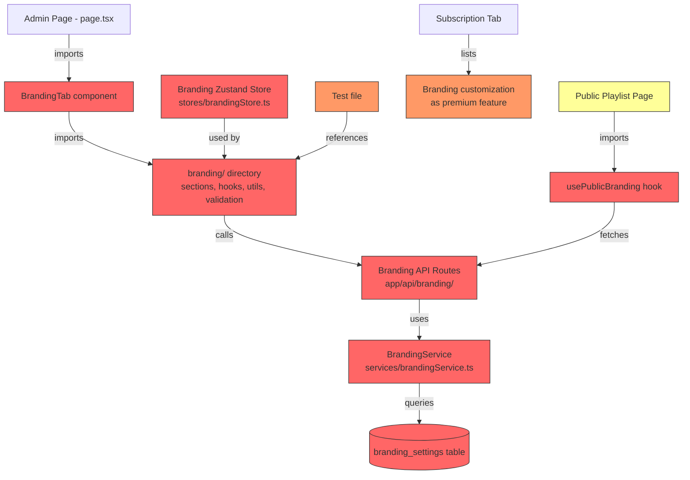

# Design Document: Remove Branding Feature

## Overview

This design covers the complete removal of the branding customization feature from 3B Jukebox. The branding feature currently allows venue owners to customize colors, logos, typography, SEO metadata, and text on their public jukebox pages. The removal involves deleting all branding-related code (UI components, API routes, service, store, hook), refactoring the public playlist page to use hardcoded defaults, updating the subscription feature list, fixing test references, and creating a database migration to drop the `branding_settings` table.

This is a deletion-heavy change. The primary risk is breaking imports or leaving dangling references. The one creative piece is refactoring the public playlist page (`app/[username]/playlist/page.tsx`) to replace dynamic branding with hardcoded default values.

## Architecture

The branding feature touches these layers of the stack:



Red = delete entirely, Orange = modify, Yellow = refactor.

### Deletion Order

Order matters to avoid intermediate broken states during development. The approach is inside-out: delete leaf dependencies first, then work up to the consumers.

1. Delete the branding component directory (`app/[username]/admin/components/branding/`)
2. Delete the branding API routes (`app/api/branding/`)
3. Delete the branding service (`services/brandingService.ts`)
4. Delete the branding Zustand store (`stores/brandingStore.ts`)
5. Delete the public branding hook (`hooks/usePublicBranding.ts`)
6. Update the admin page (`app/[username]/admin/page.tsx`) — remove BrandingTab import, tab trigger, tab content, and `'branding'` from the `activeTab` union type
7. Refactor the public playlist page (`app/[username]/playlist/page.tsx`) — remove `usePublicBranding`, replace with hardcoded defaults
8. Update the subscription tab — remove "Branding customization" line items
9. Update the test file — remove branding hook path from assertion array
10. Create the database migration to drop `branding_settings`

## Components and Interfaces

### Files to Delete

| File/Directory                                | Type                 | Reason                     |
| --------------------------------------------- | -------------------- | -------------------------- |
| `app/[username]/admin/components/branding/`   | Directory (13 files) | Entire branding admin UI   |
| `app/api/branding/settings/route.ts`          | API route            | Settings GET/PUT           |
| `app/api/branding/reset/route.ts`             | API route            | Settings reset DELETE      |
| `app/api/branding/public/[username]/route.ts` | API route            | Public branding GET        |
| `app/api/branding/public/test/route.ts`       | API route            | Test endpoint              |
| `services/brandingService.ts`                 | Service              | Server-side branding CRUD  |
| `stores/brandingStore.ts`                     | Zustand store        | Client-side branding state |
| `hooks/usePublicBranding.ts`                  | React hook           | Public page branding fetch |

### Files to Modify

#### 1. `app/[username]/admin/page.tsx`

Changes:

- Remove `import { BrandingTab } from './components/branding/branding-tab'`
- Remove `'branding'` from the `activeTab` union type (becomes `'dashboard' | 'playlist' | 'settings' | 'logs' | 'analytics'`)
- Remove the `<TabsTrigger value='branding'>` element
- Change `grid-cols-6` to `grid-cols-5` on the TabsList (currently 6 columns but only 5 visible triggers — after removing branding it becomes 4 visible triggers, so `grid-cols-4`)
- Remove the `<TabsContent value='branding'>` block
- Update `handleTabChange` cast to exclude `'branding'`

#### 2. `app/[username]/playlist/page.tsx`

This is the most significant refactor. Changes:

- Remove `import { usePublicBranding } from '@/hooks/usePublicBranding'`
- Remove the `usePublicBranding` hook call and all `settings` / `brandingLoading` state
- Remove `getFontSizeValue` helper function
- Remove the welcome message `useEffect` and `showWelcomeMessage` state
- Remove the page title/meta description/OG title `useEffect`
- Remove `getPageStyle()` function — replace with static style: `{ backgroundColor: '#000000', color: '#ffffff', fontFamily: 'Belgrano' }`
- Remove the `brandingLoading` early return
- Remove the welcome message loading gates
- Hardcode the logo to `/logo.png`
- Hardcode the venue name heading to `'3B Jukebox'` with static font styles (Belgrano, 2.25rem, normal weight, #ffffff)
- Remove the subtitle paragraph
- Hardcode SearchInput color props: `textColor='#000000'`, `secondaryColor='#6b7280'`, `accentColor1='#d1d5db'`, `accentColor3='#f3f4f6'`
- Hardcode the search container background to `#C09A5E` with no accent border
- Hardcode Playlist color props: `primaryColor='#C09A5E'`, `textColor='#000000'`, `secondaryColor='#6b7280'`, `accentColor2='#6b7280'`, `accentColor1='#d1d5db'`, `accentColor3='#f3f4f6'`
- Remove the custom footer block entirely

#### 3. `app/[username]/admin/components/subscription/subscription-tab.tsx`

Changes:

- Remove the "Branding customization" `<li>` from the Free Plan list (currently shows ✗)
- Remove the "Branding customization" `<li>` from the Monthly Plan list (currently shows ✓)

#### 4. `lib/__tests__/supabase-client-consolidation.test.ts`

Changes:

- Remove `'app/[username]/admin/components/branding/hooks/useBrandingSettings.ts'` from the `browserFiles` array

#### 5. Database Migration: `supabase/migrations/YYYYMMDD000000_drop_branding_settings.sql`

```sql
-- Drop RLS policies
DROP POLICY IF EXISTS "Allow all branding operations" ON public.branding_settings;
DROP POLICY IF EXISTS "Users can manage their own branding" ON public.branding_settings;
DROP POLICY IF EXISTS "Public read access to branding settings" ON public.branding_settings;

-- Drop trigger and function
DROP TRIGGER IF EXISTS branding_settings_updated_at ON public.branding_settings;
DROP FUNCTION IF EXISTS update_branding_settings_updated_at();

-- Drop table
DROP TABLE IF EXISTS public.branding_settings;
```

## Data Models

### Removed: `branding_settings` Table

The following table and all associated types will be removed:

| Column             | Type                 | Default                                |
| ------------------ | -------------------- | -------------------------------------- |
| id                 | uuid                 | gen_random_uuid()                      |
| profile_id         | uuid (FK → profiles) | —                                      |
| logo_url           | text                 | null                                   |
| favicon_url        | text                 | null                                   |
| venue_name         | text                 | '3B Jukebox'                           |
| subtitle           | text                 | null                                   |
| welcome_message    | text                 | null                                   |
| footer_text        | text                 | null                                   |
| font_family        | text                 | 'Belgrano'                             |
| font_size          | text                 | 'text-4xl'                             |
| font_weight        | text                 | 'normal'                               |
| text_color         | text                 | '#ffffff'                              |
| primary_color      | text                 | '#C09A5E'                              |
| secondary_color    | text                 | '#191414'                              |
| background_color   | text                 | '#000000'                              |
| accent_color_1–3   | text                 | null                                   |
| gradient_type      | text                 | 'none'                                 |
| gradient_direction | text                 | null                                   |
| gradient_stops     | text                 | null                                   |
| page_title         | text                 | '3B Jukebox'                           |
| meta_description   | text                 | 'The Ultimate Shared Music Experience' |
| open_graph_title   | text                 | '3B Jukebox'                           |
| created_at         | timestamptz          | now()                                  |
| updated_at         | timestamptz          | now()                                  |

After the migration, the `branding_settings` key in `types/supabase.ts` will become stale. Since this file is auto-generated from the database schema, it will be updated on the next `supabase gen types` run. No manual edit is needed — the deleted code no longer references these types.

### Hardcoded Defaults for Public Playlist Page

These values replace the dynamic branding settings:

```typescript
const DEFAULTS = {
  backgroundColor: '#000000',
  textColor: '#ffffff',
  fontFamily: 'Belgrano',
  primaryColor: '#C09A5E',
  secondaryColor: '#191414',
  logoSrc: '/logo.png',
  venueName: '3B Jukebox'
}
```

## Correctness Properties

_A property is a characteristic or behavior that should hold true across all valid executions of a system — essentially, a formal statement about what the system should do. Properties serve as the bridge between human-readable specifications and machine-verifiable correctness guarantees._

The branding removal is primarily a deletion task. Most acceptance criteria are specific examples (file exists/doesn't exist, specific string present/absent). However, several criteria generalize into properties over sets of files or statements.

### Property 1: No dangling branding imports

_For any_ TypeScript/TSX source file in the codebase (excluding `node_modules`, `.next`, and migration files), the file shall not contain import statements referencing any deleted branding module — specifically `BrandingService`, `useBrandingStore`, `usePublicBranding`, `BrandingTab`, `useBrandingSettings`, or any path under `components/branding/`.

**Validates: Requirements 4.2, 5.2, 6.2, 1.4**

### Property 2: No dynamic branding constructs in playlist page

_For any_ branding-dynamic construct (gradient computation, `getFontSizeValue`, `footer_text` rendering, `welcome_message` overlay, `brandingLoading` gate, dynamic `document.title` from `settings`), the public playlist page source (`app/[username]/playlist/page.tsx`) shall not contain that construct.

**Validates: Requirements 7.4, 7.5, 7.6**

### Property 3: No branding references in test assertions

_For any_ test file in the codebase (files under `__tests__/` directories), the file shall not contain string references to branding-related file paths (e.g., paths containing `branding/` or `brandingService` or `brandingStore`).

**Validates: Requirements 9.1, 9.2**

### Property 4: Migration idempotency

_For any_ `DROP` statement in the branding removal migration file, the statement shall include an `IF EXISTS` clause, ensuring the migration can be safely re-run without errors.

**Validates: Requirements 10.4**

## Error Handling

This is a deletion feature — there are no new runtime error paths being introduced. The key risks are:

1. **Build failures from dangling imports**: If any file still imports a deleted module, the TypeScript compiler and Next.js build will fail. This is caught by `yarn build` and Property 1.
2. **Test failures from stale references**: If test files reference deleted paths, tests will fail at runtime when trying to read those files. This is caught by `yarn test` and Property 3.
3. **Database migration failure**: If the migration doesn't use `IF EXISTS`, running it on a database where the table was already dropped will error. Property 4 ensures idempotency.
4. **Public playlist page regression**: The playlist page must continue to render correctly with hardcoded defaults. The refactored page should be visually verified and the build must pass.

No new error boundaries, try/catch blocks, or error states are needed. The existing error handling in the playlist page (for queue loading failures, vote errors, etc.) remains unchanged.

## Testing Strategy

### Testing Framework

- Node.js built-in test runner (`node:test`) executed via `tsx --test`
- Property-based testing library: `fast-check` (compatible with Node.js test runner)
- Each property test runs a minimum of 100 iterations

### Unit Tests

Unit tests cover the specific examples from the acceptance criteria:

- **File deletion verification**: Assert that deleted files/directories do not exist on the filesystem (`fs.existsSync` checks for the branding directory, API routes, service, store, hook)
- **Admin page structure**: Assert the admin page source does not contain `BrandingTab` import or branding tab trigger/content
- **Playlist page defaults**: Assert the playlist page source contains hardcoded default values (`#000000`, `#ffffff`, `Belgrano`, `#C09A5E`, `/logo.png`, `3B Jukebox`)
- **Subscription tab**: Assert the subscription tab source does not contain the string `Branding customization`
- **Migration SQL**: Assert the migration file contains `DROP TABLE IF EXISTS`, `DROP POLICY IF EXISTS`, `DROP TRIGGER IF EXISTS`, and `DROP FUNCTION IF EXISTS` statements in the correct order

### Property-Based Tests

Each property test references its design document property:

- **Property 1 test** — Feature: remove-branding-feature, Property 1: No dangling branding imports

  - Generate: random selection from all `.ts`/`.tsx` files in the project (excluding `node_modules`, `.next`)
  - Assert: file content does not match import patterns for deleted branding modules
  - Min iterations: 100

- **Property 2 test** — Feature: remove-branding-feature, Property 2: No dynamic branding constructs in playlist page

  - Generate: random selection from a list of banned construct patterns (`getFontSizeValue`, `gradient_type`, `gradient_direction`, `footer_text`, `welcome_message`, `brandingLoading`, `usePublicBranding`, `settings?.page_title`, `settings?.meta_description`, `settings?.open_graph_title`)
  - Assert: the playlist page source does not contain the selected pattern
  - Min iterations: 100

- **Property 3 test** — Feature: remove-branding-feature, Property 3: No branding references in test assertions

  - Generate: random selection from all test files (`**/__tests__/**/*.ts`)
  - Assert: file content does not contain branding-related path strings
  - Min iterations: 100

- **Property 4 test** — Feature: remove-branding-feature, Property 4: Migration idempotency
  - Generate: extract all `DROP` statements from the migration file
  - Assert: each `DROP` statement contains `IF EXISTS`
  - Min iterations: 100 (over randomly sampled DROP statements if multiple exist)
