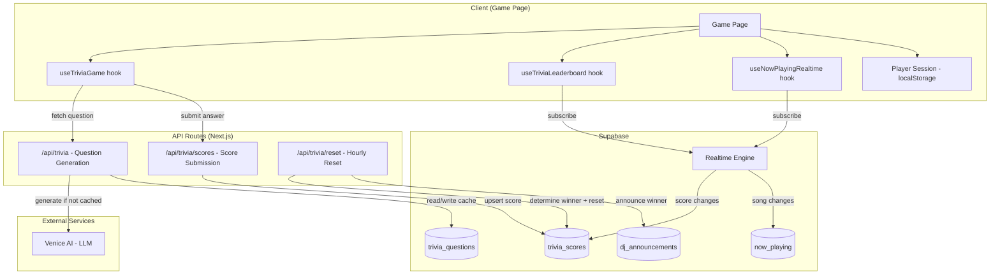

# Design Document: Song Trivia Game

## Overview

Replace the existing DGS (Dual Gravity System) music game with a song trivia game. The trivia game presents multiple-choice questions about the currently playing song or artist, generated by Venice AI. Players earn points for correct answers, compete on a live leaderboard, and the top scorer is announced by the DJ at the top of each clock hour.

The system follows a cache-first architecture: when a song starts playing, the API generates a trivia question via Venice AI and caches it in Supabase. All player devices for a venue fetch the same cached question. Scores are persisted in Supabase with Realtime subscriptions powering the live leaderboard. An hourly reset mechanism determines the winner, triggers a DJ announcement, and clears scores.

### Key Design Decisions

1. **Cache-first question delivery**: Questions are cached per `(profile_id, spotify_track_id)` in Supabase. The first device to detect a song change triggers generation; all others read from cache. This minimizes Venice AI calls and ensures consistency across devices.
2. **Client-driven hourly reset**: Rather than a server-side cron, the reset is triggered client-side when any device detects the hour boundary. A Supabase RPC function handles the atomic winner determination + score reset to avoid race conditions from multiple devices.
3. **Session-based identity**: Players are identified by a browser-generated session ID stored in localStorage. No auth required. Display names are editable and stored alongside the session ID.
4. **Reuse existing patterns**: The design mirrors `useNowPlayingRealtime` for Realtime subscriptions, the Venice AI integration pattern from `dj-script/route.ts`, and the DJ announcement system for winner announcements.

## Architecture



### Data Flow

1. **Song Change → Question**: `useNowPlayingRealtime` detects `spotify_track_id` change → `useTriviaGame` calls `/api/trivia?profile_id=X&track_id=Y` → API checks `trivia_questions` cache → if miss, calls Venice AI → caches and returns question
2. **Answer → Score**: Player taps answer → `useTriviaGame` evaluates locally against `correctIndex` → if correct, POSTs to `/api/trivia/scores` → Supabase upserts score → Realtime broadcasts to all devices
3. **Hourly Reset → Winner**: Client timer fires at XX:00 → POSTs to `/api/trivia/reset` → Supabase RPC atomically reads top scorer, resets scores, returns winner → API triggers DJ announcement via `dj_announcements` table → Realtime broadcasts cleared leaderboard

## Components and Interfaces

### API Routes

#### `POST /api/trivia` — Question Generation

Generates or retrieves a cached trivia question for a song at a venue.

```typescript
// Request
interface TriviaQuestionRequest {
  profile_id: string
  spotify_track_id: string
  track_name: string
  artist_name: string
  album_name: string
}

// Response
interface TriviaQuestionResponse {
  question: string
  options: [string, string, string, string]
  correctIndex: 0 | 1 | 2 | 3
  spotify_track_id: string
}
```

**Logic**:
1. Check `trivia_questions` for existing row matching `(profile_id, spotify_track_id)`
2. If cached, return it
3. If not, call Venice AI with a system prompt instructing it to generate a music trivia question with 4 options in JSON format
4. Parse and validate the response (must have exactly 4 options, correctIndex 0–3)
5. Randomize option order (shuffle options array, update correctIndex accordingly)
6. Cache in `trivia_questions` and return

**Venice AI prompt structure**:
```
System: You are a music trivia question generator. Given a song, generate one multiple-choice trivia question about the song, artist, album, or genre. Return ONLY valid JSON: {"question": "...", "options": ["A", "B", "C", "D"], "correctIndex": 0}. The correctIndex must be 0-3 indicating which option is correct. Make questions fun and varied in difficulty.

User: Song: "{track_name}" by {artist_name} from the album "{album_name}"
```

#### `POST /api/trivia/scores` — Score Submission

```typescript
// Request
interface ScoreSubmitRequest {
  profile_id: string
  session_id: string
  player_name: string
}

// Response
interface ScoreSubmitResponse {
  success: boolean
  new_score: number
}
```

**Logic**:
1. Validate inputs (profile_id, session_id, player_name length 1–20)
2. Upsert into `trivia_scores`: increment `score` by 1, update `player_name`, set `first_score_at` if null
3. Return new total score

#### `POST /api/trivia/reset` — Hourly Reset

```typescript
// Request
interface ResetRequest {
  profile_id: string
}

// Response
interface ResetResponse {
  winner: { player_name: string; score: number } | null
  reset: boolean
}
```

**Logic**:
1. Call Supabase RPC `trivia_determine_winner_and_reset(p_profile_id)` which atomically:
   - Selects the top scorer (highest score, earliest `first_score_at` for ties)
   - Deletes all rows for the venue
   - Returns the winner (or null if no scores)
2. If winner exists and DJ mode is enabled, upsert a DJ announcement into `dj_announcements` with a winner script
3. Return winner info

### React Hooks

#### `useTriviaGame`

Core game state hook managing question lifecycle, answer selection, and scoring.

```typescript
interface UseTriviaGameOptions {
  profileId: string | null
  username: string
}

interface UseTriviaGameResult {
  question: TriviaQuestion | null
  selectedAnswer: number | null
  isCorrect: boolean | null
  score: number
  isLoading: boolean
  error: string | null
  selectAnswer: (index: number) => void
  playerName: string
  sessionId: string
  setPlayerName: (name: string) => void
  hasJoined: boolean
  joinGame: (name: string) => void
  timeUntilReset: number // seconds until next hour
}
```

**Responsibilities**:
- Listens to `useNowPlayingRealtime` for song changes
- Fetches/generates trivia question on song change
- Manages answer selection state (one answer per question)
- Submits correct answers to `/api/trivia/scores`
- Manages player session (localStorage persistence)
- Tracks countdown to next hourly reset
- Triggers `/api/trivia/reset` at hour boundary

#### `useTriviaLeaderboard`

Real-time leaderboard subscription.

```typescript
interface UseTriviaLeaderboardOptions {
  profileId: string | null
}

interface LeaderboardEntry {
  session_id: string
  player_name: string
  score: number
  first_score_at: string
}

interface UseTriviaLeaderboardResult {
  entries: LeaderboardEntry[]
  isLoading: boolean
}
```

**Responsibilities**:
- Initial fetch of all `trivia_scores` rows where `score > 0` for the venue
- Subscribes to Realtime `postgres_changes` on `trivia_scores` filtered by `profile_id`
- Sorts entries by score descending, then `first_score_at` ascending for ties
- Re-fetches on INSERT/UPDATE/DELETE events

### React Components

#### Game Page (`app/[username]/game/page.tsx`)

Top-level page component. Replaces the existing DGS game page entirely.

```
┌─────────────────────────────────┐
│  🎵 Song Name - Artist Name    │
│  [Album Art]                    │
│                                 │
│  ┌─────────────────────────┐    │
│  │ Trivia Question Text?   │    │
│  └─────────────────────────┘    │
│                                 │
│  ┌─────────────────────────┐    │
│  │ Option A                │    │
│  ├─────────────────────────┤    │
│  │ Option B                │    │
│  ├─────────────────────────┤    │
│  │ Option C                │    │
│  ├─────────────────────────┤    │
│  │ Option D                │    │
│  └─────────────────────────┘    │
│                                 │
│  Score: 5  ⏱ 23:45 until reset │
│                                 │
│  ▼ Leaderboard                  │
│  ┌─────────────────────────┐    │
│  │ 1. Alice      8 pts     │    │
│  │ 2. You ★      5 pts     │    │
│  │ 3. Bob        3 pts     │    │
│  └─────────────────────────┘    │
└─────────────────────────────────┘
```

**Sub-components**:
- `NowPlayingHeader` — displays song name, artist, album art
- `TriviaQuestion` — question text + 4 answer buttons with correct/incorrect visual feedback
- `PlayerScore` — current score display + countdown timer
- `Leaderboard` — collapsible ranked list with current player highlighted
- `NameEntryModal` — modal for entering display name on first visit

## Data Models

### `trivia_questions` Table

Caches generated trivia questions per song per venue.

```sql
CREATE TABLE trivia_questions (
  id UUID DEFAULT gen_random_uuid() PRIMARY KEY,
  profile_id UUID NOT NULL REFERENCES profiles(id) ON DELETE CASCADE,
  spotify_track_id TEXT NOT NULL,
  question TEXT NOT NULL,
  options JSONB NOT NULL, -- ["option1", "option2", "option3", "option4"]
  correct_index SMALLINT NOT NULL CHECK (correct_index BETWEEN 0 AND 3),
  created_at TIMESTAMPTZ DEFAULT now() NOT NULL,
  UNIQUE (profile_id, spotify_track_id)
);

-- Index for fast lookups
CREATE INDEX idx_trivia_questions_lookup
  ON trivia_questions (profile_id, spotify_track_id);

-- RLS: allow public read (no auth required for game page)
ALTER TABLE trivia_questions ENABLE ROW LEVEL SECURITY;
CREATE POLICY "Public read trivia questions"
  ON trivia_questions FOR SELECT USING (true);
CREATE POLICY "Service role insert/update trivia questions"
  ON trivia_questions FOR ALL USING (auth.role() = 'service_role');
```

### `trivia_scores` Table

Tracks player scores per venue for the current hour.

```sql
CREATE TABLE trivia_scores (
  id UUID DEFAULT gen_random_uuid() PRIMARY KEY,
  profile_id UUID NOT NULL REFERENCES profiles(id) ON DELETE CASCADE,
  session_id TEXT NOT NULL,
  player_name TEXT NOT NULL CHECK (char_length(player_name) BETWEEN 1 AND 20),
  score INTEGER NOT NULL DEFAULT 0 CHECK (score >= 0),
  first_score_at TIMESTAMPTZ,
  updated_at TIMESTAMPTZ DEFAULT now() NOT NULL,
  UNIQUE (profile_id, session_id)
);

-- Index for leaderboard queries
CREATE INDEX idx_trivia_scores_leaderboard
  ON trivia_scores (profile_id, score DESC, first_score_at ASC);

-- Enable Realtime for leaderboard subscriptions
ALTER TABLE trivia_scores REPLICA IDENTITY FULL;

-- RLS: public read, service role write
ALTER TABLE trivia_scores ENABLE ROW LEVEL SECURITY;
CREATE POLICY "Public read trivia scores"
  ON trivia_scores FOR SELECT USING (true);
CREATE POLICY "Service role manage trivia scores"
  ON trivia_scores FOR ALL USING (auth.role() = 'service_role');
```

### `trivia_determine_winner_and_reset` RPC Function

Atomic winner determination and score reset.

```sql
CREATE OR REPLACE FUNCTION trivia_determine_winner_and_reset(
  p_profile_id UUID
)
RETURNS TABLE (winner_name TEXT, winner_score INTEGER) AS $$
BEGIN
  -- Get the winner (highest score, earliest first_score_at for ties)
  RETURN QUERY
  SELECT ts.player_name, ts.score
  FROM trivia_scores ts
  WHERE ts.profile_id = p_profile_id
    AND ts.score > 0
  ORDER BY ts.score DESC, ts.first_score_at ASC
  LIMIT 1;

  -- Delete all scores for this venue
  DELETE FROM trivia_scores WHERE trivia_scores.profile_id = p_profile_id;
END;
$$ LANGUAGE plpgsql;
```

### Zod Validation Schemas

```typescript
import { z } from 'zod'

export const triviaQuestionRequestSchema = z.object({
  profile_id: z.string().uuid(),
  spotify_track_id: z.string().min(1),
  track_name: z.string().min(1),
  artist_name: z.string().min(1),
  album_name: z.string().min(1)
})

export const triviaQuestionResponseSchema = z.object({
  question: z.string().min(1),
  options: z.tuple([z.string(), z.string(), z.string(), z.string()]),
  correctIndex: z.number().int().min(0).max(3)
})

export const scoreSubmitRequestSchema = z.object({
  profile_id: z.string().uuid(),
  session_id: z.string().min(1),
  player_name: z.string().min(1).max(20)
})

export const resetRequestSchema = z.object({
  profile_id: z.string().uuid()
})
```

