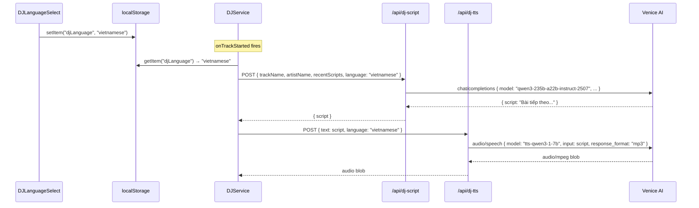

# Design Document: Vietnamese DJ Language

## Overview

This feature adds Vietnamese as a selectable language for DJ Mode. The change is additive and surgical: a single `language` field flows from the admin UI through `DJService` into both the Script API and TTS API routes, where it selects the appropriate model and prompt. The English path is completely unchanged — no existing behaviour, model, prompt, or localStorage key is modified.

Key constraints from the requirements:

- Model IDs are **hardcoded constants** in the route files — no new environment variables.
- Only `VENICE_AI_API_KEY` is used (already exists).
- Vietnamese LLM: `qwen3-235b-a22b-instruct-2507`
- Vietnamese TTS: `tts-qwen3-1-7b` — no `voice` param (language-aware synthesis)
- English TTS: `tts-kokoro` + `af_nova` (unchanged)
- Language persisted to `localStorage["djLanguage"]`
- Language selector hidden when DJ Mode is disabled

## Architecture

The change touches four layers, each with a minimal, isolated modification:

```
┌─────────────────────────────────────────────────────────────┐
│  Admin Dashboard UI                                         │
│  + DJLanguageSelect component (new)                         │
│    reads/writes localStorage["djLanguage"]                  │
│    hidden when djMode === false                             │
└────────────────────────┬────────────────────────────────────┘
                         │ language: "english" | "vietnamese"
                         ▼
┌─────────────────────────────────────────────────────────────┐
│  DJService (services/djService.ts)                          │
│  + reads localStorage["djLanguage"] in fetchAudioBlob()     │
│  + passes language to /api/dj-script and /api/dj-tts        │
└──────────┬──────────────────────────┬───────────────────────┘
           │                          │
           ▼                          ▼
┌──────────────────────┐   ┌──────────────────────────────────┐
│  /api/dj-script      │   │  /api/dj-tts                     │
│  + language param    │   │  + language param                │
│  "english" →         │   │  "english" → tts-kokoro+af_nova  │
│    llama-3.3-70b     │   │  "vietnamese" → tts-qwen3-1-7b   │
│  "vietnamese" →      │   │    (no voice param)              │
│    qwen3-235b-a22b-  │   └──────────────────────────────────┘
│    instruct-2507     │
└──────────────────────┘
```

### Data flow for a Vietnamese announcement



## Components and Interfaces

### New component: `DJLanguageSelect`

**File:** `app/[username]/admin/components/dashboard/components/dj-language-select.tsx`

Follows the same pattern as `DJFrequencySelect` — listens for `djmode-changed` and `storage` events to show/hide itself.

```typescript
'use client'

import { useState, useEffect } from 'react'

export type DJLanguage = 'english' | 'vietnamese'

const OPTIONS: { value: DJLanguage; label: string }[] = [
  { value: 'english', label: 'English' },
  { value: 'vietnamese', label: 'Vietnamese' }
]

export function DJLanguageSelect(): JSX.Element {
  const [djEnabled, setDjEnabled] = useState(false)
  const [language, setLanguage] = useState<DJLanguage>('english')

  useEffect(() => {
    const sync = (): void => {
      setDjEnabled(localStorage.getItem('djMode') === 'true')
      const stored = localStorage.getItem('djLanguage') as DJLanguage | null
      setLanguage(stored === 'vietnamese' ? 'vietnamese' : 'english')
    }
    sync()
    window.addEventListener('storage', sync)
    window.addEventListener('djmode-changed', sync)
    return () => {
      window.removeEventListener('storage', sync)
      window.removeEventListener('djmode-changed', sync)
    }
  }, [])

  if (!djEnabled) return null as unknown as JSX.Element

  const handleSelect = (value: DJLanguage): void => {
    setLanguage(value)
    localStorage.setItem('djLanguage', value)
  }

  return (
    <div className='py-1'>
      <span className='text-white text-sm font-semibold'>DJ Language</span>
      <div className='mt-1 flex flex-wrap gap-1'>
        {OPTIONS.map(({ value, label }) => (
          <button
            key={value}
            type='button'
            onClick={() => handleSelect(value)}
            className={`rounded px-2 py-0.5 text-xs font-medium transition-colors ${
              language === value
                ? 'text-white bg-green-600'
                : 'bg-gray-700 text-gray-300 hover:bg-gray-600'
            }`}
          >
            {label}
          </button>
        ))}
      </div>
    </div>
  )
}
```

### Modified: `services/djService.ts`

The only change is in `fetchAudioBlob` — read `djLanguage` from localStorage and pass it to both API calls.

**Before:**

```typescript
private async fetchAudioBlob(trackName: string, artistName: string): Promise<Blob | null> {
  // ...
  body: JSON.stringify({ trackName, artistName, recentScripts: this.recentScripts })
  // ...
  body: JSON.stringify({ text: data.script })
}
```

**After:**

```typescript
private async fetchAudioBlob(trackName: string, artistName: string): Promise<Blob | null> {
  const rawLang = localStorage.getItem('djLanguage')
  const language: 'english' | 'vietnamese' =
    rawLang === 'vietnamese' ? 'vietnamese' : 'english'
  // ...
  body: JSON.stringify({ trackName, artistName, recentScripts: this.recentScripts, language })
  // ...
  body: JSON.stringify({ text: data.script, language })
}
```

No other methods in `DJService` change.

### Modified: `app/api/dj-script/route.ts`

Add two hardcoded model constants and branch on `language`.

**Constants added at top of file:**

```typescript
const ENGLISH_LLM_MODEL = 'llama-3.3-70b'
const VIETNAMESE_LLM_MODEL = 'qwen3-235b-a22b-instruct-2507'
```

**Request parsing — add `language` extraction:**

```typescript
// Before
const { trackName, artistName, recentScripts } = body as Record<string, unknown>

// After
const { trackName, artistName, recentScripts, language } = body as Record<
  string,
  unknown
>
const isVietnamese = language === 'vietnamese'
```

**Venice AI call — branch on language:**

```typescript
// Before
body: JSON.stringify({
  model: 'llama-3.3-70b',
  messages: [
    {
      role: 'system',
      content: 'No more than 2 sentences...' + recentScriptsNote
    },
    {
      role: 'user',
      content: `Introduce the next track: "${trackName}" by ${artistName}.`
    }
  ],
  max_tokens: 150
})

// After
const model = isVietnamese ? VIETNAMESE_LLM_MODEL : ENGLISH_LLM_MODEL
const systemPrompt = isVietnamese
  ? 'Không quá 2 câu có thể đọc trong 10 giây hoặc ít hơn. Bạn là một DJ radio tên DJ 3B đang chơi nhạc tại quán bia thủ công 3B Saigon. Hãy viết một đoạn giới thiệu ngắn bằng tiếng Việt tự nhiên cho bài hát tiếp theo. Ngắn gọn và tự nhiên.' +
    recentScriptsNote
  : 'No more than 2 sentences that can be spoken in 10 seconds or less.  Do not generate non english characters.  You are an laid back, relaxed and chill radio DJ called DJ 3B playing music in a craft beer bar called 3B Saigon. Write a short announcement of no more than 2 sentences introducing the next track. Be informative but concise.' +
    'You are aware that you are an AI with a female voice though do not say that.  Never mention the date or time.' +
    recentScriptsNote

body: JSON.stringify({
  model,
  messages: [
    { role: 'system', content: systemPrompt },
    {
      role: 'user',
      content: `Introduce the next track: "${trackName}" by ${artistName}.`
    }
  ],
  max_tokens: 150
})
```

### Modified: `app/api/dj-tts/route.ts`

Add two hardcoded model constants and branch on `language`.

**Constants added at top of file:**

```typescript
const ENGLISH_TTS_MODEL = 'tts-kokoro'
const ENGLISH_TTS_VOICE = 'af_nova'
const VIETNAMESE_TTS_MODEL = 'tts-qwen3-1-7b'
```

**Request parsing — add `language` extraction:**

```typescript
// Before
const { text } = body as Record<string, unknown>

// After
const { text, language } = body as Record<string, unknown>
const isVietnamese = language === 'vietnamese'
```

**Venice AI TTS call — branch on language:**

```typescript
// Before
body: JSON.stringify({
  model: 'tts-kokoro',
  voice: 'af_nova',
  input: text,
  response_format: 'mp3'
})

// After
const ttsBody = isVietnamese
  ? { model: VIETNAMESE_TTS_MODEL, input: text, response_format: 'mp3' }
  : {
      model: ENGLISH_TTS_MODEL,
      voice: ENGLISH_TTS_VOICE,
      input: text,
      response_format: 'mp3'
    }

body: JSON.stringify(ttsBody)
```

## Data Models

### localStorage entries (additions only)

| Key            | Type   | Values                       | Default                         |
| -------------- | ------ | ---------------------------- | ------------------------------- |
| `"djLanguage"` | string | `"english"` / `"vietnamese"` | absent = treated as `"english"` |

Existing keys (`djMode`, `djFrequency`, `duckOverlayMode`) are unchanged.

### `/api/dj-script` request (updated)

```typescript
interface DJScriptRequest {
  trackName: string
  artistName: string
  recentScripts?: string[]
  language?: 'english' | 'vietnamese' // new — absent defaults to "english"
}
```

### `/api/dj-tts` request (updated)

```typescript
interface DJTTSRequest {
  text: string
  language?: 'english' | 'vietnamese' // new — absent defaults to "english"
}
```

### Hardcoded model constants

| Constant               | Value                             | Location             |
| ---------------------- | --------------------------------- | -------------------- |
| `ENGLISH_LLM_MODEL`    | `"llama-3.3-70b"`                 | `dj-script/route.ts` |
| `VIETNAMESE_LLM_MODEL` | `"qwen3-235b-a22b-instruct-2507"` | `dj-script/route.ts` |
| `ENGLISH_TTS_MODEL`    | `"tts-kokoro"`                    | `dj-tts/route.ts`    |
| `ENGLISH_TTS_VOICE`    | `"af_nova"`                       | `dj-tts/route.ts`    |
| `VIETNAMESE_TTS_MODEL` | `"tts-qwen3-1-7b"`                | `dj-tts/route.ts`    |

## Correctness Properties

_A property is a characteristic or behavior that should hold true across all valid executions of a system — essentially, a formal statement about what the system should do. Properties serve as the bridge between human-readable specifications and machine-verifiable correctness guarantees._

### Property 1: Language selector localStorage round-trip

_For any_ valid DJ language value (`"english"` or `"vietnamese"`), selecting it in `DJLanguageSelect` should persist it to `localStorage["djLanguage"]`, and re-mounting the component (with DJ Mode enabled) should display that same option as selected.

**Validates: Requirements 1.3, 1.4**

### Property 2: Language selector visibility tied to DJ Mode state

_For any_ DJ Mode state (enabled or disabled), the `DJLanguageSelect` component should be visible if and only if DJ Mode is enabled.

**Validates: Requirements 1.1, 1.6**

### Property 3: Script API uses correct model per language

_For any_ request to `/api/dj-script` with a `language` field, the model sent to Venice AI should be `qwen3-235b-a22b-instruct-2507` when `language` is `"vietnamese"`, and `llama-3.3-70b` when `language` is `"english"` or absent.

**Validates: Requirements 2.1, 2.2, 5.1**

### Property 4: Vietnamese system prompt is in Vietnamese

_For any_ request to `/api/dj-script` with `language: "vietnamese"`, the system message sent to Venice AI should contain Vietnamese-language instructions (not English instructions).

**Validates: Requirements 2.4**

### Property 5: DJService passes language to both APIs

_For any_ `localStorage["djLanguage"]` value (including absent), `DJService.fetchAudioBlob` should include a `language` field in both the `/api/dj-script` and `/api/dj-tts` request bodies, defaulting to `"english"` when the key is absent or unrecognised.

**Validates: Requirements 2.5, 3.1, 5.3**

### Property 6: TTS API uses correct model and voice config per language

_For any_ request to `/api/dj-tts`, the Venice AI TTS request body should contain `model: "tts-qwen3-1-7b"` with no `voice` field when `language` is `"vietnamese"`, and `model: "tts-kokoro"` with `voice: "af_nova"` when `language` is `"english"` or absent.

**Validates: Requirements 3.2, 3.3, 5.2**

### Property 7: Vietnamese path graceful degradation

_For any_ error condition in the Vietnamese language path (LLM failure, TTS failure, network error, non-200 response), `DJService.maybeAnnounce` should resolve without throwing, and the next track should play normally.

**Validates: Requirements 4.1, 4.2, 4.3**

### Property 8: Unknown language falls back to English

_For any_ string stored in `localStorage["djLanguage"]` that is not `"vietnamese"` (including arbitrary strings, empty string, or absent), `DJService` should treat it as `"english"` and use the English model and TTS path.

**Validates: Requirements 4.4**

## Error Handling

All error handling follows the existing DJ Mode invariant: **the next track always plays**.

| Error scenario                         | Handling                                                                     |
| -------------------------------------- | ---------------------------------------------------------------------------- |
| Vietnamese LLM request fails (network) | `fetchAudioBlob` catches, returns `null`; `maybeAnnounce` skips announcement |
| Vietnamese LLM returns non-200         | Same as above                                                                |
| Vietnamese TTS request fails (network) | Same as above                                                                |
| Vietnamese TTS returns non-200         | Same as above                                                                |
| `tts-qwen3-1-7b` model unavailable     | TTS route returns 500; `fetchAudioBlob` returns `null`; announcement skipped |
| `djLanguage` set to unrecognised value | `DJService` treats as `"english"`, uses English path                         |
| `djLanguage` absent from localStorage  | `DJService` defaults to `"english"`                                          |

The Vietnamese path errors are handled identically to the existing English path errors — no new error handling logic is needed beyond the `language` branching.

## Testing Strategy

### Unit tests

- `DJLanguageSelect` renders with label "DJ Language" when DJ Mode is enabled
- `DJLanguageSelect` renders exactly two options: "English" and "Vietnamese"
- `DJLanguageSelect` returns null when DJ Mode is disabled
- `DJLanguageSelect` defaults to "English" when `localStorage["djLanguage"]` is absent
- `/api/dj-script` returns 400 when `trackName` is missing (unchanged)
- `/api/dj-script` uses `llama-3.3-70b` when `language` is absent (backward compat)
- `/api/dj-tts` uses `tts-kokoro` + `af_nova` when `language` is absent (backward compat)
- `/api/dj-tts` omits `voice` field when `language` is `"vietnamese"`

### Property-based tests

Uses [fast-check](https://github.com/dubzzz/fast-check). Each property test runs a minimum of 100 iterations.

**Property 1: Language selector localStorage round-trip**

```typescript
// Feature: vietnamese-dj-language, Property 1: Language selector localStorage round-trip
fc.property(
  fc.constantFrom('english', 'vietnamese'),
  (lang) => {
    localStorage.setItem('djMode', 'true')
    localStorage.setItem('djLanguage', lang)
    render(<DJLanguageSelect />)
    const activeBtn = screen.getByText(lang === 'english' ? 'English' : 'Vietnamese')
    expect(activeBtn).toHaveClass('bg-green-600')
  }
)
```

**Property 2: Language selector visibility tied to DJ Mode state**

```typescript
// Feature: vietnamese-dj-language, Property 2: Language selector visibility tied to DJ Mode state
fc.property(fc.boolean(), (djEnabled) => {
  localStorage.setItem('djMode', String(djEnabled))
  render(<DJLanguageSelect />)
  const selector = screen.queryByText('DJ Language')
  if (djEnabled) {
    expect(selector).toBeInTheDocument()
  } else {
    expect(selector).not.toBeInTheDocument()
  }
})
```

**Property 3: Script API uses correct model per language**

```typescript
// Feature: vietnamese-dj-language, Property 3: Script API uses correct model per language
fc.property(
  fc.constantFrom('english', 'vietnamese', undefined),
  fc.string({ minLength: 1 }),
  fc.string({ minLength: 1 }),
  async (language, trackName, artistName) => {
    const capturedBody = await captureVeniceScriptRequest({
      trackName,
      artistName,
      language
    })
    const expectedModel =
      language === 'vietnamese'
        ? 'qwen3-235b-a22b-instruct-2507'
        : 'llama-3.3-70b'
    expect(capturedBody.model).toBe(expectedModel)
  }
)
```

**Property 4: Vietnamese system prompt is in Vietnamese**

```typescript
// Feature: vietnamese-dj-language, Property 4: Vietnamese system prompt is in Vietnamese
fc.property(
  fc.string({ minLength: 1 }),
  fc.string({ minLength: 1 }),
  async (trackName, artistName) => {
    const capturedBody = await captureVeniceScriptRequest({
      trackName,
      artistName,
      language: 'vietnamese'
    })
    const systemMsg = capturedBody.messages.find(
      (m: { role: string }) => m.role === 'system'
    )
    // English system prompt starts with "No more than" — Vietnamese prompt should not
    expect(systemMsg.content).not.toMatch(/^No more than/)
    // Should contain Vietnamese text
    expect(systemMsg.content).toMatch(/tiếng Việt|bài hát|DJ 3B/)
  }
)
```

**Property 5: DJService passes language to both APIs**

```typescript
// Feature: vietnamese-dj-language, Property 5: DJService passes language to both APIs
fc.property(
  fc.option(fc.constantFrom('english', 'vietnamese'), { nil: undefined }),
  async (storedLang) => {
    if (storedLang) {
      localStorage.setItem('djLanguage', storedLang)
    } else {
      localStorage.removeItem('djLanguage')
    }
    const expectedLang = storedLang === 'vietnamese' ? 'vietnamese' : 'english'
    const { scriptBody, ttsBody } = await captureServiceFetchBodies()
    expect(scriptBody.language).toBe(expectedLang)
    expect(ttsBody.language).toBe(expectedLang)
  }
)
```

**Property 6: TTS API uses correct model and voice config per language**

```typescript
// Feature: vietnamese-dj-language, Property 6: TTS API uses correct model and voice config per language
fc.property(
  fc.constantFrom('english', 'vietnamese', undefined),
  fc.string({ minLength: 1 }),
  async (language, text) => {
    const capturedBody = await captureVeniceTTSRequest({ text, language })
    if (language === 'vietnamese') {
      expect(capturedBody.model).toBe('tts-qwen3-1-7b')
      expect(capturedBody).not.toHaveProperty('voice')
    } else {
      expect(capturedBody.model).toBe('tts-kokoro')
      expect(capturedBody.voice).toBe('af_nova')
    }
  }
)
```

**Property 7: Vietnamese path graceful degradation**

```typescript
// Feature: vietnamese-dj-language, Property 7: Vietnamese path graceful degradation
fc.property(
  fc.constantFrom(
    'llm-network-error',
    'llm-non-200',
    'tts-network-error',
    'tts-non-200'
  ),
  async (errorType) => {
    localStorage.setItem('djMode', 'true')
    localStorage.setItem('djLanguage', 'vietnamese')
    jest.spyOn(Math, 'random').mockReturnValue(0.01) // always trigger
    setupVietnameseError(errorType)
    await expect(djService.maybeAnnounce(mockTrack)).resolves.toBeUndefined()
  }
)
```

**Property 8: Unknown language falls back to English**

```typescript
// Feature: vietnamese-dj-language, Property 8: Unknown language falls back to English
fc.property(
  fc.string().filter((s) => s !== 'vietnamese'),
  async (unknownLang) => {
    localStorage.setItem('djLanguage', unknownLang)
    const { scriptBody, ttsBody } = await captureServiceFetchBodies()
    expect(scriptBody.language).toBe('english')
    expect(ttsBody.language).toBe('english')
  }
)
```
