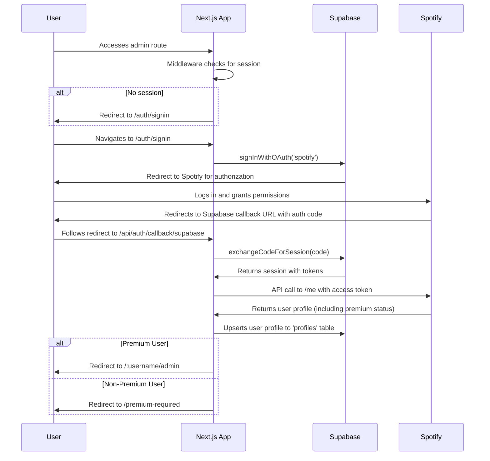

# Architecture Document: JM Bar Jukebox

## 1. Project Overview

This document outlines the architecture of the JM Bar Jukebox, a web application that allows users to control a jukebox using their Spotify accounts. The application is built with Next.js and integrates with Supabase for backend services and Spotify for music playback and user data.

## 2. Technology Stack

- **Framework:** [Next.js](https://nextjs.org/)
- **Language:** [TypeScript](https://www.typescriptlang.org/)
- **Authentication:** [Supabase Auth](https://supabase.com/docs/guides/auth) with Spotify as the OAuth provider.
- **Backend & Database:** [Supabase](https://supabase.com/) (PostgreSQL)
- **External Services:** [Spotify Web API](https://developer.spotify.com/documentation/web-api/)
- **Styling:** [Tailwind CSS](https://tailwindcss.com/)
- **State Management:** [Zustand](https://github.com/pmndrs/zustand)
- **UI Libraries:**
  - [Headless UI](https://headlessui.com/)
  - [Radix UI](https://www.radix-ui.com/)
  - [Lucide React](https://lucide.dev/)
  - [Framer Motion](https://www.framer.com/motion/)

## 3. Folder Structure

The project is organized into the following key directories:

- **`app/`**: The core of the Next.js application, containing pages and API routes.
  - **`app/api/`**: Backend API endpoints.
  - **`app/[username]/admin/`**: The main dashboard for authenticated users.
- **`components/`**: Reusable React components.
- **`lib/`**: Utility functions and library initializations.
- **`services/`**: Business logic and interactions with external APIs.
- **`supabase/`**: Supabase-related configurations and migrations.
- **`prisma/`**: Prisma schema and database-related files.
- **`hooks/`**: Custom React hooks for managing state and side effects.
- **`shared/`**: Code shared between the client and server.

## 4. Authentication Flow

User authentication is handled by Supabase Auth, using Spotify as the OAuth provider. The flow is as follows:

## 5. API Endpoints

The application exposes several API endpoints under `app/api/` to handle various backend operations:

- **`app/api/auth/...`**: Manages authentication, including callbacks and session management.
- **`app/api/playback/...`**: Controls Spotify playback, such as play, pause, and skip.
- **`app/api/playlist/...`**: Manages the jukebox playlist.
- **`app/api/search/...`**: Searches for tracks on Spotify.
- **`app/api/token/...`**: Handles Spotify API token management.

## 6. Data Management

- **Database:** The application uses a PostgreSQL database managed by Supabase. The schema is defined and managed using Prisma.
- **State Management:** Client-side state is managed with Zustand, a small, fast, and scalable state-management solution.

## 7. Key Components

- **`SpotifyPlayer`**: The main component for controlling music playback.
- **`Playlist`**: Displays the current jukebox playlist.
- **`QueueItem`**: Represents a single item in the playlist queue.
- **`Admin Dashboard`**: The main interface for authenticated users to manage the jukebox.