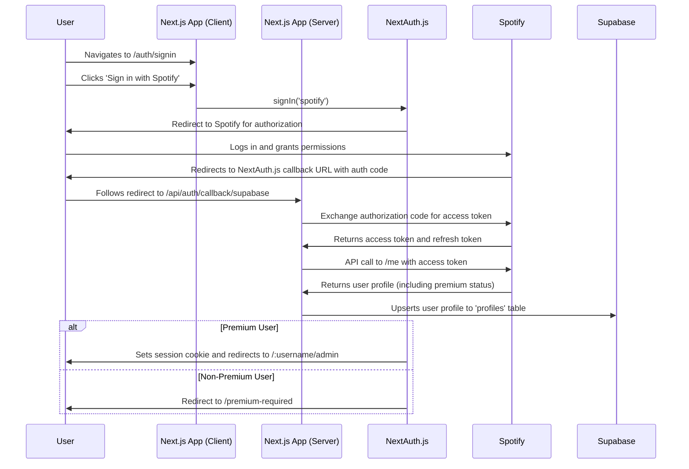

# Architecture Document: JM Bar Jukebox

## 1. Project Overview

This document outlines the architecture of the JM Bar Jukebox, a web application that allows users to control a jukebox using their Spotify accounts. The application is built with Next.js and integrates with Supabase for backend services and Spotify for music playback and user data.

## 2. Technology Stack

- **Framework:** [Next.js](https://nextjs.org/)
- **Language:** [TypeScript](https://www.typescriptlang.org/)
- **Authentication:** [NextAuth.js](https://next-auth.js.org/) with Spotify as the OAuth provider.
- **Backend & Database:** [Supabase](https://supabase.com/) (PostgreSQL)
- **Error Monitoring:** [@sentry/nextjs](https://sentry.io/)
- **Schema Validation:** [Zod](https://zod.dev/)
- **External Services:**
  - [Spotify Web API](https://developer.spotify.com/documentation/web-api/)
  - [Spotify Web Playback SDK](https://developer.spotify.com/documentation/web-playback-sdk)
- **Data Fetching:** [SWR](https://swr.vercel.app/)
- **Styling:** [Tailwind CSS](https://tailwindcss.com/)
- **State Management:** [Zustand](https://github.com/pmndrs/zustand)
- **Animations:** [Framer Motion](https://www.framer.com/motion/)
- **UI Libraries:**
  - [Headless UI](https://headlessui.com/)
  - [Radix UI](https://www.radix-ui.com/)
  - [Lucide React](https://lucide.dev/)

## 3. Folder Structure

The project is organized into the following key directories:

- **`app/`**: The core of the Next.js application, containing pages and API routes.
  - **`app/api/`**: Backend API endpoints.
  - **`app/[username]/admin/`**: The main dashboard for authenticated users.
  - **`app/[username]/playlist/`**: The public-facing playlist view.
- **`components/`**: Reusable React components.
  - **`components/ui/`**: Reusable UI components like `Card`, `Progress`, and `Tabs`.
- **`contexts/`**: React context providers for managing global state.
- **`hooks/`**: Custom React hooks for managing state and side effects.
- **`lib/`**: Utility functions and library initializations.
- **`public/`**: Static assets like images and icons.
- **`services/`**: Business logic and interactions with external APIs.
- **`shared/`**: Code shared between the client and server.
- **`supabase/`**: Supabase-related configurations and migrations.
- **`types/`**: Global TypeScript type definitions.

## 4. Authentication Flow

User authentication is handled by NextAuth.js, using Spotify as the OAuth provider. The `middleware.ts` file only protects routes under `/admin`.

The flow is as follows:

The callback logic in `app/api/auth/callback/supabase/route.ts` is complex, including fallbacks for retrieving the Spotify access token and handling user profile creation and updates.

## 5. API Endpoints

The application exposes several API endpoints under `app/api/` to handle various backend operations:

- **`app/api/auth/...`**: Manages authentication, including callbacks, session management, profile handling, and premium verification.
- **`app/api/fixed-playlist/...`**: Manages the fixed playlist.
- **`app/api/ping/...`**: A simple endpoint to check if the API is running.
- **`app/api/playback/...`**: Controls Spotify playback, such as play, pause, and skip.
- **`app/api/playlists/[id]/`**: Manages individual playlists.
- **`app/api/search/...`**: Searches for tracks on Spotify.
- **`app/api/token/[username]/`**: Manages tokens for a specific user.
- **`app/api/track-suggestions/last-suggested/`**: Retrieves the last suggested track.
- **`app/api/track-suggestions/refresh/`**: Refreshes track suggestions.
- **`app/api/track-suggestions/refresh-site/`**: Triggers a site-wide refresh of suggestions.

## 6. Data Management

- **Database:** The application uses a PostgreSQL database managed by Supabase. The schema is managed via Supabase's built-in migration tools, located in the `supabase/migrations` directory.
- **State Management:** Client-side state is managed with Zustand, a small, fast, and scalable state-management solution.

## 7. Key Components

- **`Header.tsx`**: The main application header.
- **`SearchInput.tsx`**: A reusable search input component.
- **`SpotifyPlayer`**: The main component for controlling music playback.
- **`Playlist`**: Displays the current jukebox playlist.
- **`QueueItem`**: Represents a single item in the playlist queue.
- **`Admin Dashboard`**: This is not a single component but a collection of components located under the `app/[username]/admin/components/` directory, forming the main interface for authenticated users to manage the jukebox.
- **`components/ui/`**: This directory contains a set of reusable UI components, such as `Card`, `Progress`, and `Tabs`.
