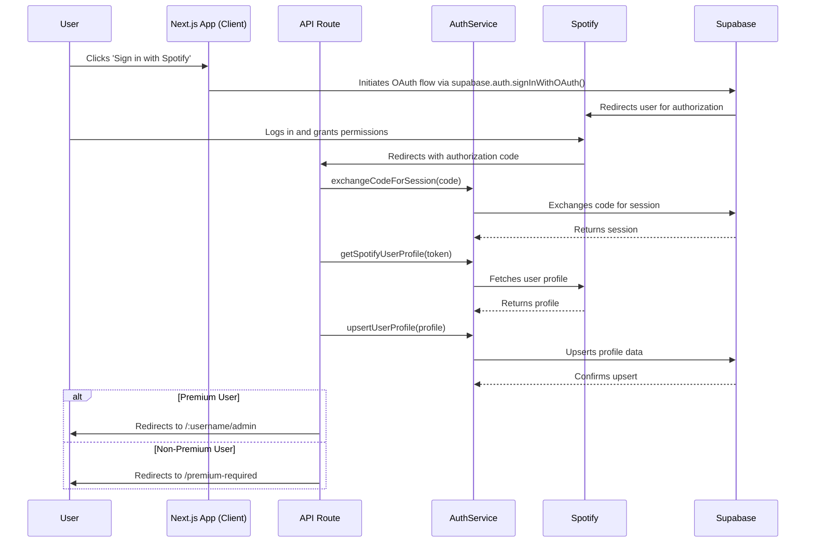

# Architecture Document: JM Bar Jukebox

## 1. Project Overview

This document outlines the architecture of the JM Bar Jukebox, a web application that allows users to control a jukebox using their Spotify accounts. The application is built with Next.js and integrates with Supabase for backend services and Spotify for music playback and user data.

## 2. Technology Stack

- **Framework:** [Next.js](https://nextjs.org/)
- **Language:** [TypeScript](https://www.typescriptlang.org/)
- **Authentication:** [Supabase Auth](https://supabase.com/docs/guides/auth) with Spotify as the OAuth provider
- **Backend & Database:** [Supabase](https://supabase.com/) (PostgreSQL)
- **Error Monitoring:** [@sentry/nextjs](https://sentry.io/)
- **Schema Validation:** [Zod](https://zod.dev/)
- **External Services:**
  - [Spotify Web API](https://developer.spotify.com/documentation/web-api/)
  - [Spotify Web Playback SDK](https://developer.spotify.com/documentation/web-playback-sdk)
- **Data Fetching:** Custom hooks with `useState`/`useEffect` patterns, with selective use of [SWR](https://swr.vercel.app/) for specific endpoints
- **Styling:** [Tailwind CSS](https://tailwindcss.com/)
- **State Management:** [Zustand](https://github.com/pmndrs/zustand) for global state, React Context for specific features
- **Animations:** [Framer Motion](https://www.framer.com/motion/)
- **UI Libraries:**
  - [Headless UI](https://headlessui.com/)
  - [Radix UI](https://www.radix-ui.com/)
  - [Lucide React](https://lucide.dev/)

## 3. Folder Structure

The project is organized into the following key directories:

- **`app/`**: The core of the Next.js application, containing pages and API routes.
  - **`app/api/`**: Backend API endpoints.
  - **`app/[username]/admin/`**: The main dashboard for authenticated users.
  - **`app/[username]/playlist/`**: The public-facing playlist view.
- **`components/`**: Reusable React components.
  - **`components/ui/`**: Reusable UI components like `Card`, `Progress`, and `Tabs`.
- **`hooks/`**: Custom React hooks for managing state and side effects.
- **`lib/`**: Utility functions and library initializations.
- **`public/`**: Static assets like images and icons.
- **`services/`**: Business logic and interactions with external APIs.
- **`shared/`**: Code shared between the client and server.
- **`stores/`**: Zustand stores for managing global application state.
- **`supabase/`**: Supabase-related configurations and migrations.
- **`types/`**: Global TypeScript type definitions.

## 4. Authentication Flow

User authentication is handled by Supabase Auth, using Spotify as the OAuth provider. The `middleware.ts` file handles Supabase session management but does not implement route protection. Route protection is handled by client-side components like `ProtectedRoute.tsx`.

The authentication callback logic has been refactored into a dedicated `AuthService` to improve separation of concerns. The API route acts as a thin controller that coordinates the authentication flow.

```mermaid
sequenceDiagram
    participant User
    participant Next.js App (Client)
    participant API Route
    participant AuthService
    participant Spotify
    participant Supabase

    User->>Next.js App (Client): Clicks 'Sign in with Spotify'
    Next.js App (Client)->>Supabase: Initiates OAuth flow via supabase.auth.signInWithOAuth()

    Supabase->>Spotify: Redirects user for authorization
    User->>Spotify: Logs in and grants permissions
    Spotify->>API Route: Redirects with authorization code

    API Route->>AuthService: exchangeCodeForSession(code)
    AuthService->>Supabase: Exchanges code for session
    Supabase-->>AuthService: Returns session

    API Route->>AuthService: getSpotifyUserProfile(token)
    AuthService->>Spotify: Fetches user profile
    Spotify-->>AuthService: Returns profile

    API Route->>AuthService: upsertUserProfile(profile)
    AuthService->>Supabase: Upserts profile data
    Supabase-->>AuthService: Confirms upsert

    alt Premium User
        API Route->>User: Redirects to /:username/admin
    else Non-Premium User
        API Route->>User: Redirects to /premium-required
    end
```

## 5. API Endpoints

The application exposes several API endpoints under `app/api/` to handle various backend operations:

- **`app/api/auth/...`**: Manages authentication, including callbacks, session management, and profile handling.
- **`app/api/analytics/...`**: Provides analytics and histogram data.
- **`app/api/artist-extract/...`**: Fetches artist information and extracts.
- **`app/api/devices/...`**: Manages Spotify device operations.
- **`app/api/fixed-playlist/...`**: Manages the fixed playlist.
- **`app/api/log-suggestion/...`**: Logs track suggestions.
- **`app/api/now-playing/...`**: Gets current playback state.
- **`app/api/ping/...`**: A simple endpoint to check if the API is running.
- **`app/api/playback/...`**: Controls Spotify playback, such as play, pause, and skip.
- **`app/api/playlist/[id]/`**: Manages individual playlists.
- **`app/api/playlists/...`**: Manages playlist operations.
- **`app/api/queue/...`**: Manages jukebox queue operations.
- **`app/api/random-track/...`**: Generates random track suggestions.
- **`app/api/search/...`**: Searches for tracks on Spotify.
- **`app/api/suggested-tracks/...`**: Manages track suggestions.
- **`app/api/token/[username]/`**: Manages tokens for a specific user.
- **`app/api/track-artwork/[trackId]/`**: Fetches track artwork.
- **`app/api/track-suggestions/`**: A consolidated endpoint for managing track suggestions.
  - `GET ?latest=true`: Fetches the last suggested track.
  - `POST`: Requests a new track suggestion based on the criteria in the body.
  - `PUT`: Updates the "last suggested" track in the cache.

## 6. Data Management

### Database Schema

The application uses a PostgreSQL database managed by Supabase with the following key tables:

- **`profiles`**: User profiles with Spotify authentication data
- **`tracks`**: Spotify track metadata
- **`jukebox_queue`**: Queue items for each user's jukebox
- **`suggested_tracks`**: Track suggestion history
- **`playlists`**: User playlist associations

### State Management

Client-side state is managed with a combination of:

- **Zustand**: For global application state (playlist store, player state, playback intent)
- **React Context**: For specific features (ToastContext, ConsoleLogsProvider)
- **Local State**: For component-specific state management

## 7. Key Components

### Core Components

- **`Header.tsx`**: The main application header.
- **`SearchInput.tsx`**: A reusable search input component.
- **`SpotifyPlayer`**: The main component for controlling music playback.
- **`Playlist`**: Displays the current jukebox playlist.
- **`QueueItem`**: Represents a single item in the playlist queue.

### Admin Dashboard Components

- **`Admin Dashboard`**: Collection of components under `app/[username]/admin/components/`:
  - **`dashboard/`**: Health monitoring, status indicators, playback controls
  - **`analytics/`**: Analytics and histogram components
  - **`playlist/`**: Playlist display and management
  - **`track-suggestions/`**: Track suggestion interface and controls
  - **`ProtectedRoute.tsx`**: Route protection for admin pages

### UI Components

- **`components/ui/`**: Reusable UI components including:
  - `Card`, `Progress`, `Tabs`
  - `Loading`, `ErrorMessage`, `Toast`
  - `AutoFillNotification`, `RecoveryStatus`

### Context Providers

- **`ConsoleLogsProvider.tsx`**: Centralized logging system
- **`ToastContext.tsx`**: Toast notification management

### Recovery System

- **`useRecoverySystem.ts`**: Handles player recovery and error management
- **`useCircuitBreaker.ts`**: Circuit breaker pattern for API calls
- **`useDeviceHealth.ts`**: Device health monitoring

### Health Monitoring

- **`useSpotifyHealthMonitor.ts`**: Overall Spotify service health
- **`useTokenHealth.ts`**: Token expiration monitoring
- **`usePlaybackHealth.ts`**: Playback state monitoring
- **`useConnectionHealth.ts`**: Connection status monitoring

## 8. Recovery and Error Handling

The application implements a comprehensive recovery system:

- **Circuit Breaker Pattern**: Prevents cascading failures
- **Player Lifecycle Management**: Handles Spotify player initialization and recovery
- **Token Management**: Automatic token refresh and validation
- **Health Monitoring**: Real-time monitoring of various system components
- **Error Boundaries**: Graceful error handling and recovery

## 9. Real-time Features

- **Supabase Realtime**: Real-time queue updates via PostgreSQL subscriptions
- **Polling Fallback**: API polling as backup for real-time connections
- **Optimistic Updates**: Immediate UI updates with background synchronization
