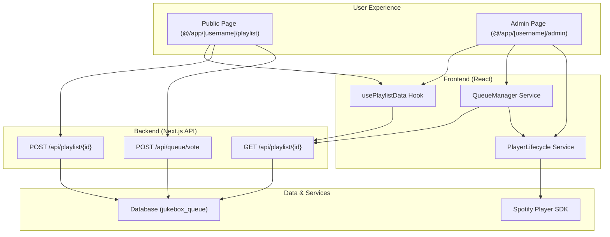

# Architectural Plan: Database-Driven Jukebox Queue

This document outlines the plan to transition the Jukebox application from a Spotify-managed playlist to an internal, database-driven queue system.

## 1. Overview

The goal of this project is to move the application's "source of truth" for the playlist from a Spotify playlist to a `jukebox_queue` table in our Supabase database. This will provide greater control over playback, enable real-time updates, and allow for advanced features like a user-voting system.

The Spotify player will still be used for audio playback, but our application will now be responsible for managing the queue and feeding it the correct tracks in the correct order.

## 2. Database Schema

A new Supabase migration will be created to set up the `jukebox_queue` table.

**SQL Schema:**

```sql
create table public.jukebox_queue (
  id uuid not null default gen_random_uuid (),
  profile_id uuid not null,
  track_id uuid not null,
  votes integer not null default 0,
  queued_at timestamp with time zone not null default timezone ('utc'::text, now()),
  constraint jukebox_queue_pkey primary key (id),
  constraint jukebox_queue_profile_id_fkey foreign KEY (profile_id) references profiles (id) on delete CASCADE,
  constraint jukebox_queue_track_id_fkey foreign KEY (track_id) references tracks (id) on delete CASCADE
);

create index IF not exists jukebox_queue_profile_id_idx on public.jukebox_queue using btree (profile_id) TABLESPACE pg_default;
create index IF not exists jukebox_queue_track_id_idx on public.jukebox_queue using btree (track_id) TABLESPACE pg_default;
create index IF not exists jukebox_queue_profile_id_votes_queued_at_idx on public.jukebox_queue using btree (profile_id, votes desc, queued_at) TABLESPACE pg_default;
```

The final index is crucial as it allows for efficient querying of the prioritized queue (`votes DESC, queued_at ASC`).

## 3. Architectural Data Flow



## 4. Phased Implementation Plan

### Phase 1: Backend & Database Foundation

1.  **Create Supabase Migration:** A new SQL migration file will be created in `supabase/migrations` containing the schema defined above.

2.  **Refactor Playlist API (`app/api/playlist/[id]/route.ts`):**

    - **`GET` Handler:** Will be rewritten to query the `jukebox_queue` table, joining with the `tracks` table to get full track details. It will order by `votes DESC`, then `queued_at ASC`.
    - **`POST` Handler:** Will be rewritten to `INSERT` a new track into the `jukebox_queue`. The call to the Spotify API to add a track to a playlist will be removed.

3.  **Implement Source-Based Ranking:** The `POST` handler will be updated to accept an `initialVotes` parameter to rank tracks based on their source.
    - **Public User Suggestion:** `initialVotes: 5` (High)
    - **Admin Analytics Suggestion:** `initialVotes: 2` (Medium)
    - **Automatic Admin Queue-fill:** `initialVotes: 1` (Low)
    - The Zod schema will be updated to `z.object({ ..., initialVotes: z.number().optional() })`.
    - The database insert will use this value, defaulting to `5` if not provided to maintain the high ranking for public suggestions.

### Phase 2: Frontend Data Layer Adaptation

1.  **Update `usePlaylistData.ts` Hook:**
    - The `SWR` fetcher will now call our refactored `GET /api/playlist/[id]` endpoint.
    - TypeScript types will be updated to match the new API response structure (an array of `jukebox_queue` items with joined track data).

### Phase 3: Playback Logic Overhaul

1.  **Create `QueueManager` Service (`services/queueManager.ts`):**

    - This service will manage the in-memory state of the queue.
    - It will provide `getNextTrack()` to determine the next song to play.
    - It will include a `markAsPlayed(queueId)` method to send a `DELETE` request to the backend to remove a track from the database queue after it has finished playing.

2.  **Integrate with `playerLifecycleService.ts`:**
    - The `player_state_changed` event listener will be modified to detect the end of a track (e.g., when `state.paused` is true and `state.position` is 0).
    - Upon track completion, it will:
      1.  Call `queueManager.markAsPlayed()` for the completed track.
      2.  Call `queueManager.getNextTrack()` to get the next song.
      3.  Explicitly command the Spotify player to play the URI of the next track.

### Phase 4: User Interface Enhancements

1.  **Update Public Page (`@/app/[username]/playlist/page.tsx`):**

    - This page will now display the live queue from the database via the `usePlaylistData` hook.
    - It will be the primary location for the user-facing voting system.

2.  **Update Admin Page (`@/app/[username]/admin/page.tsx`):**

    - This page will also display the live queue, providing an administrative overview.
    - Playback controls (Play/Pause) will be re-wired to use the `QueueManager`.
    - The logic for auto-filling the queue and adding tracks from the Analytics tab will be updated to call the backend with the appropriate `initialVotes` parameter.

3.  **Implement Voting System (Client-Side Tracking):**
    - UI elements (upvote/downvote buttons) will be added to the track list on the public page.
    - To prevent a user from voting multiple times on the same track from the same browser, the client will use `localStorage`.
    - When a user clicks a vote button, the application will:
      1.  Check `localStorage` for a record of a vote on that specific `queue_id`.
      2.  If a vote has already been cast, the UI will prevent another vote.
      3.  If no vote has been cast, it will proceed to call the API.
    - A new API endpoint (`POST /api/queue/vote`) will be created to handle `UPDATE` requests to the `votes` column in the `jukebox_queue` table.
    - After a successful API call, the client will update `localStorage` to record that the user has voted on that track.
    - **Note:** This approach is simpler to implement but is not foolproof. A user can bypass this restriction by clearing their browser storage or using a different browser.
