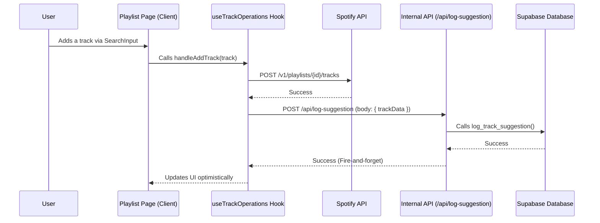

# Implementation Plan: Track Suggestion Logging

This document outlines the technical steps required to log track suggestions to the Supabase database when a user adds a track to the playlist.

## 1. High-Level Objective

When a user adds a track to the Spotify playlist via the application, we need to record this action in our internal database. This involves creating a record in the `tracks` table (if it doesn't already exist) and creating or updating a corresponding record in the `suggested_tracks` table to link the track to the user who suggested it.

## 2. Data Flow

The following diagram illustrates the end-to-end process:



## 3. Detailed Task Breakdown

### Task 1: Create a Database Stored Procedure

To ensure atomicity and simplify backend logic, we will create a PostgreSQL function in Supabase to handle the database operations.

**Action**: Execute the following SQL in the Supabase SQL Editor.

```sql
-- Function to handle logging a track suggestion
create or replace function public.log_track_suggestion(
  p_profile_id uuid,
  p_spotify_track_id text,
  p_track_name text,
  p_artist_name text,
  p_album_name text,
  p_duration_ms int,
  p_popularity int,
  p_spotify_url text
)
returns void as $$
declare
  v_track_id uuid;
begin
  -- Step 1: Upsert the track into the 'tracks' table.
  -- If the track already exists, do nothing.
  insert into public.tracks (spotify_track_id, name, artist, album, duration_ms, popularity, spotify_url)
  values (p_spotify_track_id, p_track_name, p_artist_name, p_album_name, p_duration_ms, p_popularity, p_spotify_url)
  on conflict (spotify_track_id) do nothing;

  -- Get the ID of the track (whether it was newly inserted or already exists).
  select id into v_track_id from public.tracks where spotify_track_id = p_spotify_track_id;

  -- Step 2: Upsert the suggestion into the 'suggested_tracks' table.
  -- If the user has suggested this track before, increment the count and update the timestamp.
  insert into public.suggested_tracks (profile_id, track_id, first_suggested_at, last_suggested_at)
  values (p_profile_id, v_track_id, now(), now())
  on conflict (profile_id, track_id) do update
  set
    count = suggested_tracks.count + 1,
    last_suggested_at = now();
end;
$$ language plpgsql volatile security definer;
```

### Task 2: Create the Backend API Endpoint

We will create a new, dedicated API route to handle logging user track suggestions. This avoids conflicts with the existing track suggestion generation endpoint.

**File to Create**: `app/api/log-suggestion/route.ts`

**Logic**:
1.  Define a `POST` handler for the new route.
2.  Extract the `track` object from the request body.
3.  Create a Supabase server client to get the authenticated user's session and `profile_id`.
4.  If no user is found, return a 401 Unauthorized error.
5.  Call the `log_track_suggestion` stored procedure using `supabase.rpc()` and pass the required parameters from the `track` object and the user's profile.
6.  Handle any potential errors from the database call.
7.  Return a 200 OK response on success.

### Task 3: Update the Frontend Hook

The final step is to call our new API endpoint from the `useTrackOperations` hook after a track is successfully added to the Spotify playlist.

**File to Modify**: `hooks/useTrackOperations.tsx`

**Logic**:
1.  In the `addTrack` function, after the `spotifyApi.addTracksToPlaylist` call succeeds, add a `fetch` call to our new `/api/log-suggestion` endpoint.
2.  The call should be "fire-and-forget" to avoid blocking the UI. We will not `await` its response.
3.  Include a `.catch()` block to log any potential errors to the console for debugging purposes, without alerting the user.
4.  The body of the `POST` request will contain the `track` object.

**Example Code Snippet**:
```typescript
// Inside hooks/useTrackOperations.tsx in the addTrack function

try {
  // Existing call to add track to Spotify playlist
  await spotifyApi.addTracksToPlaylist(playlistId, [trackItem.track.uri]);

  // --- NEW LOGIC ---
  // Fire-and-forget call to our internal API to log the suggestion.
  fetch('/api/log-suggestion', {
    method: 'POST',
    headers: { 'Content-Type': 'application/json' },
    body: JSON.stringify({ track: trackItem.track }),
  }).catch(error => {
    console.error('Failed to log track suggestion:', error);
  });
  // --- END NEW LOGIC ---

  // ... rest of the existing success logic
} catch (error) {
  // ... existing error handling
}